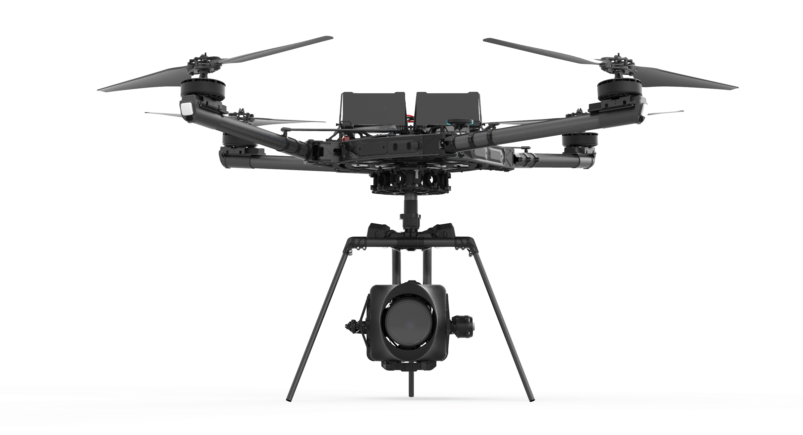

# Introducing ALTA X

ALTA X is a professional multi-rotor aircraft designed for demanding cinematic, professional, and industrial applications. Completely redesigned from the ground up, ALTA X is the next generation of the ALTA family. Built for the user, ALTA X emphasizes expandability and customization to make sure it can stand up to all challenges thrown its way, while still being the reliable workhorse drone that ALTA pilots know and love.

This Aircraft Flight Manual describes the complete operation of airframe and flight control systems, and the normal maintenance of those items. Do not operate ALTA X without reading and understanding this manual.

‌
This manual is not a substitute for adequate flight training. Training requirements can vary when operating in different countries or under different flight conditions. Always consult local regulations before flying ALTA X. In areas where there are no flight training requirements, it is the sole determination of the pilot-in-command as to whether he or she has the appropriate level of training or experience for a given flight. Always set and adhere to personal minimums and fly within your own capabilities.

Throughout the manual warnings, cautions and notes are used to highlight various important procedures. These are defined as follows:


‌Warnings are used to highlight procedures which, if not strictly observed, may result in personal injury.



Cautions are used to highlight procedures which, if not strictly observed, may cause damage to equipment.



Notes are used to highlight specific operating conditions, usability tips and tricks or steps of a procedure.


