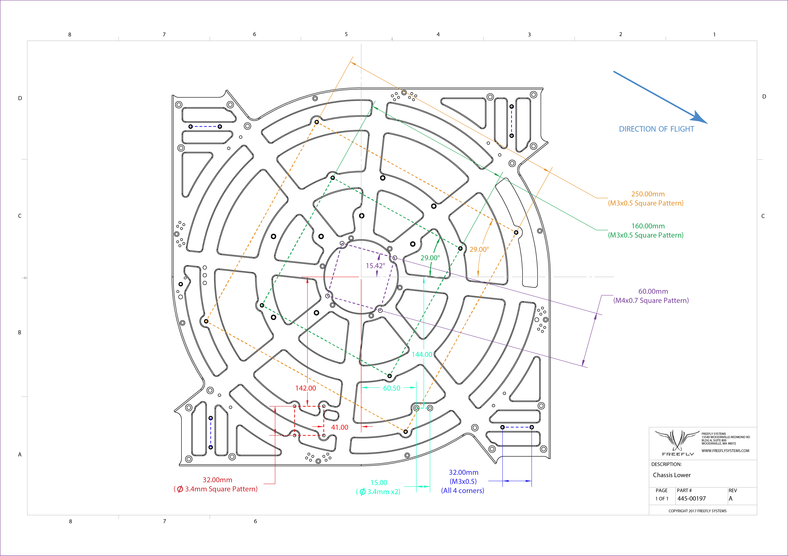

# Technical Drawings and CAD

### Aircraft Dimensions

<table>
  <thead>
    <tr>
      <th style="text-align:left"></th>
      <th style="text-align:left"></th>
    </tr>
  </thead>
  <tbody>
    <tr>
      <td style="text-align:left">
        

        

          
        

      </td>
      <td style="text-align:left">
        

        

          
        

      </td>
    </tr>
  </tbody>
</table>

| Dimension | Length \[mm\] |
| :--- | :--- |
| Unfolded Diameter \(not including props\)
 | 1415 |
| Unfolded Diameter \(Including Props\)
 | 2273 |
| Folded Diameter
 | 877 |
| Height
 | 387 |
| Height \(Skyview\) | 434 |

### Mounting Interfaces - Chassis Underside





[Shrinkwrap Model Link](https://a360.co/36qlhMQ) - Fusion 360 Web Viewer. \(Downloadable STEP file available here\)

[Landing Gear CAD](https://myhub.autodesk360.com/ue2845571/g/shares/SH919a0QTf3c32634dcf7a63bb3c7b0d4177?viewState=NoIgbgDAdAjCA0IDeAdEAXAngBwKZoC40ARXAZwEsBzAOzXjQEMyzd1C0BjRmTgZgBsAgKwBaYbgAcnUQBYYAIwBmoyRABMM3ABNGnAJwB2BUM6HDaAL4gAukA) shrinkwrap \(Downloadable STEP available here\)

CAD files for Movi Pro can be found in this [section](https://freefly.gitbook.io/freefly-public/products/m-vi-pro-series/technical-drawings-and-cad)

