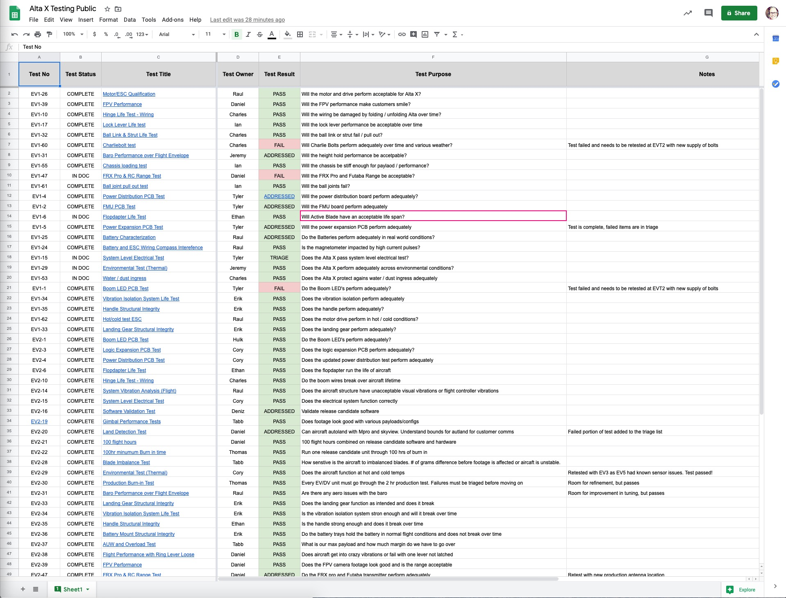

# Test Documentation

All the tests that were completed \(except for a few confidential ones\) are listed in a [google sheet here](https://docs.google.com/spreadsheets/d/12bGZendgnr6sTo7NTKgX23aJqNqq7iSC3xMmFqjuUAk/edit#gid=0)

This overview sheet will tell you key information about the test, who completed the test, and the test result.  If you want to understand the test in more detail you can review each test plan individually by following the link for each test.

