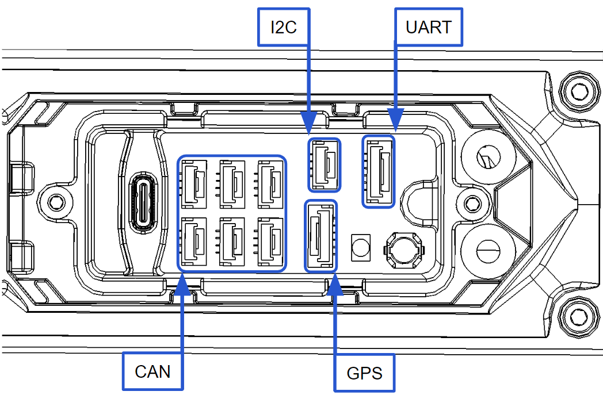
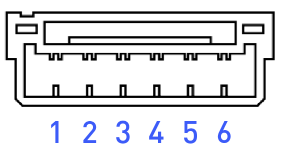
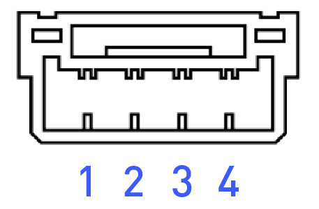

# Appendix

## 

### Powerplant

|  |  |
| :--- | :--- |
| Number of Motors | 4 |
| Motor Max Continuous Power Output | 100 A |
| Motor Max Instantaneous Peak Power Output | 130 A \(&gt;3s\) |
| Equivalent Kv | 115 rpm/V |

### Propellers

|  |  |
| :--- | :--- |
| Material | Carbon Fiber Reinforced Nylon |
| Propeller Orientation | \(2x\) CW and \(2x\) CCW Props |
| Propeller Type | Folding - 840 x 230 mm \(33 x 9in\) |

### Battery

<table>
  <thead>
    <tr>
      <th style="text-align:left"></th>
      <th style="text-align:left"></th>
    </tr>
  </thead>
  <tbody>
    <tr>
      <td style="text-align:left">Cells</td>
      <td style="text-align:left">12S</td>
    </tr>
    <tr>
      <td style="text-align:left">Nominal Battery Voltage</td>
      <td style="text-align:left">44.4V</td>
    </tr>
    <tr>
      <td style="text-align:left">Charged Battery Voltage</td>
      <td style="text-align:left">50.4V</td>
    </tr>
    <tr>
      <td style="text-align:left">Battery Connectors</td>
      <td style="text-align:left">XT-90</td>
    </tr>
    <tr>
      <td style="text-align:left">Required Minimum Battery Discharge Rating (Per Pack)</td>
      <td style="text-align:left">
        
320 Amps per battery

        <ul>
          <li>(assumes two batteries) 20C for a 16A-hr pack.</li>
        </ul>
      </td>
    </tr>
  </tbody>
</table>### Weight

|  |  |
| :--- | :--- |
| Maximum Gross for Takeoff | 34.9kg |
| Maximum Payload | 15.9kg |
| Typical Standard Empty Weight | 10.4 kg |

### Flight Controller

|  |  |
| :--- | :--- |
| Autopilot Name | Custom Auterion PX4 flight control stack |
| Flight Modes | Manual, Altitude, Position, Mission, Loiter, Orbit, Return |
| Supported Inputs | MAVlink SDK |
| Supported Radios | Futaba, Spektrum, PX4 compatible SBUS and PPM receivers |
| Supported Radio Controller Telemetry Systems | Voltage feed provided for Futaba RX telemetry |
| Minimum Radio Controller Channels Required | 5 \(roll, pitch, yaw, throttle, mode\) |
| Supported GNSS | GPS/Glonass/Beidou/Galileo |

### Lighting and Indication

|  |  |
| :--- | :--- |
| Orientation Lights | Boom tip mounted LEDs |
| Orientation Light Color Options | User controlled in software - red, orange, yellow, green, cyan, blue, purple, white, and off. |
| FPV Ability | Yes, see the FPV integration section for instructions on how to mount the FPV. |

### Isolation Systems

|  |  |
| :--- | :--- |
| Vibration Isolation System | Built-in _\(see chart below for weight suggestions\)_ |

| Payload \[lb\] | Payload \[Kg\] | Isolator Durometer | Cartridge Qty |
| :--- | :--- | :---: | :---: |
| 0 - 3 \* | 0 - 1.4 | 30A | 3 |
| 4 - 10 \* | 1.8 - 4.5 | 30A | 6 |
| 11 - 19 \*\* | 5.0 - 8.6 | 30A | 9 |
| 20 - 23 \*\* | 9.1 - 10.4 | 30A/40A | 9 |
| 24 - 29 \*\* | 10.9 - 13.2 | 40A | 9 |
| 30 - 32 \*\* | 13.6 - 14.5 | 40A/50A | 9 |
| 33 - 35 \*\* | 15.0 - 15.9 | 50A | 9 |
| &gt;35 \*\*\* | &gt;15.9 | 60A | 9 |

## Performance Charts

### Flight Time v. Payload

### Maximum Gross Weight

To determine maximum gross weight, determine flight location pressure altitude and temperature, and refer to the weight in the chart below.
 Gross Weight includes payload, battery and structure weight.

The maximum gross weight might exceed the weight allowed by regulatory agencies. When determining gross weight, please consider any such local restrictions on aircraft weight when planning aircraft weight.


The maximum gross weight at a defined density altitude was established by calculating weight so that sufficient thrust margin for maneuvering is maintained.



Cells highlighted in yellow indicate where the weight is limited by the maximum design weight


## Expansion Ports

### External Com Expansion

The external communications expansion port is located between booms 1 and 2 on the ALTA.

<table>
  <thead>
    <tr>
      <th style="text-align:center">GH-6 Pin</th>
      <th style="text-align:center">GH-4 Pin</th>
    </tr>
  </thead>
  <tbody>
    <tr>
      <td style="text-align:center">
        

        

          
        

      </td>
      <td style="text-align:center">
        

        

          
        

      </td>
    </tr>
  </tbody>
</table>#### 5V External Power

The external expansion connector port 5V power is provided by a dedicated 5V 3A current limited power supply separate of the redundant 5V power supplies for the flight controller. Each output on the external expansion connectors is protected by a 1.1A hold 2.2A trip PTC \(Part number 0ZCG0110FF2C\). The sum of the power supplying the following components must be less than 3A:

* Motor boom LEDs \(approx 1A during flight with 2x red and 2x green LEDs\)
* Long range radio if not powered via other means \(FRX Pro is powered by 12V\)
* All internal CANbus peripherals on CAN expansion connectors
* All external UART, I2C, and CANbus connectors

#### UART Port - _GH-6 Pin_

MAVLink serial communications at 57600b 8-N-1

| Pin | Signal | Voltage \(V\) |
| :--- | :--- | :--- |
| 1 | VCC | +5V |
| 2 | TX \(Out\) | +3V |
| 3 | RX \(In\) | +3V |
| 4 | CTS \(In\) | +3V |
| 5 | RTS \(Out\) | +3V |
| 6 | GND | GND |

#### GPS2 Port _- GH-6 Pin_

Nuttx console output at 57600b 8-N-1.

| Pin | Signal | Voltage \(V\) |
| :--- | :--- | :--- |
| 1 | VCC | +5V |
| 2 | TX \(Out\) | +3V |
| 3 | RX \(In\) | +3V |
| 4 | I2C1 SCL | +3V |
| 5 | I2C1 SDA | +3V |
| 6 | GND | GND |

#### CAN Ports _- GH-4 Pin_

Peripheral CANbus for future expansion.

| Pin | Signal | Voltage \(V\) |
| :--- | :--- | :--- |
| 1 | VCC | +5V |
| 2 | CAN\_H | +5V |
| 3 | CAN\_L | +5V |
| 4 | GND | GND |


WARNING: Internal Long Range RF CAN is 12V VCC, do not use!


#### I2C Ports _- GH-4 Pin_

I2C bus for future expansion

| Pin | Signal | Voltage \(V\) |
| :--- | :--- | :--- |
| 1 | VCC | +5V |
| 2 | I2C1 SCL | +3V |
| 3 | I2C1 SDA | +3V |
| 4 | GND | GND |

### Power Expansion

The power expansion port is located between booms 1 and 2 on the ALTA; it contains three externally-facing and two internally-facing direct battery connected power expansion connectors with female socket pin XT-30 type connectors. Each external output is protected by a 10A automotive mini blade type fuse. The replacement fuse part number is 0297010.WXNV.

The system and fuses are sized to supply 10A or less continuously on each external port simultaneously; the internal connectors share the same fuse with the external connector J1. Please note that the output voltage will vary with system battery voltage as the battery discharges.


Use of any other size fuse could cause the aircraft to crash if shorted. 


