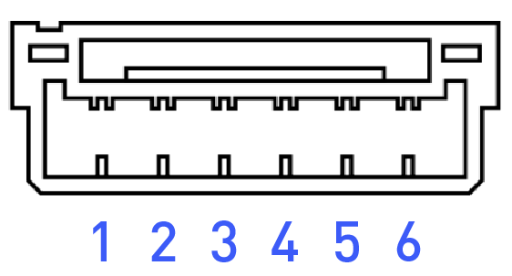
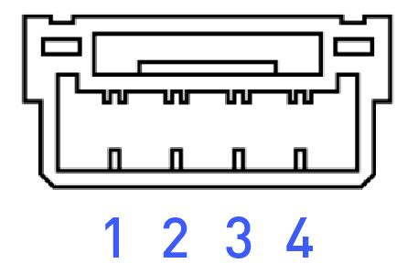

# Electrical Interfaces

## Expansion Ports

### External Com Expansion

The external communications expansion port is located between booms 1 and 2 on the ALTA.

<table>
  <thead>
    <tr>
      <th style="text-align:center">GH-6 Pin</th>
      <th style="text-align:center">GH-4 Pin</th>
    </tr>
  </thead>
  <tbody>
    <tr>
      <td style="text-align:center">
        

        

          
        

      </td>
      <td style="text-align:center">
        

        

          
        

      </td>
    </tr>
  </tbody>
</table>

#### 5V External Power

The external expansion connector port 5V power is provided by a dedicated 5V 3A current limited power supply separate of the redundant 5V power supplies for the flight controller. Each output on the external expansion connectors is protected by a 1.1A hold 2.2A trip PTC \(Part number 0ZCG0110FF2C\). The sum of the power supplying the following components must be less than 3A:

* Motor boom LEDs \(approx 1A during flight with 2x red and 2x green LEDs\)
* Long range radio if not powered via other means \(FRX Pro is powered by 12V\)
* All internal CANbus peripherals on CAN expansion connectors
* All external UART, I2C, and CANbus connectors

#### UART Port - _GH-6 Pin_

MAVLink serial communications at 57600b 8-N-1

| Pin | Signal | Voltage \(V\) |
| :--- | :--- | :--- |
| 1 | VCC | +5V |
| 2 | TX \(Out\) | +3V |
| 3 | RX \(In\) | +3V |
| 4 | CTS \(In\) | +3V |
| 5 | RTS \(Out\) | +3V |
| 6 | GND | GND |

#### GPS2 Port _- GH-6 Pin_

Nuttx console output at 57600b 8-N-1.

| Pin | Signal | Voltage \(V\) |
| :--- | :--- | :--- |
| 1 | VCC | +5V |
| 2 | TX \(Out\) | +3V |
| 3 | RX \(In\) | +3V |
| 4 | I2C1 SCL | +3V |
| 5 | I2C1 SDA | +3V |
| 6 | GND | GND |

#### CAN Ports _- GH-4 Pin_

Peripheral CANbus for future expansion.

| Pin | Signal | Voltage \(V\) |
| :--- | :--- | :--- |
| 1 | VCC | +5V |
| 2 | CAN\_H | +5V |
| 3 | CAN\_L | +5V |
| 4 | GND | GND |


WARNING: Internal Long Range RF CAN is 12V VCC, do not use!


#### I2C Ports _- GH-4 Pin_

I2C bus for future expansion

| Pin | Signal | Voltage \(V\) |
| :--- | :--- | :--- |
| 1 | VCC | +5V |
| 2 | I2C1 SCL | +3V |
| 3 | I2C1 SDA | +3V |
| 4 | GND | GND |

### Power Expansion

The power expansion port is located between booms 1 and 2 on the ALTA; it contains three externally-facing and two internally-facing direct battery connected power expansion connectors with female socket pin XT-30 type connectors. Each external output is protected by a 10A automotive mini blade type fuse. The replacement fuse part number is 0297010.WXNV.

The system and fuses are sized to supply 10A or less continuously on each external port simultaneously; the internal connectors share the same fuse with the external connector J1. Please note that the output voltage will vary with system battery voltage as the battery discharges.


Use of any other size fuse could cause the aircraft to crash if shorted. 


## FPV Cable Pinout

### Cable FPV TX

Every Alta X comes with a cable pre-installed to attach the FPV video transmission system. Freefly provides this FPV system and the appropriate cable to attach the transmitter to the aircraft cable, but if the customer wants to install their own FPV transmitter, please use the pinout below for wiring guidance. Also see note below pinout for camera-specific guidance.

<table>
  <thead>
    <tr>
      <th style="text-align:left">
        
Connector Pinout

        
(DF11-6DEP-2C)

      </th>
      <th style="text-align:left">Designation</th>
      <th style="text-align:left">Color</th>
    </tr>
  </thead>
  <tbody>
    <tr>
      <td style="text-align:left">1</td>
      <td style="text-align:left">12V</td>
      <td style="text-align:left">RED</td>
    </tr>
    <tr>
      <td style="text-align:left">2</td>
      <td style="text-align:left">GND</td>
      <td style="text-align:left">BLACK</td>
    </tr>
    <tr>
      <td style="text-align:left">3</td>
      <td style="text-align:left">5V</td>
      <td style="text-align:left">PURPLE</td>
    </tr>
    <tr>
      <td style="text-align:left">4</td>
      <td style="text-align:left">5V-Pass-Thru</td>
      <td style="text-align:left">GREY</td>
    </tr>
    <tr>
      <td style="text-align:left">5</td>
      <td style="text-align:left">VID-IN</td>
      <td style="text-align:left">YELLOW</td>
    </tr>
    <tr>
      <td style="text-align:left">6</td>
      <td style="text-align:left">VID-OUT</td>
      <td style="text-align:left">ORANGE</td>
    </tr>
  </tbody>
</table>

Note: The Freefly-provided FPV system powers the camera via the 5V-passthrough at the VTX. If the customer wants to install their own VTX that does not provide a 5v-passthrough, it is necessary to power the camera directly from the 5V pin \(Pin 3\). This can be done by moving the pin on the camera cable from pin 4 to pin 3.

