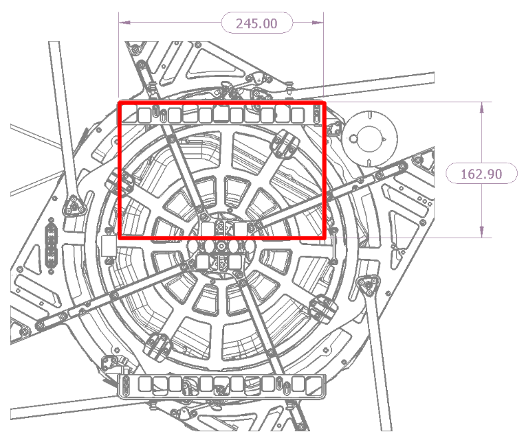
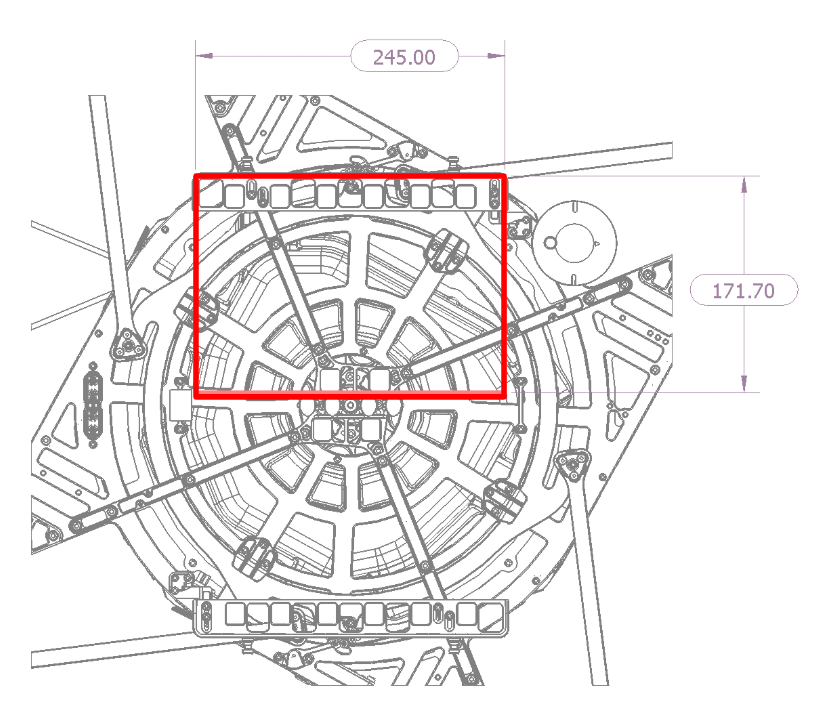
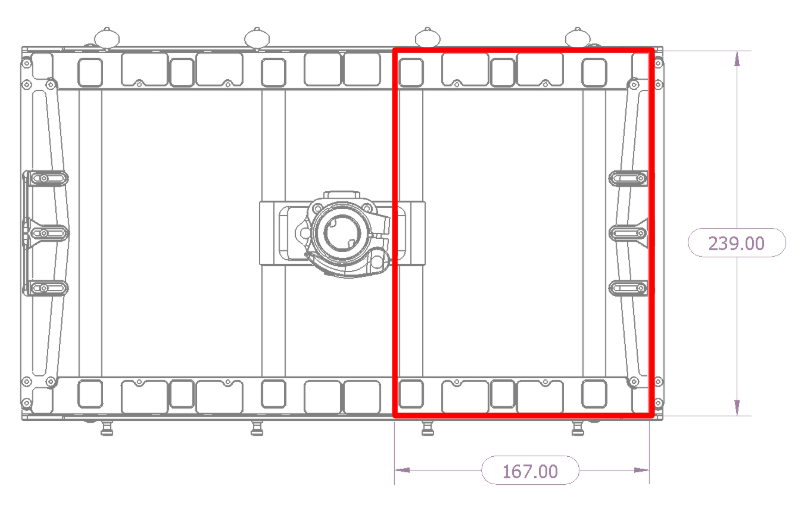
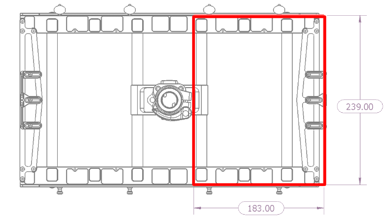
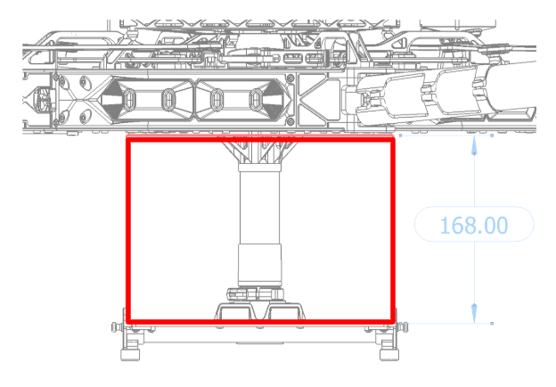

# Technical Specs

## Powerplant

|  |  |
| :--- | ---: |
| Number of Motors | 4 |
| Motor Max Continuous Power | 17,760W  |
| Motor Max Instantaneous Peak Power | 23,088W  \(&lt;3s\) |
| Equivalent Kv | 115 rpm/V |

## Propellers

|  |  |
| :--- | ---: |
| Material | Carbon Fiber Reinforced Nylon |
| Propeller Orientation | \(2x\) CW and \(2x\) CCW Props |
| Propeller Type | Folding - 840 x 230 mm \(33 x 9in\) |

## Battery

<table>
  <thead>
    <tr>
      <th style="text-align:left"></th>
      <th style="text-align:right"></th>
    </tr>
  </thead>
  <tbody>
    <tr>
      <td style="text-align:left">Cells</td>
      <td style="text-align:right">12S</td>
    </tr>
    <tr>
      <td style="text-align:left">Nominal Battery Voltage</td>
      <td style="text-align:right">44.4V</td>
    </tr>
    <tr>
      <td style="text-align:left">Peak Battery Voltage</td>
      <td style="text-align:right">50.4V</td>
    </tr>
    <tr>
      <td style="text-align:left">Battery Connectors</td>
      <td style="text-align:right">XT-90 Anti Spark</td>
    </tr>
    <tr>
      <td style="text-align:left">Required Minimum Battery Discharge Rating (Per Pack)</td>
      <td style="text-align:right">
        
260a per battery

        <ul>
          <li>(assumes two batteries) 20C for a 16A-hr pack.</li>
        </ul>
      </td>
    </tr>
  </tbody>
</table>Battery Tray Dimensions

## Weight

|  |  |
| :--- | ---: |
| Maximum Gross Takeoff Weight | 34.9kg |
| Maximum Payload | 15.9kg |
| Empty Weight | 10.4 kg |

## Environmental

|  |  |
| :--- | ---: |
| Operating Temperature | -20C to +50C |
| Operating Ceiling | \(Weight-dependent. See performance specs\) |
| Ingress Protection | Tested to IP43 equivalent |

## Flight Controller

|  |  |
| :--- | ---: |
| Autopilot Name | Custom PX4 flight control stack |
| Flight Modes | Manual, Altitude, Position, Mission, Loiter, Orbit, Return |
| Supported Inputs | MAVlink SDK |
| Supported Radios | Futaba, Spektrum, PX4 compatible SBUS and PPM receivers |
| Supported Radio Controller Telemetry Systems | Voltage feed provided for Futaba RX telemetry |
| Minimum Radio Controller Channels Required | 5 \(roll, pitch, yaw, throttle, mode\) |
| Supported GNSS | GPS/Glonass/Beidou/Galileo |

## Lighting and Indication

|  |  |
| :--- | :--- |
| Orientation Lights | Boom tip mounted LEDs |
| Orientation Light Color Options | User controlled in software - red, orange, yellow, green, cyan, blue, purple, white, and off. |
| FPV Ability | Yes, see the FPV integration section for instructions on how to mount the FPV. |

## Isolation Systems

|  |  |
| :--- | :--- |
| Vibration Isolation System | Built-in _\(see chart below for weight suggestions\)_ |

| Payload \[lb\] | Payload \[Kg\] | Isolator Durometer | Cartridge Qty |
| :--- | :--- | :---: | :---: |
| 0 - 3 \* | 0 - 1.4 | 30A | 3 |
| 4 - 10 \* | 1.8 - 4.5 | 30A | 6 |
| 11 - 19 \*\* | 5.0 - 8.6 | 30A | 9 |
| 20 - 23 \*\* | 9.1 - 10.4 | 30A/40A | 9 |
| 24 - 29 \*\* | 10.9 - 13.2 | 40A | 9 |
| 30 - 32 \*\* | 13.6 - 14.5 | 40A/50A | 9 |
| 33 - 35 \*\* | 15.0 - 15.9 | 50A | 9 |

## **Radio Specs**

| Operating Frequency |  |
| :--- | ---: |
| Futaba  | 2.4 Ghz |
| FRX Pro  | 900Mhz |
| FPV TX | 5.8 Ghz |
| RFD 900X | 900Mhz |

| Max Transmitting Distance |  |
| :--- | ---: |
| Futaba | Varies on conditions |
| FRX Pro | 1-2 Miles LOS |
| FPV TX | TBD |
| RFD 900X | 1-2 Miles LOS |

| Power Supply |  |
| :--- | ---: |
| Futaba | DC - 6V HT5F18008 NIHM |
| FRX Pro | Input 5-30v |
| FPV TX | Up to 600mA |
| RFD 900X | 5V |

| Output Power \(max\) |  |
| :--- | ---: |
| Futaba | ± 0.52dBm |
| FRX Pro | 10mW - 1W \(User adjustable\) |
| FPV TX | 25mW \(up to 800mW with HAM license\*\) |
| RFD 900X | 1W \(+30dBm\) |

| USB Power Supply |  |
| :--- | ---: |
| Futaba | NA |
| FRX Pro | 5V |
| FPV TX | NA |
| RFD 900X | 5V |

| Operating Temperature |  |
| :--- | ---: |
| Futaba | NA |
| FRX Pro | -20 to 50C |
| FPV TX | Normal Airflow |
| RFD 900X | -40 to +85 deg C |

\*\*\*\*

