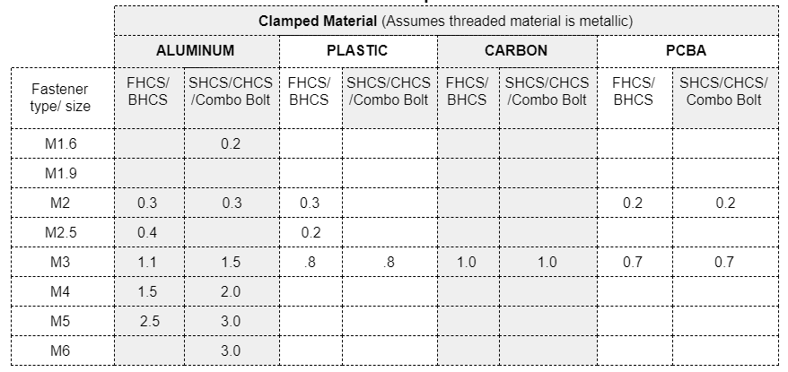
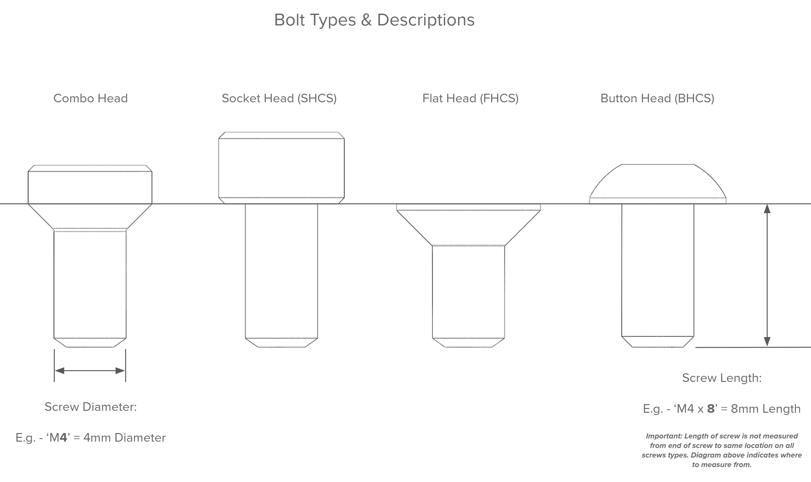
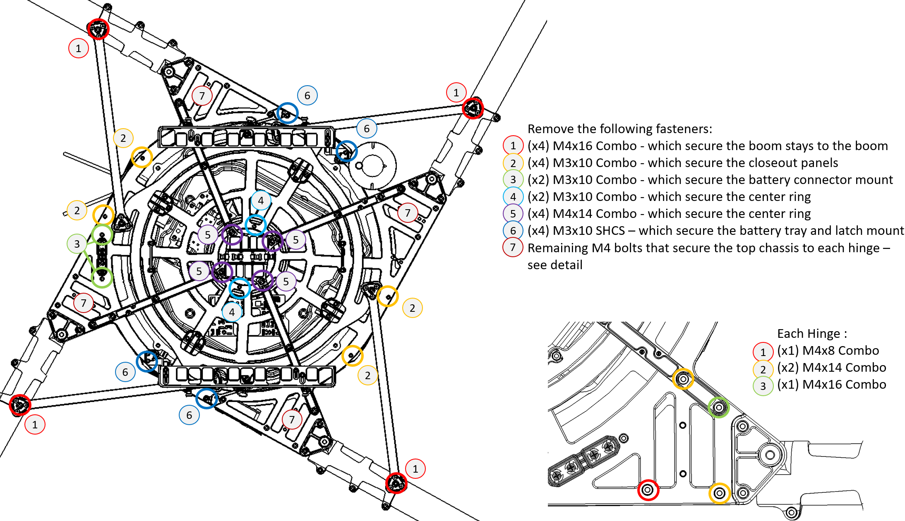
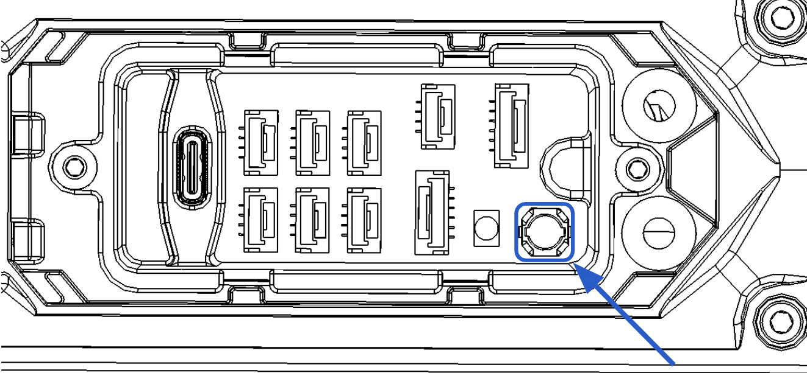
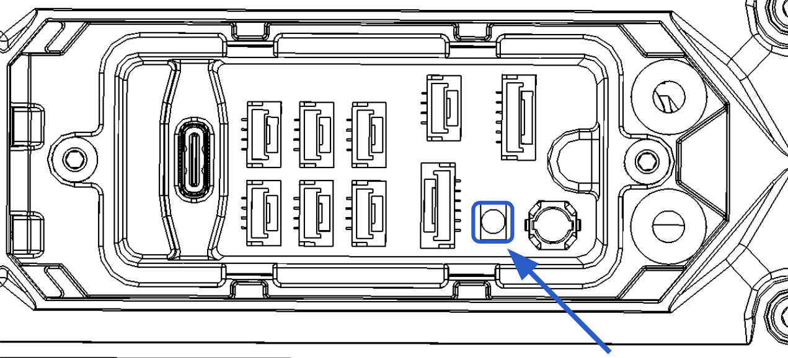

# Maintenance

## Interval Inspections

### Every 15 Flights

ALTA X is designed to be as low-maintenance as possible.
 It is recommended to check ALTA X’s fasteners regularly. This check should occur roughly after every 15 flights. To check ALTA X’s fasteners, apply a tightening torque to each fastener on the chassis using the supplied hex drivers. The fasteners should not slip.

#### Inspect Fastener Tightness

Check the tightness of the following fasteners to verify no loose fasteners:

* Motor mount bolts
* Boom clamping bolts
* Prop hub bolts
* Prop bolts
* Top and bottom chassis bolts
* Closeout panel bolts
* FPV camera mounting plate bolts
* Boom stay attachment bolts
* GPS/Compass mounting bolts


If a fastener does slip, tighten it using the methods described in the Fastener Installation section. Do not apply additional thread locking compound unless the fastener has repeatedly come loose.


### Every 15 Flight Hours

#### Inspect Fastener Tightness

Check the tightness of the fasteners as described above.

#### Inspection Wear Components

Inspect the following items. Replace if worn.

* Propeller blades - Chips, cracks, or deep scratches
* ActiveBlade bumpers
   - Broken or crushed

#### Inspect Boom Ring Latch Tightness

Check boom latching tightness by closing the latch. There should be a firm closing force and click. Adjust the tension by using a 2.0mm hex wrench on the set screw located in the rear of the latch link.

## Replacement of Parts

Spare or replacement parts are available for sale separately at [freeflysystems.com](https://freeflysystems.com/). Please refer to the store for a current listing of all available spare parts.


**Use Of Threadlocker**

Bolts and screws used in the daily use of this aircraft do not require threadlocking compound. This includes the screws holding on the battery trays, vibration isolation system and the Skyview landing gear parts. 

However, for the structural fasteners described in parts of this section blue Loctite 243 compound or equivalent is required. Apply sparingly to the threads before insertion.



**Fastener Installation**

The Freefly hex drivers included with ALTA X are designed to limit the torque that can be applied to each bolt or screw and help prevent stripping the fastener head.

Thread all fasteners into their respective holes until snug \(when the fastener head bottoms out and lightly clamps the two mating parts together\).

To prevent excessive tightening and damaging the fastener or parts, twist the driver from the smaller diameter knurled section of the tool between your thumb and index finger for small fasteners \(under size M3\) or with your thumb and two forefingers for larger fasteners \(size M3 and larger\).



Before performing any part replacement, ensure that ATLA X has been unplugged from any power source. Leaving ALTA X powered while performing any work on it can result in a potentially dangerous situation.


#### Fastener Torque Values

### **Replacing ActiveBlade Bumpers**

<table>
  <thead>
    <tr>
      <th style="text-align:left"></th>
      <th style="text-align:left"></th>
      <th style="text-align:left"></th>
    </tr>
  </thead>
  <tbody>
    <tr>
      <td style="text-align:left">1.</td>
      <td style="text-align:left">Push down on one side of the<b> </b>ActiveBlade assembly to open the gap
        and provide better access. Pull the bumper out from that side.</td>
      <td
      style="text-align:left">
        

        

          
        

        </td>
    </tr>
    <tr>
      <td style="text-align:left">2.</td>
      <td style="text-align:left">Repeat this for the second bumper.</td>
      <td style="text-align:left"></td>
    </tr>
    <tr>
      <td style="text-align:left">3.</td>
      <td style="text-align:left">To replace, insert the tail of the new bumper into the hole and pull into
        place, until the shoulder is fully seated. A circular motion may help with
        seating.</td>
      <td style="text-align:left"></td>
    </tr>
    <tr>
      <td style="text-align:left">4.</td>
      <td style="text-align:left">To replace the second bumper, push down on the ActiveBlade assembly and
        again pull the tail of the bumper to seat.</td>
      <td style="text-align:left"></td>
    </tr>
    <tr>
      <td style="text-align:left">5.</td>
      <td style="text-align:left">Rock the the ActiveBlade assembly back and forth to make sure the bumpers
        are aligned.</td>
      <td style="text-align:left"></td>
    </tr>
  </tbody>
</table>### \*\*\*\*

### **Replacing Propeller Sets**

|  |  |  |
| :--- | :--- | :--- |
| 1. | First, remove the ActiveBlade bumpers as detailed in the previous section. |  |
| 2. | Remove \(2x\) M5x30 bolts and \(4x\) M3x10 bolts and remove the top plate. |  |
| 3. | Replace props and nylon washers if required. |  |
| 4. | Refit top plate and attach with \(2x\) M5x30 bolts and \(4x\) M3x10 bolts. Loctite 243 or equivalent must be used to secure these fasteners. |  |
| 5. | Reinsert the ActiveBlade bumpers as detailed in the previous section. |  |


Props are supplied as a weight matched and balanced pair. Only fit props in the factory supplied pair.


\*\*\*\*

### **Replacing ActiveBlades**

<table>
  <thead>
    <tr>
      <th style="text-align:left"></th>
      <th style="text-align:left"></th>
      <th style="text-align:left"></th>
    </tr>
  </thead>
  <tbody>
    <tr>
      <td style="text-align:left">1.</td>
      <td style="text-align:left">Remove (x4) M3x10 bolts by accessing through the top of the assembly as
        shown.</td>
      <td style="text-align:left">
        

        

          
        

      </td>
    </tr>
    <tr>
      <td style="text-align:left">2.</td>
      <td style="text-align:left">Fit new assembly and secure with (x4) M3x10 bolts. Loctite 243 or equivalent
        must be used to secure these fasteners.</td>
      <td style="text-align:left"></td>
    </tr>
  </tbody>
</table>### **Opening Chassis**

<table>
  <thead>
    <tr>
      <th style="text-align:left"></th>
      <th style="text-align:left"></th>
      <th style="text-align:left"></th>
    </tr>
  </thead>
  <tbody>
    <tr>
      <td style="text-align:left">1.</td>
      <td style="text-align:left">Set aircraft on a stable level work surface.During disassembly, take care
        to note the location of fasteners and orientation of parts, as this will
        greatly help with reassembly.</td>
      <td style="text-align:left"></td>
    </tr>
    <tr>
      <td style="text-align:left">2.</td>
      <td style="text-align:left">
        
Remove the following fasteners (reference drawing below):

        <ol>
          <li>(x4) M4x16 Combo - which secure the boom stays to the boom</li>
          <li>(x4) M3x10 Combo - which secure the closeout panels</li>
          <li>(x4) M3x10 Combo - which secure the battery connector mount</li>
          <li>(x2) M3x10 Combo - which secure the center ring</li>
          <li>(x4) M4x14 Combo - which secure the center ring</li>
          <li>(x4) M3x10 SHCS - which secure the battery tray and latch mount</li>
          <li>Remaining M4 bolts that secure the top chassis to each hinge. See detail
            in drawing below. Note: There are 3 different length M4 bolts in this area.</li>
        </ol>
      </td>
      <td style="text-align:left"></td>
    </tr>
    <tr>
      <td style="text-align:left">3.</td>
      <td style="text-align:left">The top chassis can now be removed from the machine, and the inner cover
        lifted off to access the enclosure area.</td>
      <td style="text-align:left"></td>
    </tr>
    <tr>
      <td style="text-align:left">4.</td>
      <td style="text-align:left">To reassemble, refit the enclosure making sure it is well seated and there
        are no trapped wires.</td>
      <td style="text-align:left"></td>
    </tr>
    <tr>
      <td style="text-align:left">5.</td>
      <td style="text-align:left">Attach the power connector with (x2) M3x10 bolts before reseating the
        top chassis, making sure the orientation is correct.</td>
      <td style="text-align:left">`</td>
    </tr>
    <tr>
      <td style="text-align:left">6.</td>
      <td style="text-align:left">Reassemble the remaining chassis fasteners. Take care to align the fasteners
        correctly. It is recommended to get all fasteners started before torquing.
        Loctite 243 or equivalent should be used in all these locations.</td>
      <td
      style="text-align:left"></td>
    </tr>
  </tbody>
</table>

### Replacing Booms


If replacing more than one boom, replace one at a time to reduce the chances of mixing up connections.


|  |  |  |
| :--- | :--- | :--- |
| 1. | Remove the top chassis as detailed in the previous section. |  |
| 2. | Trace the wires from the boom to be replaced. There will be three cables from each boom, a power cable, an LED cable and a motor control cable. Carefully unplug each, taking care to note the locations for when the replacement boom is fitted. 
 |  |
| 3. | Remove any strain relieving zip ties. Take care to note the correct wire routing.
 |  |
| 4. | Loosen the three M4 bolts that clamp the boom, and carefully slide the boom out of the hinge.
 |  |
| 5. | Remove the corrugated tube from the old boom, noting its location on the harness. If being reused, remove the ActiveBlade assembly from the old boom.
 |  |
| 6. | Prepare the new boom assembly by attaching the corrugated tube. |  |
| 7. | Feed the wiring harness through the hinge, slide the boom into place and temporarily secure by lightly tightening the hinge bolts.
 |  |
| 8. | Connect new boom’s three cables, route the wires and secure with strain relief zip ties where needed. Make sure the corrugated tube is positioned correctly and strain relieved to the chassis securely.
 |  |
| 9. | Replace the enclosure cover and reinstall the top chassis per the previous section. |  |
| 10. | The booms on ALTA X are clocked to improve yaw authority. Replacement booms are supplied with alignment cards to allow accurate clocking of the motors. Their use is covered in this video. Before aligning the motors, completely remove the M4 boom clamp fasteners, and apply Loctitie 243 or equivalent. Once aligned, torque fasteners.
 |  |
| 11. | Reattach the ActiveBlade assembly as described in previous section.
 |  |

### Updating Firmware

Autopilot and system component firmware is updated via the USB expansion port on ALTA X located in the chassis closeout between booms 1 and 2. To update firmware download the latest [FW files from the ALTA X Firmware page](https://freeflysystems.com/support/alta-x-support) and follow the instructions below.

<table>
  <thead>
    <tr>
      <th style="text-align:left"></th>
      <th style="text-align:left"></th>
      <th style="text-align:left"></th>
    </tr>
  </thead>
  <tbody>
    <tr>
      <td style="text-align:left">1.</td>
      <td style="text-align:left">Download the latest ALTA X FW from the ALTA X Firmware page on the support
        website.</td>
      <td style="text-align:left"></td>
    </tr>
    <tr>
      <td style="text-align:left">2.</td>
      <td style="text-align:left">Plug in a USB cable to your computer. Leave the other end unplugged from
        ALTA X for now.</td>
      <td style="text-align:left"></td>
    </tr>
    <tr>
      <td style="text-align:left">3.</td>
      <td style="text-align:left">Remove the chassis closeout between Booms 1 and 2 to reveal the expansion
        board.</td>
      <td style="text-align:left"></td>
    </tr>
    <tr>
      <td style="text-align:left">4.</td>
      <td style="text-align:left">Hold down the USB MSC Button on the expansion board while plugging in
        the USB C to the expansion board on your ALTA. Your ALTA will show up in
        your file browser as a USB disk named FF-ALTA.</td>
      <td style="text-align:left">
        
      </td>
    </tr>
    <tr>
      <td style="text-align:left">5.</td>
      <td style="text-align:left">You should see a folder named &apos;freefly&apos;.</td>
      <td style="text-align:left"></td>
    </tr>
    <tr>
      <td style="text-align:left">6.</td>
      <td style="text-align:left">Replace the &#x2018;freefly&#x2019; folder in the root of the drive with
        the new one downloaded from the Freeflysystems.com website.</td>
      <td style="text-align:left"></td>
    </tr>
    <tr>
      <td style="text-align:left">7.</td>
      <td style="text-align:left">
        
Unplug ALTA X from the USB and then apply USB power (or battery power
          with the props removed) while holding down the Boot button on the expansion
          board.

        
Hold Boot button until motor boom lights start blinking blue.

      </td>
      <td style="text-align:left">
        
      </td>
    </tr>
    <tr>
      <td style="text-align:left">8.</td>
      <td style="text-align:left">ALTA X should display blue solid or flashing lights on its motors to show
        it is updating its FW. Once complete the system will boot normally and
        display red and green directional lights on the motors.</td>
      <td style="text-align:left"></td>
    </tr>
  </tbody>
</table>
For troubleshooting, you can view details of the bootloading process by connecting to the GPS2 UART on the expansion connector with a USB to UART adapter and a cable using the dronecode/PX4 UART standard pinout. The UART settings are 57600 baud, 8-N-1.



Test radio channels, arming, and disarming behavior after firmware updates to ensure radio mapping has been preserved. Incorrect radio mapping can lead to loss of control.



 Do not use a battery to power ALTA X during FW updates! Using USB power prevents unwanted motor spin-ups.


