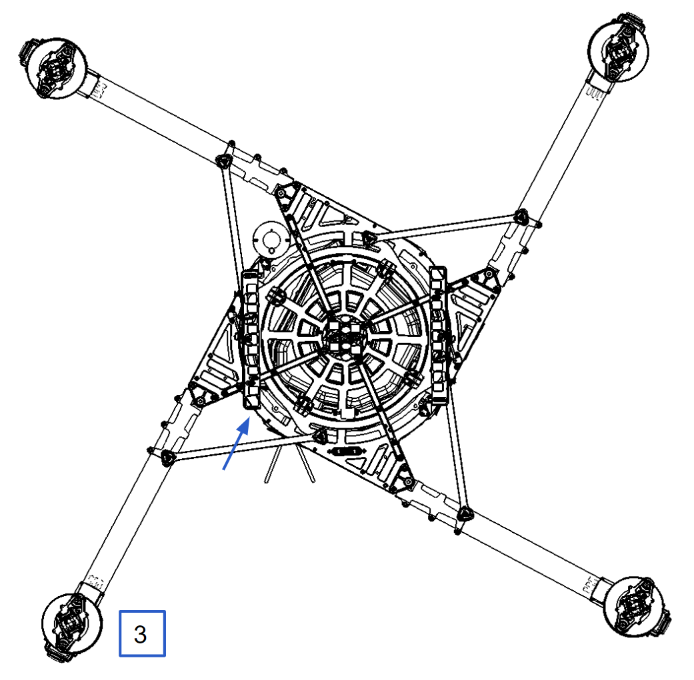
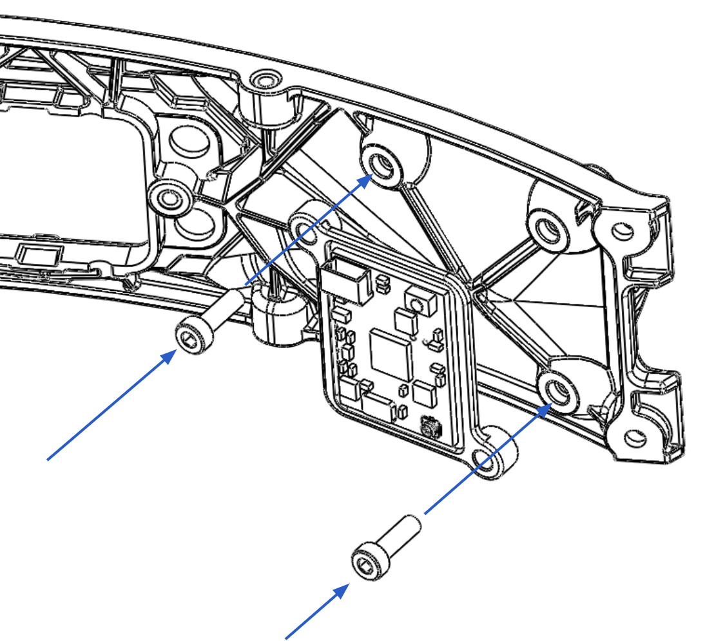
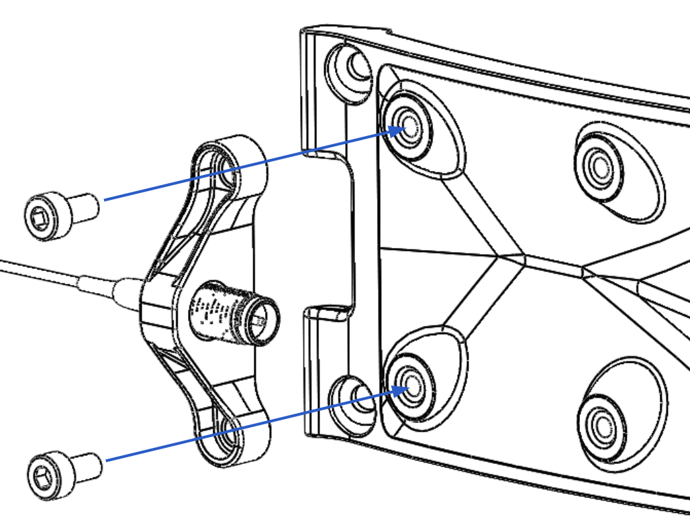
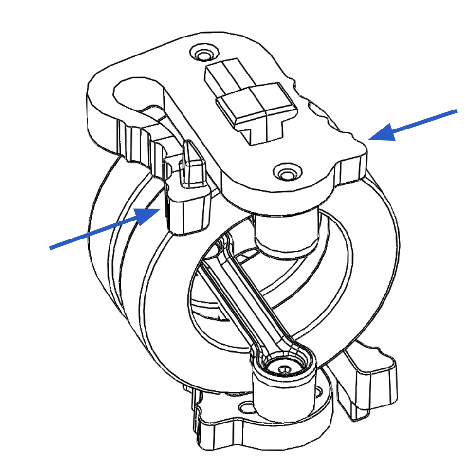

# Integrations

## RX Transmitter

ALTA X allows for the installation of a radio control system. S.Bus, S.Bus2, DSM2, and DSMX receiver types are supported. Some ALTA X emergency control modes \(Return-to-Land and Autoland\) may vary depending on the type of radio. Refer to the [Flight Controller Modes](../alta-8-pro/operating-alta-pro/flight-controller-modes.md#flight-controller-modes) section of this manual for additional details.

### **Installation of Futaba Radio**

<table>
  <thead>
    <tr>
      <th style="text-align:left"></th>
      <th style="text-align:left"></th>
      <th style="text-align:left"></th>
    </tr>
  </thead>
  <tbody>
    <tr>
      <td style="text-align:left">1.</td>
      <td style="text-align:left">Locate the bay used for receiver installation (between booms 2 &amp; 3
        )</td>
      <td style="text-align:left">
        
      </td>
    </tr>
    <tr>
      <td style="text-align:left">2.</td>
      <td style="text-align:left">Remove quick release door with radio wires:</td>
      <td style="text-align:left">
        
      </td>
    </tr>
    <tr>
      <td style="text-align:left">3.</td>
      <td style="text-align:left">Plug signal wire into receiver.</td>
      <td style="text-align:left">
        
      </td>
    </tr>
    <tr>
      <td style="text-align:left">4.</td>
      <td style="text-align:left">If using telemetry, plug the telemetry wire located in the bay between
        booms 2 &amp; 3 into the opposite side of the receiver.</td>
      <td style="text-align:left">
        
      </td>
    </tr>
    <tr>
      <td style="text-align:left">5.</td>
      <td style="text-align:left">Feed receiver antenna through bottom of chassis via the plastic ferrule.</td>
      <td
      style="text-align:left">
        
        </td>
    </tr>
    <tr>
      <td style="text-align:left">6.</td>
      <td style="text-align:left">
        
Secure receiver using the provided double-sided tape to inside of receiver
          housing.
           
        

        
Replace the quick release door.
           
        

      </td>
      <td style="text-align:left">
        
      </td>
    </tr>
    <tr>
      <td style="text-align:left">7.</td>
      <td style="text-align:left">Route antenna wires into the two antenna tubes below ALTA X chassis.</td>
      <td
      style="text-align:left">
        
        </td>
    </tr>
    <tr>
      <td style="text-align:left">8.</td>
      <td style="text-align:left">Repeat installation process for dual receivers (if applicable).</td>
      <td
      style="text-align:left"></td>
    </tr>
  </tbody>
</table>### **Installation of Spectrum Radio**

|  |  |  |
| :--- | :--- | :--- |
| 1. | Locate the bay used for receiver installation \(between booms 2 & 3 \) |  |
| 2. | Remove quick release door with radio wires: |  |
| 3. | Feed signal cable through panel grommet. |  |
| 4. | Plug in receiver/satellite into signal cable. |  |
| 5. | Attach receiver/satellite to exterior using double-sided tape. |  |

### Radio Controller Calibration and Mapping

ALTA X can be used with a variety of radio controllers. Different radio controllers can map functions to different channels, so properly mapping controller channels to ALTA X functions is an important step before flying. Radio calibration and channel mapping are performed using the ALTA QGroundControl program or app.

If you are uncertain about your radio channel mapping, obtain assistance from an experienced pilot or from Freefly Customer Support.

#### Calibrating Radios Using ALTA QGroundControl App

Calibrating any compatible radio is done using the ALTA QGroundControl app. This only needs to be done when using a new radio with the ALTA X; ALTA X that were bought with a radio have already gone through the Calibration and Mapping procedures.

1. Power the ALTA X by plugging in a USB-C cable to the expansion port. 
2. The expansion port is located under the closeout between booms 1 and 2
   .
3. Once connected, the ALTA X electronics will be powered and you may turn on the radio. 
4. Open the ALTA QGroundControl program, navigate to the Radio tab in the Vehicle Setup menu, and then initiate the radio calibration.
5. Set the transmitter mode radio button that matches your radio configuration \(this ensures that QGroundControl displays the correct stick positions for you to follow during calibration\).
6. Move the sticks to the positions indicated in the text \(and on the radio image\). Press Next when the sticks are in position. Repeat for all positions.
7. When prompted, move all other switches and dials through their full range \(you will be able to observe them moving on the Channel Monitor\).
8. Press Next to save the settings


Make sure to reset all trims and subtrims to zero before continuing with calibrating and mapping your radio.


#### Mapping Channels Using ALTA QGroundControl App

Radio channel mapping is accomplished with the ALTA Qgroundcontrol App. Prior to mapping channels, ensure your radio controller and receivers are properly installed and calibrated. Refer to the Radio Installation section of this manual and your radio controller’s documentation.

1. Power the ALTA X by plugging in a USB-C cable to the expansion port. 
   1. The expansion port is located under the closeout between booms 1 and 2
2. Once connected, the ALTA X electronics will be powered and you may turn on the transmitter. 
3. Open the ALTA QGroundControl program, navigate to the Flight Mode tab in the Vehicle Setup menu for access to the channel mapping.
4. Channel mapping can be customized by the user on this menu to fit their preferences. Below is a quick description of the items mapped to the transmitter and suggested channels for each mapped item.


Customers are advised to use tablets, laptops, or desktops to perform the Radio Calibration and Channel Mapping; some mobile devices may crop these menus.


#### Function Descriptions

The following functions can be mapped to radio controller channels. These are found in the Radio section of the Configurations menu in ALTA QGroundControl. Each function is also represented by a chart that responds to control input allowing for quick verification of mapping settings.
****

_**Controller**_

Use this to select the appropriate receiver. The following guide is compiled for convenience. For complete specifications and which mode will work with your receiver, refer to your radio controller or receiver manuals.

* DSM2/DSMX are typically used by Spektrum controllers
* SBUS is typically used by Futaba controllers

_**Pitch/Roll/Yaw/Throttle**_

The Pitch, Roll, Yaw and Throttle controls are the basic flight controls and are mapped to the two radio controller sticks.

_**Mode**_

The required Mode Switch selects between the three different flight modes: Manual, Altitude, and Position. A three-position switch is recommended to select the three different modes. However, a two-position switch may be used, but will only allow for selecting between Manual Mode and \(depending on radio controller mixes\) either Altitude Mode or Height Mode

_**Return to Home Switch**_

The optional Return to Home Switch selects between the different Return-to-Land \(RTH\) functions. At minimum a two-position switch is required for the Home Switch functions to select between RTL Off, and initiate RTL functions.

#### **Typical Channel Mappings**

The following radio channel mapping configurations are recommendations only and can be set in ALTA QGroundControl. Depending on exact radio models, these may help as an initial configuration. However, it is up to the pilot setting up ALTA X for flight to determine if these settings are appropriate.

_**Futaba 14SG/8FG**_

| Function | Channel Number | Direction |
| :--- | :--- | :--- |
| Pitch | 2 | Normal |
| Roll | 1 | Normal |
| Yaw | 4 | Normal |
| Throttle | 3 | Reverse |
| Mode Switch | 5 | Normal |
| Home Switch | 6 | Normal |

_**Spektrum DX18**_

| Function | Channel Number | Direction |
| :--- | :--- | :--- |
| Pitch | 3 | Reverse |
| Roll | 2 | Reverse |
| Yaw | 4 | Reverse |
| Throttle | 1 | Normal |
| Mode Switch | 6 | Reverse |
| Home Switch | 7 | Normal |

## FPV Camera and Transmitter

### FPV System installation

|  |  |  |
| :--- | :--- | :--- |
| 1. | Connect the FPV camera cable to the FPV extension located inside the chassis at the base of boom. |  |
| 2. | Screw the FPV mount to the top of the chassis with the \(x4\) M3x14 screws and washers. |  |
| 3. | Screw the FPV camera bracket to the FPV mount with \(x2\) M2.5x5 screws and washers. |  |
| 4. | Screw the FPV camera to the bracket using the included \(x4\) M2x4 screws and washers. |  |
| 5. | Plug the FPV cable into the back of the camera. |  |

### VTX System Installation

|  |  |  |
| :--- | :--- | :--- |
| 1. | Connect the VTX cable to the VTX extension located inside the chassis at the base of boom \#3 |  |
| 2. | Screw the VTX and its mount to the interior of the closeout panel adjacent to the base of boom \#3 using 2x M3x10 screws. Then plug in the VTX cable. This can be done without removing the closeout panel. |  |
| 3. | Route the SMA mount and cable through the access port at the base of boom \#3. Ensure you do not unplug the u.FL connector during this step. |  |
| 4. | Screw the SMA mount to the accessory mounting pattern using 2x M3x5 screws |  |
| 5. | Attach the included TBS Triumph Antenna to the SMA jack and tighten. |  |

## Phoenix LIDAR

Freefly has tested the [Phoenix LiDAR](https://www.phoenixlidar.com/miniranger/) systems to ensure easy integration and compatibility.  To use ALTA X with the the miniRANGER system simply install the system using the Toad in the Hole quick release, and then follow the normal LiDAR workflow as described by [Phoenix Aerial](https://phoenixlidar.gitbook.io/documentation/).

## External Computer

|  |  |  |
| :--- | :--- | :--- |
| 1. | To mount an external computer, first open the chassis.  Directions for opening the chassis can be found in the maintenance section. |  |
| 2. | Once the chassis is open use the 32x32 mm hole pattern in the lower chassis plate  to mount the computer.  The hole pattern is sized for M3 bolts.  |  |
| 3. | After mounting the external computer and routing its power and I/O cables, close the chassis. |  |

## Skyview

|  |  |  |
| :--- | :--- | :--- |
| 1. | Remove the \(x4\) M4x14 combo head bolts that secure the isolator assembly to the bottom of the aircraft. |  |
| 2. | Unbolt and remove the center battery support.  Using a 10mm wrench, remove the 4 posts from the bottom of the chassis.   |  |
| 3. | Secure the Skyview landing gear spacer to the chassis using \(x4\) M4x14 combo head bolts.  Attach the Skyview landing gear onto the spacer using the TITH quick release.  |  |
| 4. | Unbolt \(x4\) M4x10 socket heads and remove the spacer from the isolation assembly. |  |
| 5. | Attach the TITH plug using \(x4\) M4x8 socket head cap screws.  |  |
| 6. | Attach the vibration isolation assembly to the stiffener ribs on top of the chassis using \(x4\) M4x14 Combo head screws.  |  |
| 7. | ALTA X is now ready to fly in Skyview mode! |  |

## MoVI Carbon

To use MōVI Carbon with ALTA X we recommend using the 40 duro isolators that ship with ALTA X.  Install landing gear on MōVI Carbon and attach to ALTA X using the Toad in the Hole Quick Release.  We recommend using qty 2 12s 16Ah flight packs with MōVI Carbon as this will allow 20+ minute flight times.  Default Movi Carbon tuning should work well with ALTA X and FRX Pro can be added to MoVI Carbon to increase control range and robustness.

## Isolator Cartridges

Isolator cartridges are available in different durometers, which gives the user the ability to fine tune vibration damping performance for different payload weights or ambient temperatures. Durometer options include 30A, 40A, 50A, 60A. The durometer of a cartridge is shown in recessed lettering on each of the O-rings.  Use the chart below as a general guide choosing the correct isolator cartridges for your payload.

| Payload \[lb\] | Payload \[Kg\] | Isolator Durometer | Cartridge Qty |
| :--- | :--- | :---: | :---: |
| 0 - 3 \* | 0 - 1.4 | 30A | 3 |
| 4 - 10 \* | 1.8 - 4.5 | 30A | 6 |
| 11 - 19 \*\* | 5.0 - 8.6 | 30A | 9 |
| 20 - 23 \*\* | 9.1 - 10.4 | 30A/40A | 9 |
| 24 - 29 \*\* | 10.9 - 13.2 | 40A | 9 |
| 30 - 32 \*\* | 13.6 - 14.5 | 40A/50A | 9 |
| 33 - 35 \*\* | 15.0 - 15.9 | 50A | 9 |
| &gt;35 \*\*\* | &gt;15.9 | 60A | 9 |


\* Depends on Payload Sensitivity - run as many isolators as possible.

\*\* Mix and Match different durometers to attain desired vibration isolation qualities. When shooting video it is desirable to run the softest isolators possible without bottoming out the isolators.

\*\*\* 60A isolators should be used when the most rigid connection between payload and aircraft is desirable.


|  |  |  |
| :--- | :--- | :--- |
| 1. | To install, place the cartridges between the two isolator plates. Ensure they are engaged in the track features and are parallel with the plates. |  |
| 2. | Push inwards fully until they click, indicating the cartridges are locked in place. Pull outwards on the cartridge to ensure it is locked. |  |
| 3. | To remove, pinch the cartridge latch to unlock it from isolation plates and slide it outwards to disengage. |  |


Flight testing may be required to determine the optimal isolator for a given setup.


