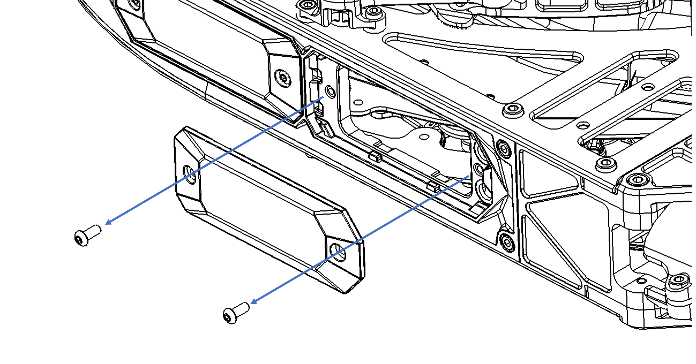
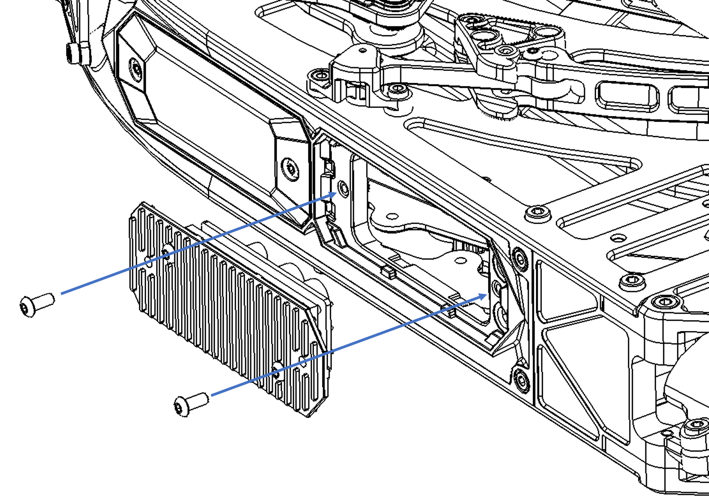
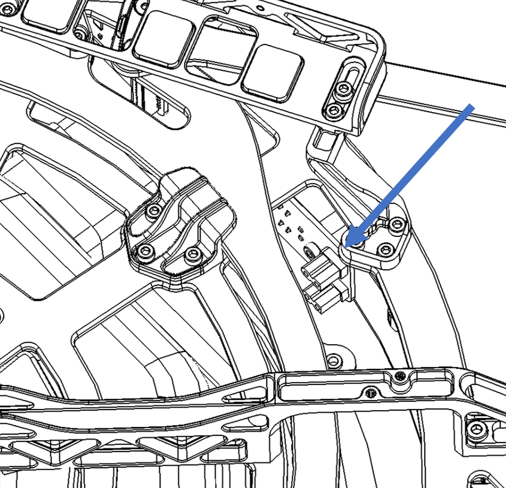

# 5V/12V DC-DC Converters

## Description & Specifications

The Freefly DC-DC converters draw power from the 50V battery bus and provide up to 120W of 5V or 12V DC. The converters utilize off the shelf converters mounted on a custom heatsink with and a custom capacitor board to provide better transient response.

| Spec | 12V | 5V |
| :--- | :--- | :--- |
| Operating input voltage range | 18-75VDC | 18-75VDC |
| Output voltage | 12VDC | 5VDC |
| Max output current \(Note 1\) | 10A | 24A |
| Max output power \(Note 1\) | 120W | 120W |
| Recommended max output power | 100W | 100W |
| Operating Temperature | -40C to 85C | -40C to 85C |
| Input power connector | XT30 \(Male Pins\) | XT30 \(Male Pins\) |
| Output power connector | XT60 \(Female Sockets\) | XT60 \(Female Sockets\) |

Note 1: Above ambient temperatures of 50C, some current/power derating will be necessary.

## Installation

The converter mounts onto any unused closeout. Installation steps:

|  |  |  |
| :--- | :--- | :--- |
| 1. | Remove two screws holding closeout door, remove closeout door |  |
| 2. | Install DC-DC converter using supplied button-head screws |  |
| 3. | Route & connect XT30 connector to inside of the power expansion board |  |
| 4. | Route XT60 connector to desired location |  |


The internal XT30s of the power expansion board share the same 10A fuse as J1.


## Operation Notes

The power converter will power on automatically as soon as the battery is connected on the aircraft.

* The power converter will power on automatically as soon as the battery is connected on the aircraft.
* The converters have overcurrent & short circuit protection, and will restart automatically upon clearing of overcurrent/short circuit condition.


Caution! The DC-DC converter heatsink may get very hot when drawing power.


