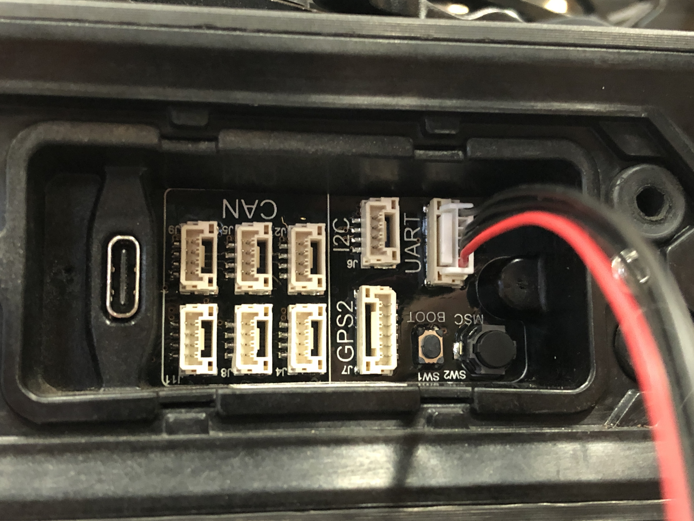
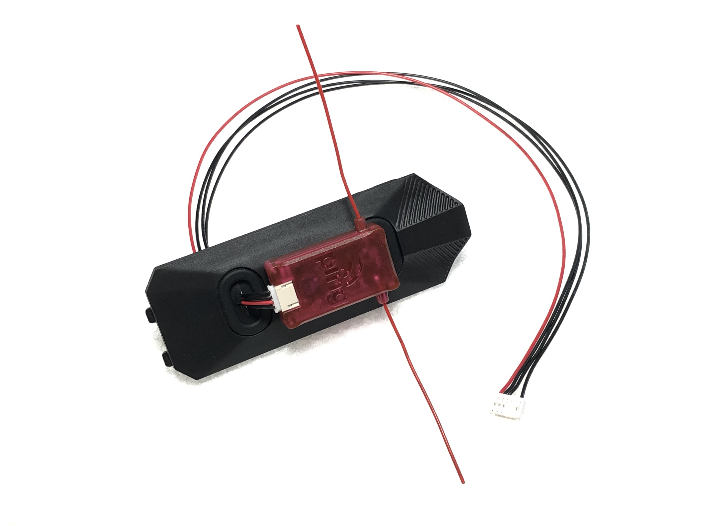
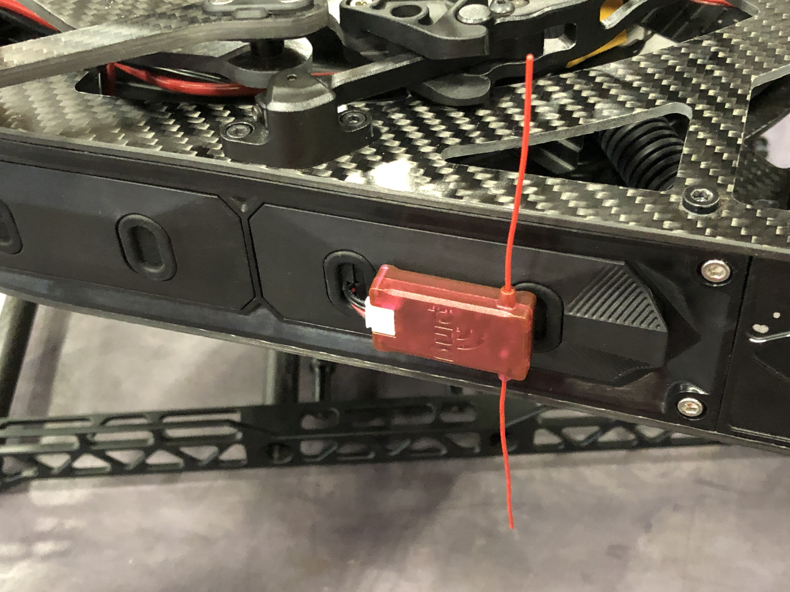
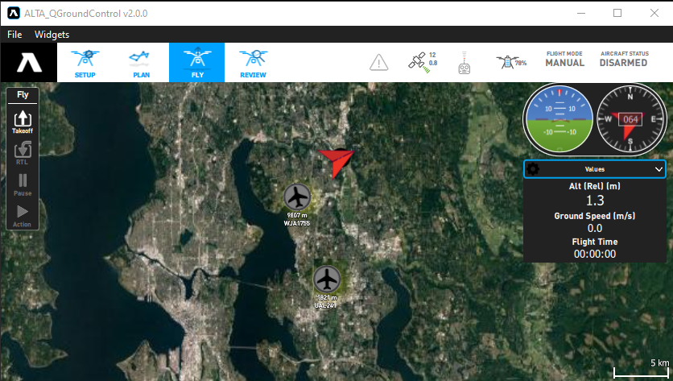

# ADS-B Receiver

## ALTA X Installation 

pingRX is a dual-frequency ADS-B traffic receiver for UAS Sense and Avoid. The pingRX can be connected to the UART port on the expansion board. In the ALTA Ground Control app change the parameter “SER\_TEL2\_BAUD” to 57600 8N1.

Mount the pingRX to the closeout panel with a double-sided adhesive pad. The antennas should be vertically oriented.

Aircraft ADS-B positions will show up in ALTA Ground Control map along with the call sign and altitude.

