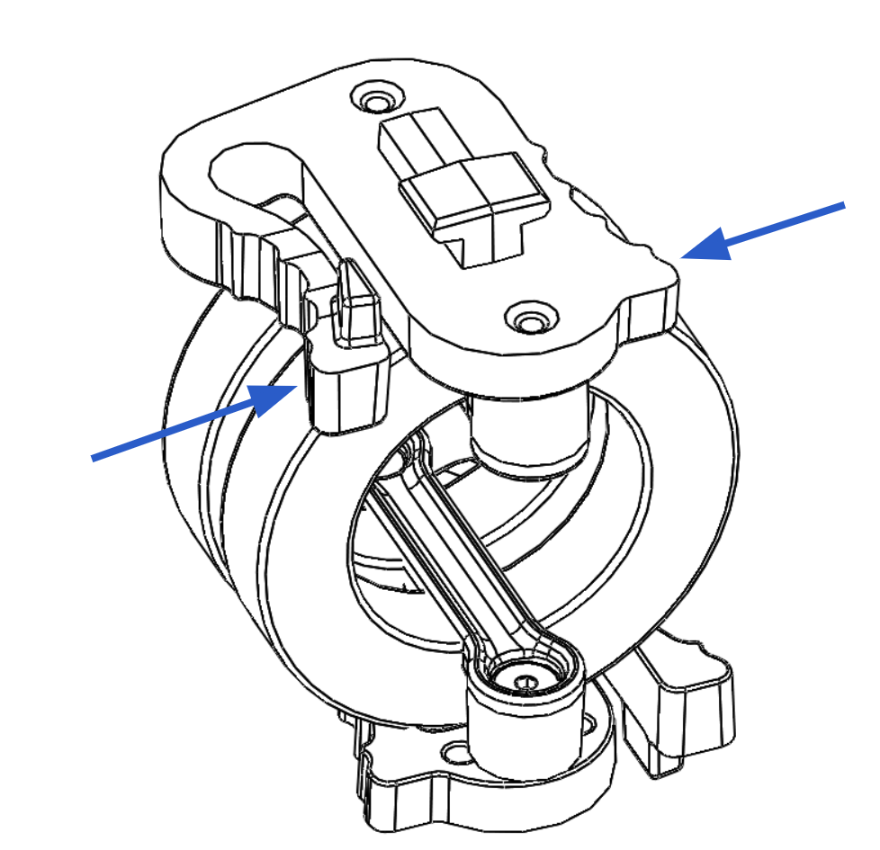

# Isolator Cartridges

Isolator cartridges are available in different durometers, which gives the user the ability to fine tune vibration damping performance for different payload weights or ambient temperatures. Durometer options include 30A, 40A, 50A, 60A. The durometer of a cartridge is shown in recessed lettering on each of the O-rings.  Use the chart below as a general guide choosing the correct isolator cartridges for your payload.

| Payload \[lb\] | Payload \[Kg\] | Isolator Durometer | Cartridge Qty |
| :--- | :--- | :---: | :---: |
| 0 - 3 \* | 0 - 1.4 | 30A | 3 |
| 4 - 10 \* | 1.8 - 4.5 | 30A | 6 |
| 11 - 19 \*\* | 5.0 - 8.6 | 30A | 9 |
| 20 - 23 \*\* | 9.1 - 10.4 | 30A/40A | 9 |
| 24 - 29 \*\* | 10.9 - 13.2 | 40A | 9 |
| 30 - 32 \*\* | 13.6 - 14.5 | 40A/50A | 9 |
| 33 - 35 \*\* | 15.0 - 15.9 | 50A | 9 |
| &gt;35 \*\*\* | &gt;15.9 | 60A | 9 |


\* Depends on Payload Sensitivity - run as many isolators as possible.

\*\* Mix and Match different durometers to attain desired vibration isolation qualities. When shooting video it is desirable to run the softest isolators possible without bottoming out the isolators.

\*\*\* 60A isolators should be used when the most rigid connection between payload and aircraft is desirable.


|  |  |  |
| :--- | :--- | :--- |
| 1. | To install, place the cartridges between the two isolator plates. Ensure they are engaged in the track features and are parallel with the plates. |  |
| 2. | Push inwards fully until they click, indicating the cartridges are locked in place. Pull outwards on the cartridge to ensure it is locked. |  |
| 3. | To remove, pinch the cartridge latch to unlock it from isolation plates and slide it outwards to disengage. |  |


Flight testing may be required to determine the optimal isolator for a given setup.


