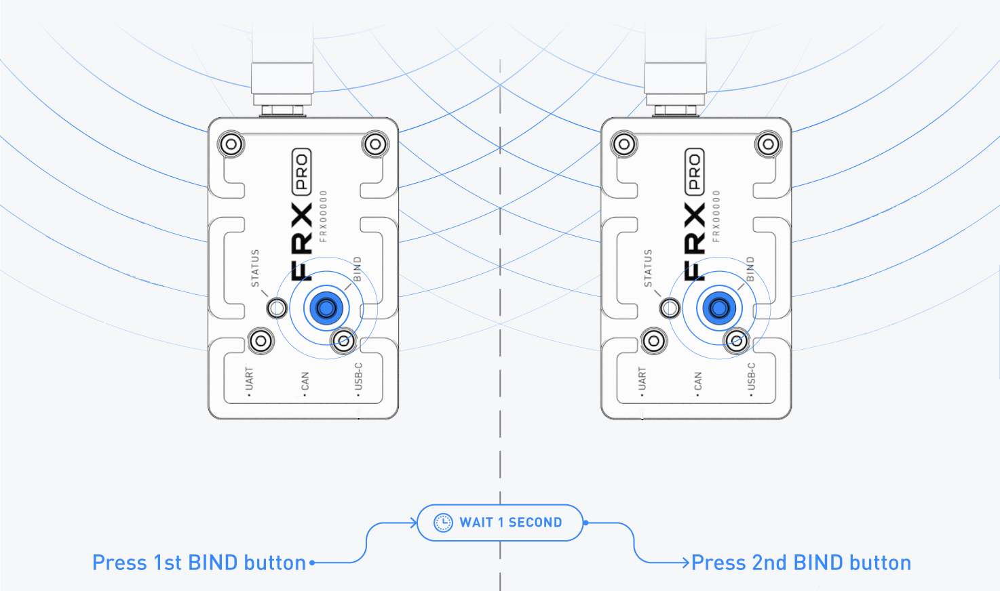
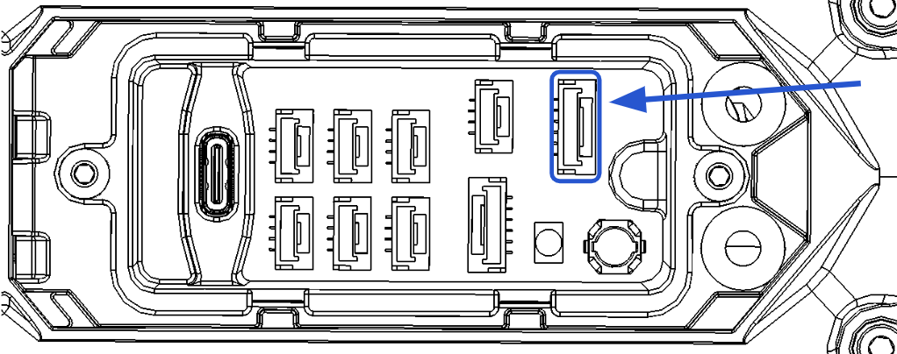

# Aircraft Setup

## Arming and Disarming

| Definitions |  |
| :--- | :--- |
| Armed | Aircraft will spin propellers, ready to fly |
| Disarmed | Safe mode, no spinning propellers |

### Arming

To arm ALTA, put the throttle stick in the bottom right corner for 1.5 seconds. Upon arming, the propellers will start spinning and the boom LED indicator lights will turn bright green/red.

If the ALTA does not arm, please check QGroundControl for errors or warnings.


When armed, propellers will spin! Please follow all precautions and stay a safe distance away from ALTA X. Before arming, make sure to stay clear of the propellers.


### Disarming

To disarm ALTA, put the throttle stick on the bottom left corner for 1.5 seconds. Upon disarming, the propellers will stop spinning and the boom LED indicators lights will dim. The aircraft will only disarm in flight in manual mode. Once landed, it can be disarmed in altitude and position modes.


Holding the throttle/yaw stick low and left in manual mode while flying can disarm the aircraft!


#### Auto Disarm Modes

Under some conditions, ALTA will automatically disarm

| Conditions                | ALTA X Behavior |
| :--- | :--- |
| Ground timeout before taking off                                             | If ALTA has not taken off after 2 minutes idling armed on the ground, it will automatically disarm. This timeout can be changed in parameter COM\_DISARM\_PRFLT \(units are in seconds, a value of “0” disables this timeout entirely\). |
| Ground timeout after flight | If ALTA has been previously flown but not power cycled, after 5 seconds idling armed on the ground, it will automatically disarm. This timeout can be changed in parameter COM\_DISARM\_LAND \(units are in seconds, a value of “0” disables this timeout entirely\). |
| Autoland | If ALTA detects landing in Autoland mode, it will disarm after 5 seconds following the logic above. See section “[Landing Modes](untitled-7.md#landing-modes)” for more information on the Landing Detector feature. |

## Flight Modes

ALTA X has three primary flight control modes which are selected using the Mode Switch: Manual Mode, Altitude Mode, and Position Mode. ALTA X also has two emergency control modes, Return-to-Land and Autoland, which are available only during certain situations. For additional information, refer to the sub-section associated with each [emergency control mode](../alta-8-pro/emergency-procedures/).


Altitude Mode and Position Mode are assistive only and are not a replacement for pilot skill and ability. Pilots should be proficient in Manual Mode flight in order to react to emergency situations as required.



Always center the control input sticks on the radio controller when switching between control modes to prevent unexpected movement of the ALTA X.


### Manual Mode

In Manual Mode, ALTA X will only stabilize its attitude. At neutral control input \(middle pitch and roll stick position\), ALTA X will attempt to remain level. Throttle control is direct. In this mode, it will blow with the wind, and will require constant throttle adjustment to hold altitude.

### Altitude Mode

Altitude Mode changes the throttle stick behavior to command climb and descent rates. The higher the throttle stick position, the faster ALTA X will climb. Conversely, the lower the throttle stick position, the faster ALTA X will descend.

When the throttle stick is centered, ALTA X will enter Altitude Hold. In Altitude Hold, ALTA X will maintain a target altitude and try to correct for vertical drift. If a disturbance moves ALTA X away from this target altitude, ALTA X will climb or descend to return to the target altitude.


Altitude Mode is assistive only and is not a replacement for pilot skill and ability. Pilots should be proficient in Manual Mode flight in order to react to emergency situations as required.


### Position Mode

Position Mode changes the pitch/roll stick behavior to command ground speeds. Pitch and roll stick deflection will command fore/aft and left/right ground speeds respectively. Controlling altitude in Position Mode is the same as in Altitude Mode.

With pitch and roll controls centered, ALTA X will enter Position Hold. In Position Hold, ALTA X will maintain its position over a given point on the ground and correct for disturbances.

Position Mode requires a strong GPS signal and communication with a minimum of 6 satellites. If a weak signal is present, ALTA X will not enter Position Mode


Position Mode is assistive only and is not a replacement for pilot skill and ability. Pilots should be proficient in Manual Mode flight in order to react to emergency situations as required.



Flight using Position Mode in areas of degraded GPS signal, such as near buildings or under dense tree cover, is not recommended. The automatic reversion to Manual Mode can cause unexpected, abrupt changes in flight behavior.


### Waypoints Mode

Waypoints mode allows ALTA X to execute a predefined autonomous waypoint missions that have been uploaded to the flight controller via ALTA QGroundControl \(QGC\). For more information on all of the different options and abilities built into the Waypoint functionality you can read more in the [PX4 Literature](https://docs.px4.io/v1.9.0/en/flight_modes/mission.html).


ALTA X must have a GPS lock before takeoff to set a valid home position in order to start a waypoints mission. Waypoint mode will be unavailable if the aircraft took off before GPS lock was achieved. Operator must land and rearm with GPS lock to enable.


### Return-to-Launch

Return-to-Launch Mode will command ALTA X to fly back to the defined Home Point. When ALTA X first acquires a GPS position, it sets this as the Home Point of the flight. See the Radio Channel Mapping section in this manual for more information on setting up the Return-to-Launch Switch.

RTL can be initiated automatically with a LOS event if it is selected as the Signal Loss Action in ALTA QGroundControl. RTL can also be initiated manually while flying in any Mode and setting the Home Switch to RTL.

When initiated manually using the Home Switch, ALTA X will climb to the configured return altitude, fly back to the Home Point, and descend to 10m. ALTA X will hover above the home point and wait for a set amount of time and then land. The pilot can cancel the RTL procedure by returning the Home Switch to off.

During an LOS event, RTL followed by Autoland will be initiated automatically. ALTA X will first check its current altitude against configured RTL altitude. ALTA X will climb to Safe Height. Next, ALTA X will fly back to the home position at the default waypoint speed set in the ALTA X QGroundControl. Finally, upon reaching the home position, ALTA X will loiter for 45s and then begin to Autoland.

The Autoland function will land in place. The vertical speed at which the ALTA will descend during an Autoland varies as the ALTA approaches the ground. Higher above the elevation of the home point, ALTA X descends at a faster rate and gradually slows to the user-defined Autoland Descent Rate before landing. By default, the aircraft will descend at 0.7m/s until touchdown is detected. 


Autoland is intended to be a failsafe in case of loss of RC control only. If control is available, the operator should land in manual mode. High wind, sloped ground, and narrow landing gear on the current payload can make the aircraft prone to tip over when autolanding. Reducing the autoland velocity may result in missed land detection for some weight combinations, which can have unpredictable results, so it is advised not to change this value.



The RTL switch on the radio will override all other modes, and prevent any mode switches. To return to a normal flight mode, make sure to toggle the RTL switch to OFF. 



Ensure that the RTL switch is OFF before takeoff.


## Landing Modes

It is suggested that the operator lands in Manual mode, as it offers the most control for a precise touchdown. However it is possible to land in Altitude and Position modes as well. The aircraft behaves a little differently in each mode:

### Manual Mode

In manual mode, the operator will maneuver the aircraft over the landing spot, and descend slowly using direct throttle control. As the aircraft nears the ground and enters ground effect, the pilot will often need to reduce throttle a little bit to keep the aircraft descending. Once touchdown is achieved, the operator should reduce throttle to zero promptly so that it settles on the ground instead of possibly bouncing or dragging the gear. Disarm as normal.

### Altitude Mode

Landing in altitude mode is different than manual because the throttle stick now controls descent velocity rather than throttle directly. The aircraft will automatically adjust throttle through ground effect to maintain the same descent velocity. The operator will still need to manually control pitch and roll to maintain position over the desired landing site. Once the aircraft is on the ground, bring throttle stick to minimum, and then switch to manual mode and disarm. The aircraft will automatically disarm after 5 seconds if left running.

### Position Mode

Landing in position mode uses the same altitude control as in Altitude mode, but additionally will control the position. This can be useful as it will fight the wind and drift automatically, but the aircraft may maintain a pitch and roll to do so, requiring care to avoid a prop strike on the ground or a tipover when using narrow landing gear. As the aircraft nears the ground, the maximum angle will be reduced to prevent large scale reactions to stick moments, but the operator should keep pitch and roll motions to a minimum when near the ground. Once the aircraft is on the ground, bring throttle stick to minimum, and then switch to manual mode and disarm. The aircraft will automatically disarm after 5 seconds if left running

### Autoland Mode

It is possible to command the aircraft to autoland, as described above. It is not recommended in cases other than failsafe, or after careful testing. Autoland is not as precise as a human pilot, and certain payload combinations can result in tipovers or bouncing. Tall, narrow landing gear is particularly susceptible to tipover on autoland in high winds.


If the aircraft tips over with the props running, ALWAYS power cycle the aircraft before attempting takeoff again. If the motors or props hit the ground, they may not start on next arm and cause it to tip again.


## Important Parameters

| Parameter | Function |
| :--- | :--- |
| MPC\_THR\_HOVER | Controls the throttle setpoint required for hovering. This depends on the weight of the aircraft, and is about 29% for no payload. Default is 40% for a 15lb payload. Setting this parameter correctly will eliminate drops or climbs when switching between manual and either altitude or position mode with the throttle stick at 50%.  |
| BOOM_\(1-4\)_\_COLOR | Controls the color of each boom LED. |
| OSD\_\(\*\*\*\*\*\) | All parameters starting with 'OSD\_' configure how the OSD looks and acts. |
| OSD\_BAT\_ALARM | Sets what cell voltage the aircraft will flash the Boom lights and the OSD battery symbol to indicate low battery to the user. |
| MPC\_MAN\_TILT\_MAX | Defines how far the aircraft is allowed to tilt while being controlled in manual mode. This can be reduced for a little less aggressive feeling for a pilot. Recommended to leave at 45 degrees for maximum performance. Reducing to 35 degrees will give a more gentle and slow flight handling. This parameter only affects manual mode. In position and automodes, the aircraft angle is set to 45 for performance. |
| MPC\_VEL\_MANUAL | Defines how fast the maximum speed the aircraft will fly in position mode. This can be reduced for more fine control at lower speeds. |
| MPC\_XY\_CRUISE | Defines the default waypoint speed, as well as the RTL speed. This can be increased up to 20m/s, however it is suggested to set waypoint velocity separately for missions. If setting this high and commanding slow waypoint velocities may result in the aircraft slowing down too far in advance of a waypoint. |
| \*\_EXPO | Controls stick expo in different modes, can be used to adjust the feel of the aircraft while flying. More expo will require more stick input to get the same angle or speed when near zero stick, and will increase rapidly to maximum once the stick is at higher deflections. |
| MPC\_Z\_VEL\_MAX\_\(_UP/DN\)_ | Controls maximum climb and descent velocities in altitude, position and waypoint modes.
 |

## Mission Planning

### Creation/Modification/Execution

Missions can be created, loaded, saved, and modified from the Plan View. An overview of Plan View can be found in public [QGC documentation](https://docs.qgroundcontrol.com/en/). Click on \(+\) sign at the toolbar left of the screen to enter waypoint addition mode. In this mode, users can add waypoints by tapping or left clicking on the 2D map. A new plan can be created by clicking File -&gt; New -&gt; Yes when in Plan View.

To modify a waypoint, first click on it. The selected waypoint will turn green. Click and hold on clicking for a second time to drag the waypoint around the map. Latitude and longitude values will change automatically. 

When the initial waypoint is added, a Planned Home indicator is automatically added. Initial waypoint will automatically be named as “Takeoff”. Planned Home is where the aircraft will land if a return to home signal is sent, unless there are rally points. Takeoff location is the first waypoint the vehicle will move towards as soon as mission mode is entered.

Users can observe mission specific values such as total mission time or total mission distance from the panel at the top of the screen. Once users are finished modifying a mission the mission needs to be uploaded to the vehicle. If a vehicle connection is established with the QGroundControl, a button named “Upload Mission” will be highlighted as soon as user makes a modification to the mission itself. Click on “Upload Mission” to load the mission file. Afterwards, go to “Flight View”. Uploaded mission can be executed from the Flight View by sliding the mission start slider or taking the vehicle into mission mode.

### Detailed Mission Items

|  |  |
| :--- | :--- |
| Waypoint specific Variables | Waypoint specific values -such as speed, altitude or commands- can be modified by selecting a waypoint and using the detailed waypoint list at the right hand side of the screen.  |
| Planned Home | Planned Home \(a.k.a Mission Start\) item in the detailed waypoint list can be used as a settings item. The altitude and flight speed values will be passed to all other waypoints along the list. |
| Mission Ending | Mission ending characteristics can be customized by toggling “return to home” option. |
| Home Position | The home position can be changed and centered to the middle of the map from the settings item. |

### Advanced Users

Detailed waypoint list can be used to give commands at each waypoint. Command menu can be accessed by clicking on the three horizontal lines \(top right of waypoint details panel\). These commands will add an extra waypoint. The point of this waypoint is to indicate that there will be a command executed, it’s not really a physical waypoint. These commands include the following options: return to home, go to another waypoint, land and takeoff. Since the addition of the “command waypoint” might cause confusion, users are advised to get hands-on experience with simpler missions.

The Flight Speed variable inside the detailed waypoint list assigns a speed value that will be executed after vehicle passes the waypoint. For example, if default Flight Speed is set to 5 m/s and it is re-set to 20 m/s at third waypoint, vehicle will start to increase its speed from 5 m/s to 20 ms/ as soon as it passes waypoint three. So the target flight speed between waypoint 3 and waypoint 4 will be 20 m/s. Unless flight speed is reset back to 5 m/s at waypoint 4, 20 m/s value will be passed to rest of the waypoints. 

## Tuning

ALTA X is pretuned by Freefly, and can be flown without changes. However, each user may have a different preference or use case for their aircraft. This section gives some guidance for how to tune some of the behaviors of the aircraft to suit individual needs. It is NOT recommended to tune low-level control parameters, as they could cause instability or control issues which could result in a crash.

| Issue | Tuning Resolution |
| :--- | :--- |
| My aircraft is too aggressive in manual mode | Reduce MPC\_MAN\_TILT\_MAX to 30-35 degrees. Do not reduce it further as it may not be able to handle wind. |
| My aircraft is too fast in position mode | Decrease MPC\_VEL\_MANUAL - this value defines the maximum speed at full stick in position mode. If a more precise, slow velocity is required, reducing this will cap the speed and give more stick sensitivity at lower speed |
|  | Increase MC\_XY\_MAN\_EXPO to decrease sensitivity for small stick motions. |
| My aircraft climbs or descends too quickly/slowly in altitude and position mode | Adjust MPC\_Z\_VEL\_MAX\_DN and MPC\_Z\_VEL\_MAX\_UP. They control the maximum speed |
| My aircraft accelerates too slowly or quickly in position mode | Adjust parameter MPC\_ACC\_HOR to increase or decrease the acceleration used to reach the desired velocity. Value is m/s^2 |
|  | Adjust parameters MPC\_ACC\_UP/DOWN\_MAX to control how fast the aircraft accelerates vertically. |


Loading the defaults or known-good presets will allow you to quickly return functional ALTA X if there is ever uncertainty about changes to the tuning properties.


## Sensor Calibration

ALTA X features redundant,  highly sensitive 3-axis magnetometers, gyroscopes, and accelerometers that measure specific force, angular rate, and earth’s magnetic field to infer heading and maintain stability. Occasionally, the sensors will require re-calibration.


ALTA X’s compass may require calibration if locations have changed. For best results, it is recommended to perform manual compass calibrations away from ferrous objects, buildings and vehicles. In addition, concrete can contain steel rebar which may influence compass calibrations.



Perform calibration without a payload attached and all motor booms extended and latched. Folded booms will cause an inaccurate calibration. 

It is recommended to use two people to perform the compass calibration as it requires handling and rotating ALTA X.



Alta X has 4 magnetometers, one in the GPS mast, and 3 internally used as backups. In cases where a payload is mounted that affects the onboard magnetometers more than the external one, QGroundControl will notify the user that magnetometers are inconsistent. Users can calibrate the aircraft with the payload attached to solve. 

If the payload is causing enough corruption that calibrating with it on does not work, contact Freefly support for alternative solutions.


### Sensor Calibration Prep

<table>
  <thead>
    <tr>
      <th style="text-align:left"></th>
      <th style="text-align:left"></th>
      <th style="text-align:center"></th>
    </tr>
  </thead>
  <tbody>
    <tr>
      <td style="text-align:left">1.</td>
      <td style="text-align:left">Mount a pair of batteries onto ALTA X.</td>
      <td style="text-align:center"></td>
    </tr>
    <tr>
      <td style="text-align:left">2.</td>
      <td style="text-align:left">Plug in the batteries to power up the aircraft.</td>
      <td style="text-align:center"></td>
    </tr>
    <tr>
      <td style="text-align:left">3.</td>
      <td style="text-align:left">Open the ALTA QGroundControl and connect to ALTA X.</td>
      <td style="text-align:center"></td>
    </tr>
    <tr>
      <td style="text-align:left">4.</td>
      <td style="text-align:left">Navigate to the Sensors tab under Vehicle Setup.</td>
      <td style="text-align:center"></td>
    </tr>
    <tr>
      <td style="text-align:left">5.</td>
      <td style="text-align:left">Available sensors are displayed as a list of buttons beside the sidebar.
        Sensors marked with green are already calibrated. Sensors marked with red
        require calibration prior to flight.</td>
      <td style="text-align:center">
        

          
        

        

          
        

      </td>
    </tr>
    <tr>
      <td style="text-align:left">6.</td>
      <td style="text-align:left">Click on the button for each sensor to start its calibration sequence
        and follow the instructions provided in the ALTA X QGroundControl.</td>
      <td
      style="text-align:center"></td>
    </tr>
    <tr>
      <td style="text-align:left">7.</td>
      <td style="text-align:left">
        
Start by selecting Set Orientations and set the autopilot orientation

        <ol>
          <li>Autopilot Orientation: <b>ROTATION_YAW_180</b>
          </li>
          <li>External Compass Orientation: <b>ROTATION_YAW_270</b>
          </li>
        </ol>
      </td>
      <td style="text-align:center"></td>
    </tr>
  </tbody>
</table>### Compass Calibration

Follow the instructions below to perform a compass calibration on ALTA X. Compass calibrations should be done when flying in a new location or when ALTA QGroundControl prompts a calibration.

<table>
  <thead>
    <tr>
      <th style="text-align:left"></th>
      <th style="text-align:left"></th>
      <th style="text-align:left"></th>
    </tr>
  </thead>
  <tbody>
    <tr>
      <td style="text-align:left">1.</td>
      <td style="text-align:left">Click the Compass sensor button.</td>
      <td style="text-align:left"></td>
    </tr>
    <tr>
      <td style="text-align:left">2.</td>
      <td style="text-align:left">Click OK to start the calibration.</td>
      <td style="text-align:left"></td>
    </tr>
    <tr>
      <td style="text-align:left">3.</td>
      <td style="text-align:left">Place the vehicle in any of the orientations shown in red (incomplete)
        and hold it still. Once prompted (the orientation-image turns yellow),
        rotate the vehicle around the specified axis in either/both directions.
        Once the calibration is complete in that orientation the associated image
        on the screen will turn green.</td>
      <td style="text-align:left">
        

        

          
        

      </td>
    </tr>
    <tr>
      <td style="text-align:left">4.</td>
      <td style="text-align:left">Repeat the calibration process for all vehicle orientations.</td>
      <td style="text-align:left"></td>
    </tr>
  </tbody>
</table>### Accelerometer Calibration

Follow the instructions below to perform an accelerometer calibration on ALTA X. Accelerometer calibrations should only be done when prompted by ALTA QGroundControl.

<table>
  <thead>
    <tr>
      <th style="text-align:left"></th>
      <th style="text-align:left"></th>
      <th style="text-align:left"></th>
    </tr>
  </thead>
  <tbody>
    <tr>
      <td style="text-align:left">1.</td>
      <td style="text-align:left">Click the Accelerometer sensor button.</td>
      <td style="text-align:left"></td>
    </tr>
    <tr>
      <td style="text-align:left">2.</td>
      <td style="text-align:left">Click OK to start the calibration.</td>
      <td style="text-align:left"></td>
    </tr>
    <tr>
      <td style="text-align:left">3.</td>
      <td style="text-align:left">Position the vehicle as guided by the images on the screen. This is very
        similar to compass calibration.</td>
      <td style="text-align:left">
        

        

          
        

      </td>
    </tr>
  </tbody>
</table>### Level Horizon Calibration

Follow the instructions below to perform a level horizon calibration on ALTA X. Horizon calibrations should only be done if the horizon \(as shown in the HUD\) is not level after completing Accelerometer calibration and the aircraft is sitting on a level surface.

|  |  |
| :--- | :--- |
| 1. | Click the Level Horizon sensor button. |
| 2. | Place the vehicle in its level flight orientation on a level surface. |
| 3. | Click OK to start the calibration. |

## GPS Lights

The GPS module includes multi-color LED status lights that provide extra indication of aircraft status on the ground.

<table>
  <thead>
    <tr>
      <th style="text-align:left"></th>
      <th style="text-align:left">
        

        

          
        

      </th>
      <th style="text-align:left"></th>
    </tr>
  </thead>
  <tbody>
    <tr>
      <td style="text-align:left"><b>GPS Color</b>
      </td>
      <td style="text-align:left"><b>Meaning</b>
      </td>
      <td style="text-align:left"><b>Description</b>
      </td>
    </tr>
    <tr>
      <td style="text-align:left">Solid Blue</td>
      <td style="text-align:left">Armed, No GPS Lock</td>
      <td style="text-align:left">
        
Indicates vehicle has been armed and has no position lock from the GPS.
          Position, Mission and RTL flight modes are not available.
           
        

        
Warning! When armed, propellers will start spinning!
           
        

      </td>
    </tr>
    <tr>
      <td style="text-align:left">Pulsing Blue</td>
      <td style="text-align:left">Disarmed, No GPS Lock</td>
      <td style="text-align:left">Indicates vehicle is disarmed armed and has no position lock from the
        GPS. Position, Mission and RTL flight modes will not be available until
        GPS lock is acquired.</td>
    </tr>
    <tr>
      <td style="text-align:left">Solid Green</td>
      <td style="text-align:left">Armed, GPS Lock</td>
      <td style="text-align:left">
        
Indicates vehicle has been armed and has position lock from the GPS. All
          flight modes are available.
           
        

        
Warning! When armed, propellers will start spinning!
           
        

      </td>
    </tr>
    <tr>
      <td style="text-align:left">Pulsing Green</td>
      <td style="text-align:left">Disarmed, GPS Lock</td>
      <td style="text-align:left">Indicates vehicle is disarmed and has position lock from the GPS. All
        flight modes will be available.</td>
    </tr>
    <tr>
      <td style="text-align:left">Solid Purple</td>
      <td style="text-align:left">Failsafe Mode</td>
      <td style="text-align:left">Indicates an error has been encountered during flight and the vehicle
        will enter RTL mode.</td>
    </tr>
    <tr>
      <td style="text-align:left">Solid Amber</td>
      <td style="text-align:left">Low Battery Warning</td>
      <td style="text-align:left">Indicates a battery voltage below threshold.</td>
    </tr>
    <tr>
      <td style="text-align:left">Flashing Red</td>
      <td style="text-align:left">Error / Setup Required</td>
      <td style="text-align:left">Indicates an error, typically an issue with sensor calibration or autopilot
        configuration.</td>
    </tr>
  </tbody>
</table>## WIFI and FRX Connectivity

ALTA X provides two main connectivity methods for wireless telemetry: WIFI for short range, FRX Pro \(optional\) for long range. The wireless connectivity allows users to define parameters, monitor ALTA and configure missions.

### WIFI

WiFi is most useful during preflight planning. WIFI is disabled by default, please see the next section for enabling WiFi.

After enabling the WIFI, connect your ground control device to the SSID \(“ALTAX-\[SN\]"\). Once connected, open QGroundControl, and it will automatically detect the connection and connect to the ALTA.


If operating multiple ALTAs, please make sure you connect to the correct one. It is advised to set different passwords for each aircraft to minimize chance of erroneous connections. 


#### Enable and configure WIFI

ALTA X allows users to update the system’s WiFi password and SSID. All ALTA Xs initially come with WiFi disabled for safety reasons. To enable WiFi connectivity follow the steps below!


Please read this entire section if you intend to use the WiFi feature of ALTA X.

When flying multiple aircraft with WiFi enabled, take extreme caution to ensure that the aircraft connected to the laptop/mobile device is the desired craft. Failing to connect to the correct device may result in an inadvertently arming a aircraft or disarming one that is inflight
.


|  |  |
| :--- | :--- |
| 1. | Connect to ALTA X using the FRX Pro or USB |
| 2. | Go to the System Parameters under the Parameter tab in the Vehicle Setup menu and find the FF\_WIFI\_ENABLE parameter |
| 3. | Change the FF\_WIFI\_ENABLE parameter to 1 and MAV\_1\_CONFIG to "TELEM2" and restart ALTA X  |
| 4.  | Check \(or set\) the following parameters to configure wifi: MAV\_1\_MODE=Normal, MAV\_1\_RATE = 20000,  MAV\_1\_FORWARD=Disabled, and SER\_TEL2\_BAUD=921600 8N1 |
|  | Restart the Alta X and connect with a wifi device.  |

<table>
  <thead>
    <tr>
      <th style="text-align:left"></th>
      <th style="text-align:left"></th>
      <th style="text-align:left"></th>
    </tr>
  </thead>
  <tbody>
    <tr>
      <td style="text-align:left">1.</td>
      <td style="text-align:left">
        

        
Connect to ALTA X&#x2019;s WiFi using the initial password listed below

        <ul>
          <li>SSID: ALTAX-&lt;serial number&gt;; eg. ALTAX-781880</li>
          <li>Password: altaalta</li>
        </ul>
      </td>
      <td style="text-align:left">Note that this connection won&apos;t provide internet, and some devices
        may disconnect if not internet is detected. Users will have to disable
        this feature to use Alta X WIFI</td>
    </tr>
    <tr>
      <td style="text-align:left">2.</td>
      <td style="text-align:left">Open your preferred web browser and go to 192.168.4.1</td>
      <td style="text-align:left"></td>
    </tr>
    <tr>
      <td style="text-align:left">3.</td>
      <td style="text-align:left">
        
Select setup, then update the SSID and password as necessary. Make sure
          to make the password is eight characters long, secure, and noted down somewhere
          in case you forget!

        <ul>
          <li><b>Do not change any of the other menu items!</b>
          </li>
        </ul>
      </td>
      <td style="text-align:left">
        

        

          
        

      </td>
    </tr>
    <tr>
      <td style="text-align:left">4.</td>
      <td style="text-align:left">Once the password and SSID have been updated, hit the save button at the
        bottom of the menu.</td>
      <td style="text-align:left">
        

        

          
        

      </td>
    </tr>
    <tr>
      <td style="text-align:left">5.</td>
      <td style="text-align:left">Power cycle ALTA X and ensure you can connect to ALTA X using the new
        password.</td>
      <td style="text-align:left"></td>
    </tr>
  </tbody>
</table>#### Configure WIFI settings


ALTA X passwords must be longer than eight characters and should be unique for each ALTA X. Do not use the same password on multiple machines!



We suggest not selecting ‘Connect Automatically’ when using WiFi to connect to ALTA X and clearly labeling each FRX Pro pair.


### FRX Pro

#### Reset Wifi

To reset the wifi, follow these steps:

|  |  |  |
| :--- | :--- | :--- |
| 1. | Power off Alta X |  |
| 2.  | Hold MSC button and connect USB power, wait for it to load into USB file mode |  |
| 3.  | With the aircraft still powered on in USB file mode, press and hold the BOOT button for 10 seconds.  |  |
| 4. | The Wifi will default to SSID: ALTA with password "altaalta" |  |
| 5. | Change the wifi settings as described above in "Configure WIFI Settings"  |  |

The optional FRX Pro long range radio provides telemetry and aircraft control out to much longer range than the WiFi connection.

#### Using FRX Pro

<table>
  <thead>
    <tr>
      <th style="text-align:left"></th>
      <th style="text-align:left"></th>
      <th style="text-align:left"></th>
    </tr>
  </thead>
  <tbody>
    <tr>
      <td style="text-align:left">1.</td>
      <td style="text-align:left">
        

        
Plug the ground FRX Pro into a laptop or portable device using a USB-C
          cable

        <ul>
          <li>The device should recognize the FRX as a serial comms device</li>
          <li>The LED on the FRX will light up</li>
        </ul>
      </td>
      <td style="text-align:left"></td>
    </tr>
    <tr>
      <td style="text-align:left">2.</td>
      <td style="text-align:left">Power up ALTA X, if bound the FRX&apos;s will connect automatically and
        begin sending data back and forth.</td>
      <td style="text-align:left"></td>
    </tr>
  </tbody>
</table>#### Binding FRX Pro

<table>
  <thead>
    <tr>
      <th style="text-align:left"></th>
      <th style="text-align:left"></th>
    </tr>
  </thead>
  <tbody>
    <tr>
      <td style="text-align:left">1.</td>
      <td style="text-align:left">Power up the ALTA that has the FRX Pro using batteries (powering up with
        USB will not provide power to the FRX)</td>
    </tr>
    <tr>
      <td style="text-align:left">2.</td>
      <td style="text-align:left">Plug the ground FRX Pro into a laptop using the USB-C cable</td>
    </tr>
    <tr>
      <td style="text-align:left">3.</td>
      <td style="text-align:left">
        
If the FRX Pro modules are already bound and connected to a ground station
          FRX Pro, the status lights on both FRX Pro modules will turn green after
          a few seconds.

        <ul>
          <li>If the status light on both radios does not turn green after 10 seconds,
            press the bind button of the FRX Pro connected to the controller, wait
            one second, then press the bind button of the other FRX Pro.</li>
        </ul>
      </td>
    </tr>
    <tr>
      <td style="text-align:left">4.</td>
      <td style="text-align:left">
        <ul>
          <li>Both FRX Pro&apos;s status lights will begin flashing green and the modules
            will initiate the binding procedure.
            <ul>
              <li>If the FRX Pro modules cannot establish a connection the status lights
                will turn red and then return to their standby state.</li>
            </ul>
          </li>
        </ul>
      </td>
    </tr>
    <tr>
      <td style="text-align:left">5.</td>
      <td style="text-align:left">Repeat the binding steps above if a binding attempt fails.</td>
    </tr>
  </tbody>
</table>
FRX Pros configured for use in non-ALTA products \(ie, Mōvi\) need to be reconfigured before they can be used in ALTA. Please contact Freefly for instructions to reconfigure the radios. The symptom for mis-configured radios is that only one radio shows a Green LED and rebinding does not reestablish communications.


## Datalogging

ALTA X provides comprehensive logging capabilities, which are enabled by default. In the default configuration, logging starts when the aircraft is armed, and ends when the aircraft is disarmed. These logs are stored on the onboard SD card, and can be downloaded to provide information about the flight. 

### Downloading Datalogs

Logs are stored on the onboard SDcard. To download them, follow the following steps.

|  |  |
| :--- | :--- |
| 1. | Ensure the ALTA X's battery  is unplugged. |
| 2. | Hold down the button labeled “MSC” on the expansion board while plugging in a USB-C cable that is attached to a computer. Hold the MSC button for 5 seconds. |
| 3. | The aircraft should enumerate as a USB drive on the host computer. This may take another 10-15 seconds depending on the host PC. |
| 4. | Open the new USB drive in a file manager. |
| 5. | The “logs” subdirectory contains all the logs. |
| 6. | In the logs directory, there are subdirectories labeled with a date. In each folder is a time stamped file with a “.ulg” extension. These are the logs |
| 7. | Download whichever logs are of interest. There may be some logs with very small file sizes, less than 1MB. These are typically generated by arming and then immediately disarming. |


If the aircraft never acquired GPS, the aircraft may not have good time information and may label the folder as “sess002” or equivalent. In this case, the largest number is the most recent.



Logs can be downloaded using QGroundControl over the datalink, but this is discouraged as it is VERY slow and the logs are often corrupt. USB mode is recommended.


### View Datalogs

Log files are in “[ulog](https://dev.px4.io/v1.9.0/en/log/ulog_file_format.html)” format. This format is binary, and contains extensive information about the flight and the vehicle. The easiest way to view the logs is to browse to [http://logs.px4.io](http://logs.px4.io) and upload the ulg file. It will present many plots showing data such as angles, position, speed, GPS quality, vibration, etc. It will also show the build information, current configuration, and any errors detected in the flight. 

### Log Cleanup

The onboard SD card holds 8GB of data, which is able to store logs for hundreds of flight hours. The ALTA X will start to delete old logs if it runs out of space, so it is useful to periodically clean out the logs if you don’t want them to be lost. Download all the logs as shown above, and then delete all \(or some\) of the folders in the “logs” subdirectory.

## MAVLink

ALTA X supports MAVLink connection via two connectors, with one on the communications expansion panel on the outside of the aircraft \(labeled UART\) and one inside the aircraft.

### External Expansion Panel UART

The external UART connection uses 57600 baud 8-N-1. This port is packet switch multiplexed with an OSD module, which means that there will be some periodic MAVlink parameter streams present by default for OSD use. Because it is packet switched, the user does not need to account for multiplexing their transmitted messages themselves, but instead just needs to plan for the fact that there will be some unrequested traffic received from the flight controller.

### Internal Expansion UART

The internal port is prewired with a cable made available inside of the chassis. The connector is a JST GH 6 pin connector matching the standard dronecode/PX4 pinout. It is paired with a standard 4 pin GH CANbus connector for peripheral CANbus connections.

The internal port is shared with the WIFI module. To enable it for external communications use, you must ensure WIFI is disabled using the parameter “FF\_WIFI\_ENABLE”. WIFI is disabled by default, which means external communications are enabled. The internal port uses 921600 baud 8-N-1 by default but is modifiable using parameter “SER\_TEL2\_BAUD”.

This UART can be configured as a MAVLink “onboard” port, which enables a group of standard MAVLink streams for communication with an onboard companion computer.


See this for more details: [https://docs.px4.io/v1.9.0/en/peripherals/mavlink\_peripherals.html](https://docs.px4.io/v1.9.0/en/peripherals/mavlink_peripherals.html)


