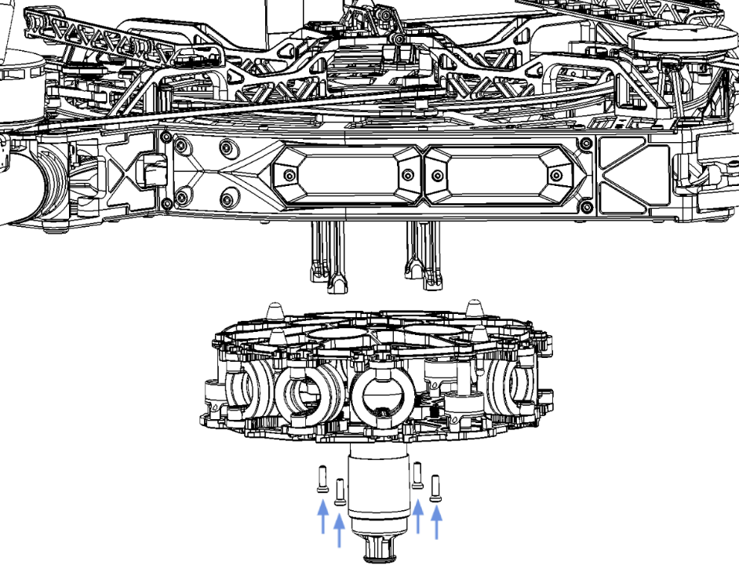
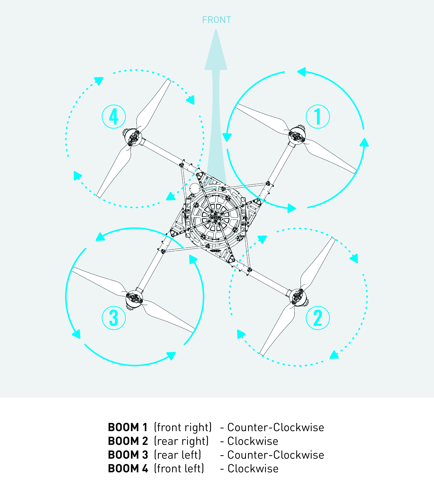

# Quick Start Guide

## Included in Box

|  |  |  |
| :--- | :--- | :--- |
| Vibration Isolation System
 | 2.0mm Hex Driver
 | Skyview Landing Gear\*
 |
| Alta X Spare Parts | 2.5mm Hex Driver
 | Futaba Radio Controller\*
 |
| Alta X QuickStart Card
 | 3.0mm Hex Driver
 | FRX - Alta X Ready\*
 |
| Alta X Product Card
 |  | Alta X Travel Case\*
 |

_\* Optional accessories_

### Additional Required Components

#### Radio Controller

ALTA X supports a variety of radio controllers as outlined in the Controller Integration section of the manual. A minimum of five \(5\) channels are required, with four \(4\) used for flight control, and the remaining one \(1\) used for mode selection. A  radio controller with between six to ten channels is highly recommended to make use of Return-to-Land \(RTH\) and ALTA X’s other functions. It is recommended to use a radio controller with a three-way switch for Mode selection and a two-way switch for the [Return-to-Launch](untitled-7.md#return-to-launch) function.

#### Flight Battery

ALTA X can accommodate a variety of Lithium Polymer \(LiPo\) flight battery packs. Battery packs must be 12S, having a nominal voltage of 44.4 V. Only run ALTA X using two packs at a time. For additional information on expected flight duration, refer to the [Performance Section](../alta-8-pro/performance/weight-endurance-performance-data.md) of this manual.

## Box to Flight

### Unfold

<table>
  <thead>
    <tr>
      <th style="text-align:left"></th>
      <th style="text-align:left"></th>
      <th style="text-align:left"></th>
    </tr>
  </thead>
  <tbody>
    <tr>
      <td style="text-align:left">1.</td>
      <td style="text-align:left">
        
Remove ALTA X from its box or travel case.

        <ul>
          <li>If you did not purchase the travel case with ALTA X; install the four
            vibration isolation stand-offs to the four threaded holes on the underside
            of ALTA X then mount the vibration isolator with (4x) M4x14 Combo bolts.</li>
        </ul>
      </td>
      <td style="text-align:left">
        

        

          
        

      </td>
    </tr>
    <tr>
      <td style="text-align:left">2.</td>
      <td style="text-align:left">
        
Use the built-in Toad in the Hole (TITH) on ALTA X&#x2019;s vibration
          isolator to mount ALTA X to your payload. If you are not using Skyview
          landing gear your payload will act as ALTA X&#x2019;s landing gear.

        <ul>
          <li>Make sure to latch the TITH once you feel the TITH fully seat; you will
            hear a &#x2018;click&#x2019; when seated.</li>
        </ul>
      </td>
      <td style="text-align:left"></td>
    </tr>
    <tr>
      <td style="text-align:left">3.</td>
      <td style="text-align:left">Fully unfold ALTA X&#x2019;s booms; note that all of the booms are linked
        and will open simultaneously.</td>
      <td style="text-align:left">
        

        

          
        

      </td>
    </tr>
    <tr>
      <td style="text-align:left">4.</td>
      <td style="text-align:left">
        
Secure the booms by latching both the red safety latches on ALTA X.

        <ul>
          <li>Always make sure both safety latches are fully latched before flying ALTA
            X!</li>
        </ul>
      </td>
      <td style="text-align:left"></td>
    </tr>
    <tr>
      <td style="text-align:left">5.</td>
      <td style="text-align:left">Note flight direction relative to motor positions and GPS. Arrow on GPS
        indicates forward flight direction.</td>
      <td style="text-align:left"></td>
    </tr>
  </tbody>
</table>

### Batteries

<table>
  <thead>
    <tr>
      <th style="text-align:left"></th>
      <th style="text-align:left"></th>
      <th style="text-align:left"></th>
    </tr>
  </thead>
  <tbody>
    <tr>
      <td style="text-align:left">1.</td>
      <td style="text-align:left">
        
Adjust the battery tray to fit your preferred batteries by loosening and
          adjusting the (8x) M3x6 SHCS fasteners securing the two movable tray components.

        <ul>
          <li>Ensure the fasteners are tightened after the trays have been adjusted.</li>
        </ul>
      </td>
      <td style="text-align:left"></td>
    </tr>
    <tr>
      <td style="text-align:left">2.</td>
      <td style="text-align:left">
        
Place your batteries on the tray and secure them with the four battery
          straps.

        <ul>
          <li>See the <a href="untitled-3/#battery">Appendix</a> for minimum battery requirements.</li>
        </ul>
      </td>
      <td style="text-align:left"></td>
    </tr>
  </tbody>
</table>

### Fly

<table>
  <thead>
    <tr>
      <th style="text-align:left"></th>
      <th style="text-align:left"></th>
      <th style="text-align:left"></th>
    </tr>
  </thead>
  <tbody>
    <tr>
      <td style="text-align:left">1.</td>
      <td style="text-align:left">Ensure you have completed the necessary <a href="untitled-6.md#unpacking-and-setup">preflight checks</a> for
        ALTA X</td>
      <td style="text-align:left"></td>
    </tr>
    <tr>
      <td style="text-align:left">2.</td>
      <td style="text-align:left">
        
Turn on your transmitter

        <ul>
          <li>Review the <a href="untitled-5/#installation-of-futaba-radio">transmitter integration</a> section
            of this manual for a step by step guide to installing your transmitter
            if this has not been done</li>
        </ul>
      </td>
      <td style="text-align:left"></td>
    </tr>
    <tr>
      <td style="text-align:left">3.</td>
      <td style="text-align:left">
        
Plug the batteries into ALTA X using the built-in battery leads.

        <ul>
          <li>Only power ALTA X with batteries when intending to fly; make sure you
            are in a safe takeoff location and adhering to your regions UAV regulations.</li>
        </ul>
      </td>
      <td style="text-align:left"></td>
    </tr>
    <tr>
      <td style="text-align:left">4.</td>
      <td style="text-align:left">Once the batteries are plugged into ALTA X and you are in a safe takeoff
        location arm ALTA X by holding full low throttle and full right yaw. Once
        armed the all motors will spin up.</td>
      <td style="text-align:left"></td>
    </tr>
    <tr>
      <td style="text-align:left">5.</td>
      <td style="text-align:left">
        
After ALTA X is armed you may takeoff and use

        <ul>
          <li>We recommend quickly checking ALTA X&#x2019;s orientation before takeoff
            by giving small roll/pitch inputs.</li>
          <li>Ensure you are monitoring ALTA X&#x2019;s voltage during flight to prevent
            low battery situations.</li>
        </ul>
      </td>
      <td style="text-align:left"></td>
    </tr>
    <tr>
      <td style="text-align:left">6.</td>
      <td style="text-align:left">Once the flight is complete, return to a safe location to land ALTA X.
        After landing disarm ALTA X by holding minimum throttle and full left yaw.</td>
      <td
      style="text-align:left"></td>
    </tr>
    <tr>
      <td style="text-align:left">7.</td>
      <td style="text-align:left">Unplug the batteries after disarming ALTA X and then turn off the remote
        controller.</td>
      <td style="text-align:left"></td>
    </tr>
    <tr>
      <td style="text-align:left">8.</td>
      <td style="text-align:left">Detailed procedural steps can be found in the <a href="untitled-6.md">&#x2018;Procedures</a>&#x2019;
        section of this manual; ensure that you have reviewed and understand each
        step before flying.</td>
      <td style="text-align:left"></td>
    </tr>
  </tbody>
</table>

