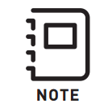

# Binding and Setup

### FRX Pro Binding

* Turn on the gimbal and MōVI Controller that the FRX Pro's are going to link.
  * The FRX Pro's status light will turn white during boot and standby. 
  * If the FRX Pro modules are already bound and connected to a gimbal and controller which are running, the status lights will turn green after a few seconds.
* If the status light remains white, press the bind button of the FRX Pro connected to the controller, wait one second, then press the bind button of the other FRX Pro.
  * Both FRX Pro's status lights will begin flashing white and the modules will initiate the binding procedure.
* Once a data connection is established both the status lights on the FRX Pro modules will turn green.
* If the FRX Pro modules cannot establish a connection the status lights will turn red and then return to their standby state.
  * Repeat the binding steps above if a binding attempt fails.

### MoVI Controller Setup

* To use the MōVI Controller with FRX Pro you must change the MōVi Controller's Radio Type setting to 'USB'
  * To access this setting navigate to the MōVI Controller's Radio Config menu and use the Menu Set knob to change the Radio Type to 'USB'
* Once the setting has been changed, 'Write' it to the MōVI Controller's memory by selecting the 'Write' field on the next line and pressing the Menu Set knob.
  * To use the old MC-RX with this MōVI Controller, you must set the Radio Type back to 'Internal'

In order to use FRX Pro with your MōVI Controller you must be using a MōVI Controller that has been updated to v4.1.X or newer. This FW will be available once the first FRX Pros are shipped!

Running dual MōVI Controllers using FRX Pro is not possible, due to the FRX Pro's large power draw it consumes the power from both COM ports on the GCU. Please use the MōVI Controller Receivers when attempting to use two MōVI Controllers.

