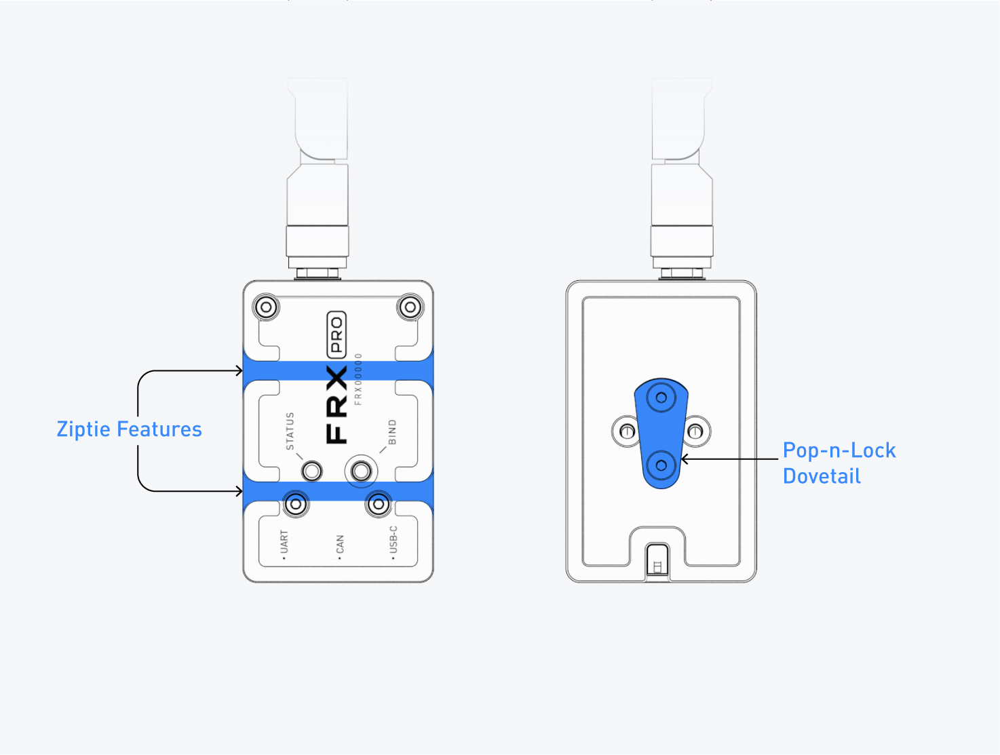
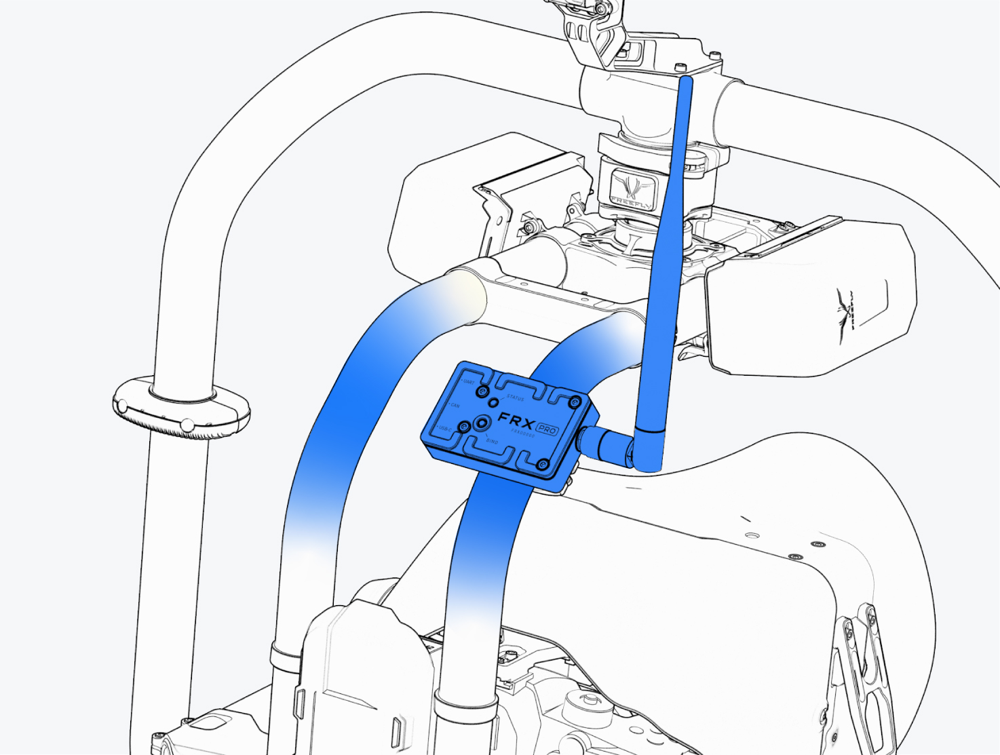
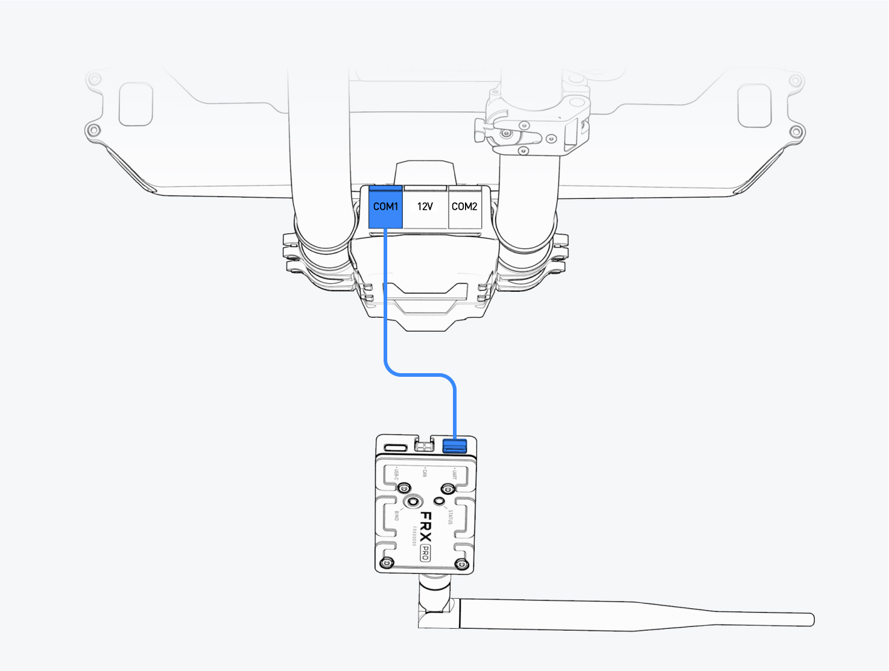
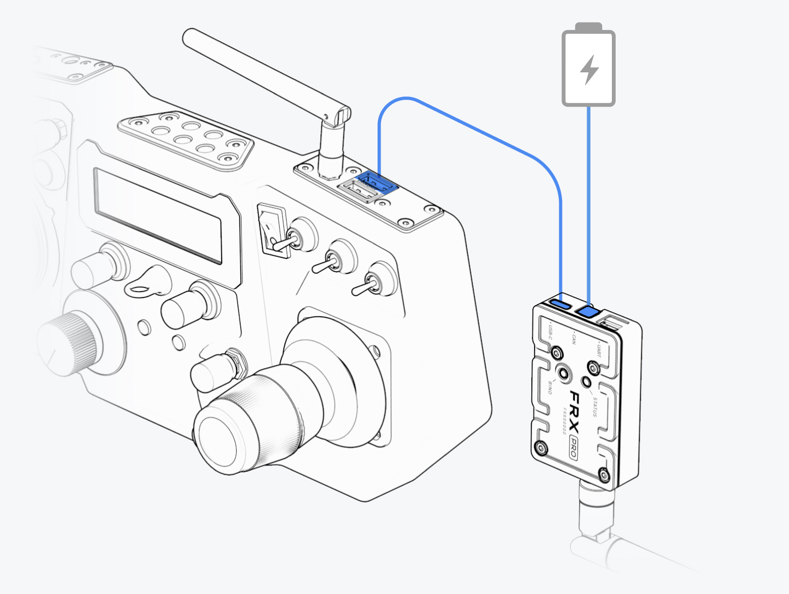

# Mounting

### FRX Pro Mounting

* Install a FRX Pro module to your gimbal using the [Pop-n-Lock](https://store.freeflysystems.com/search?type=product&q=Pop-n-Lock) dovetail and a Pop-n-Lock mounted to the pan axis of your gimbal. See the diagram below for suggested mounting areas on your gimbal.
  * If necessary you can update the orientation of the Pop-n-Lock dovetail to make adjust the orientation of the FRX Pro module.
  * Alternatively you can utilize the zip-tie features machined into the front face of FRX Pro to secure it to the mounting surface.

* Mount the other FRX Pro module to your MōVI Controller setup. 
  * We suggest using a [Screw Mount Pop-n-Lock](https://store.freeflysystems.com/collections/movi-pro/products/pop-n-lock-screw-mount-quick-release) kit to utilize one of the many 1/4-20" mounting location on the MōVI Controller and most monitors.

### FRX Pro Wiring

#### Gimbal Side

* Unplug any devices from **COM1** of the gimbal's GCU.
  * When using FRX Pro you will no longer need the older MC-RX's. These can be removed from the gimbal.
* Use one of the COM Cables provided in the kit to connect the FRX Pro's UART port to the **COM1 port** of your gimbal.

#### Controller Side

* For power, connect the other FRX Pro module to an external power supply, such as a V-Lock battery using the FRX Pro D-Tap Power cable.
* For signal, connect the FRX Pro to the MōVI Controller using the USB Cable provided in the kit.
  * Ensure you have plugged the USB Cable into the bottom USB port on the MōVI Controller.

