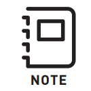

# Updating and Configuration

### Configurator

[Latest FW + Configurator](https://freeflysystems.com/support/frx-pro)

| Item  |
| :--- |
| 1. COM Port Drop down Menu |
| 2. Read Configuration Button |
| 3. Default Configuration Button |
| 4. Write Configuration Button |
| 5. Power Level Setting |
| 6. Aux Baud Rate Setting |
| 7. FRX FW Version  |
| 8. FW File Selection Button |
| 9. FW Load Button |

### Updating FRX Pro

FRX Pro's ship with the latest stable FW preloaded onto each module so no updating is necessary before use!

* To update the FRX Pro module you will need to download the latest FRX Pro FW to a PC.
  * You can find the latest FW packages on the FRX Pro's support page.
  * For the latest MōVI Controller FW, please visit the [MōVI Controller Support](https://freeflysystems.com/support/movi-controller-support) page.
* Connect the USB A-C cable to your computer then plug in the FRX Pro module while holding down its Bind button.
  * The status light will turn blue indicating it is in FW Update Mode.
* Open the configurator bundled with the FRX Pro FW and connect to the correct COM port using the drop down menu at the top of the configurator.
  * If you are using a Mac select the port named 'tty.ubsbmodemXXXXXX'.
* With the correct COM port selected, choose the new firmware file using the Browse button. 
  * The name of the file will be FRX\_Pro\_x-x-x\_xxxxxxxx.enc.
* Click the Load button to begin the FW load process. After a few seconds, the new firmware file will be sent to the FRX Pro module. Wait for the progress to reach 100%.
  * If FW load fails make sure you are in the FW Update Mode.
* FRX Pro modules are updated individually; this means each module must be updated when a FW update is released.

### Configuring FRX Pro

FRX Pro's power and baud rate can be adjusted when necessary, for instruction review the steps detailed out below.

* To enter Configuration mode simply connect an FRX to a PC using a USB A-C cable.
  * Do not press the bind button to enter the Configuration mode.
* Open the configurator bundled with the FRX Pro FW and connect to the correct COM port using the drop down menu at the top of the configurator.
* With the COM port selected, press the Start Configuration Mode button. 
* The Power Level and Aux Baud Rate can now be adjusted and written to the FRX Pro module using the Write Configuration button.
  * Always use an Aux baud Rate of '111111' when using FRX Pro with the MōVI family of gimbals.
  * To reset the FRX Pro module to defaults select the Default Configuration button in the configurator.

