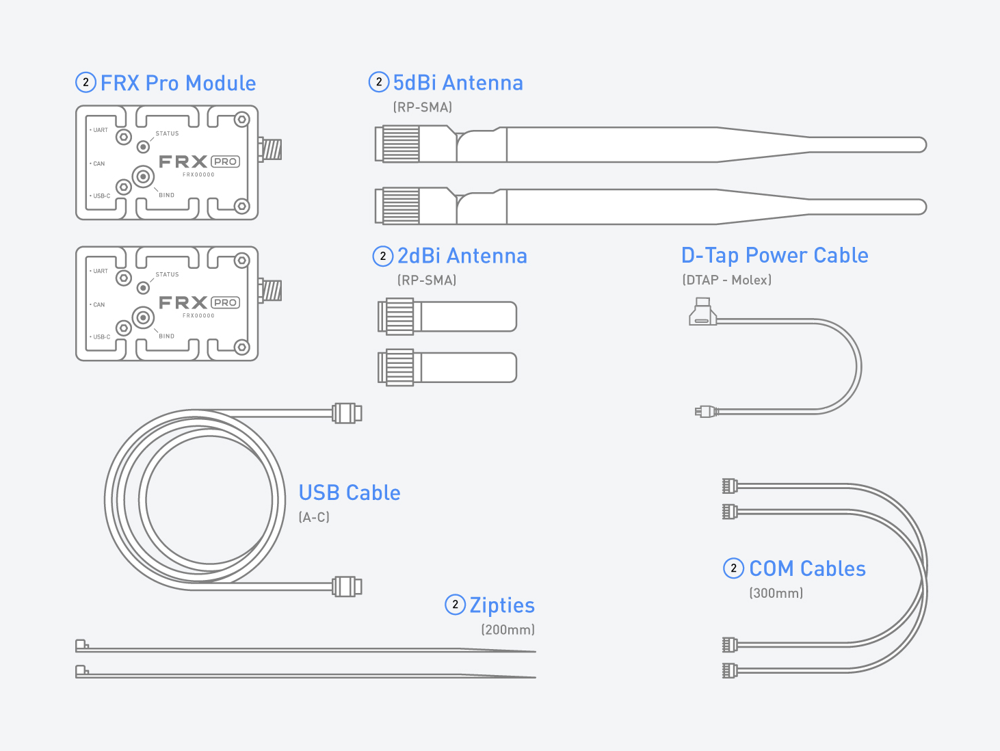

# In the Box

### FRX Pro Kit Contents

| Item | Quantity |
| :--- | :--- |
| FRX Pro Module | 2 |
| COM Cable 300mm | 2 |
| USB Cable \(A-C\)  | 1 |
| D-Tap Power Cable \(DTAP - Molex\) | 1 |
| 5dBi Antenna \(RP-SMA\) | 2 |
| 2dBi Antenna \(RP-SMA\) | 2 |
| Zipties 200mm | 2 |

### Additional Optional Accessories

| Item | Use |
| :--- | :--- |
| [25mm Pop-n-Lock](https://store.freeflysystems.com/collections/movi-pro/products/pop-n-lock-25mm-quick-release) | Used to mount FRX Pro to MōVI Pro and MōVI Carbon |
| [50mm Pop-n-Lock](https://store.freeflysystems.com/collections/movi-xl/products/pop-n-lock-50mm-quick-release) | Used to mount FRX Pro to MōVI XL |
| [Screw Mount Pop-n-Lock](https://store.freeflysystems.com/collections/movi-pro/products/pop-n-lock-screw-mount-quick-release) | Used to mount FRX Pro to MōVI Controller and other products with 1/4-20 mounts. |
| FRX Pro - Single Module\* | Replace or add an additional FRX Pro to your Freefly kit |
| FRX Pro Spare D-Tap Power Cable\* | Replace the D-Tap Power Cable in the FRX Pro Kit |
| 5dBi Spare Antenna Set\* | Replace the 5dBi antennas provided in the FRX Pro Kit |
| 2dBi Spare Antenna Set\* | Replace the 2dBi antennas provided in the FRX Pro Kit |

\*Note: These items are not yet available in the Freefly store but will be added soon.

