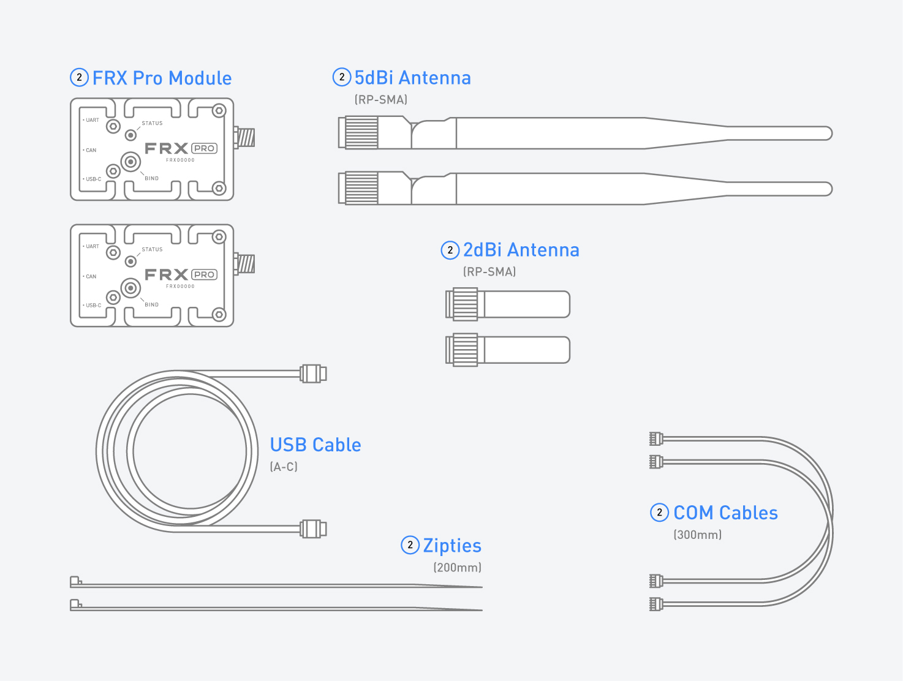

# In the Box

### FRX Pro Kit Contents

| Item | Quantity |
| :--- | :--- |
| FRX Pro Module | 2 |
| COM Cable 300mm | 2 |
| USB Cable \(A-C\)  | 1 |
| 5dBi Antenna \(RP-SMA\) | 2 |
| 2dBi Antenna \(RP-SMA\) | 2 |
| Zipties 200mm | 2 |

### Additional Optional Accessories

<table>
  <thead>
    <tr>
      <th style="text-align:left">Item</th>
      <th style="text-align:left">Use</th>
    </tr>
  </thead>
  <tbody>
    <tr>
      <td style="text-align:left"><a href="https://store.freeflysystems.com/collections/movi-pro/products/pop-n-lock-25mm-quick-release">25mm Pop-n-Lock</a>
      </td>
      <td style="text-align:left">Used to mount FRX Pro to M&#x14D;VI Pro and M&#x14D;VI Carbon</td>
    </tr>
    <tr>
      <td style="text-align:left"><a href="https://store.freeflysystems.com/collections/movi-xl/products/pop-n-lock-50mm-quick-release">50mm Pop-n-Lock</a>
      </td>
      <td style="text-align:left">Used to mount FRX Pro to M&#x14D;VI XL</td>
    </tr>
    <tr>
      <td style="text-align:left"><a href="https://store.freeflysystems.com/collections/movi-pro/products/pop-n-lock-screw-mount-quick-release">Screw Mount Pop-n-Lock</a>
      </td>
      <td style="text-align:left">
        
Used to mount FRX Pro to M&#x14D;VI Controller and other products

        
with 1/4-20 mounts.

      </td>
    </tr>
    <tr>
      <td style="text-align:left">FRX Pro - Single Module*</td>
      <td style="text-align:left">Replace or add an additional FRX Pro to your Freefly kit</td>
    </tr>
    <tr>
      <td style="text-align:left">5dBi Spare Antenna Set*</td>
      <td style="text-align:left">Replace the 5dBi antennas provided in the FRX Pro Kit</td>
    </tr>
    <tr>
      <td style="text-align:left">2dBi Spare Antenna Set*</td>
      <td style="text-align:left">Replace the 2dBi antennas provided in the FRX Pro Kit</td>
    </tr>
  </tbody>
</table>\*Note: These items are not yet available in the Freefly store but will be added soon.

