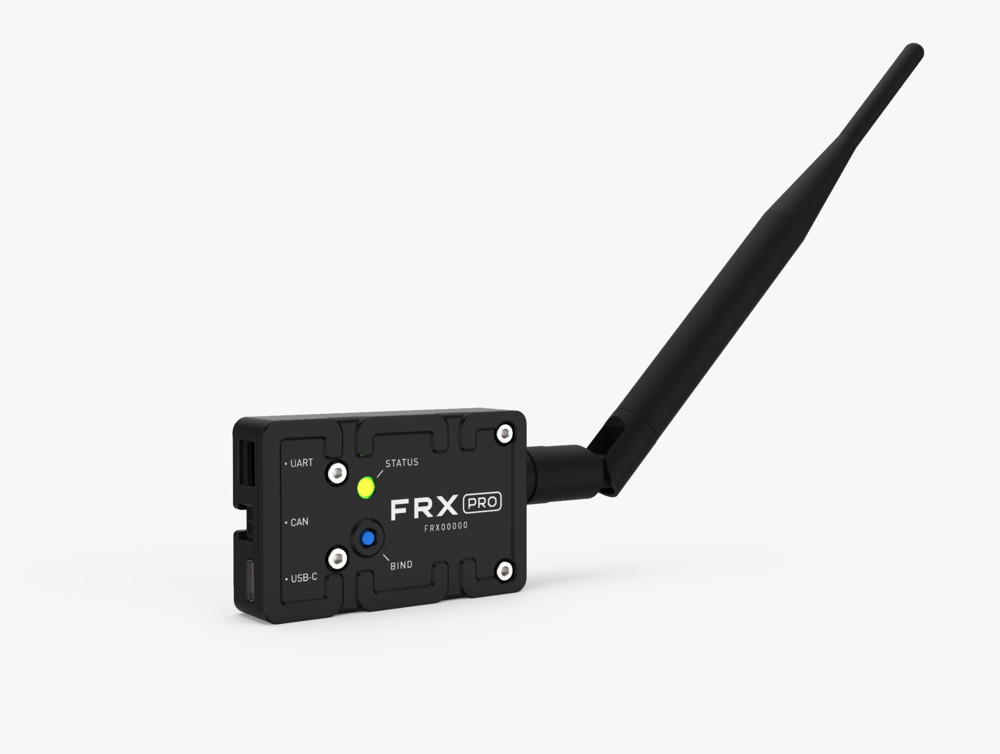

# Introduction

FRX Pro was designed to increase the performance of Freefly's family of gimbal controllers by allowing users to achieve increased range and better connections in even the harshest RF environments. FRX Pro is perfect for professionals who are looking to push their Freefly gear further to get shots that were previously unattainable. 

This manual covers the setup, use, and troubleshooting information needed to successfully use FRX Pro with your other Freefly gear. We advise reading and understanding this manual before using FRX Pro with other products in the Freefly Ecosystem!

Throughout the manual, warnings, cautions and notes are used to highlight various important procedures. These are defined as follows:

