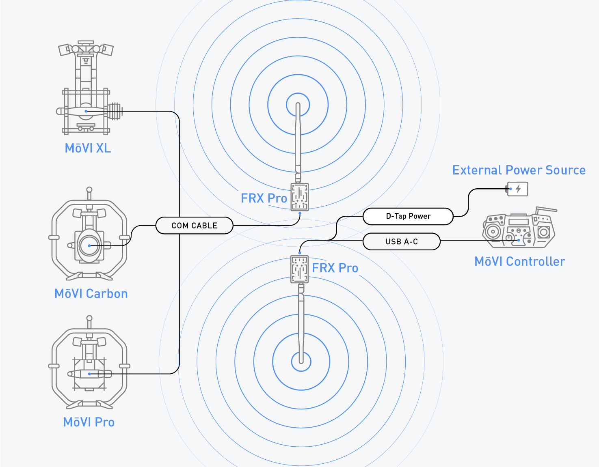
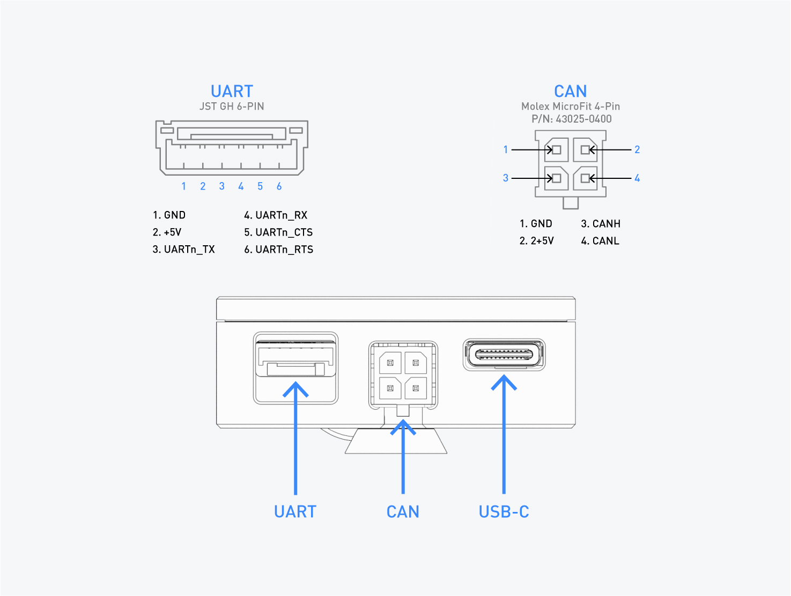

# System Diagram

### FRX Pro Overview

| Item | Function |
| :--- | :--- |
| 1. Status LED | Communicates FRX Pro status to the user |
| 2. Bind Button | Binds FRX Pro units to one another |
| 3. UART Port | Connects to FRX Pro to Freefly products with UART communication ports |
| 4. CAN Port | Connects to FRX Pro to Freefly products with CAN communication ports |
| 5. USB-C Port | Connects to FRX Pro to Freefly products with USB communication ports |

### Setup Overview

### Status Light Overview

### Connectors and Pinouts

