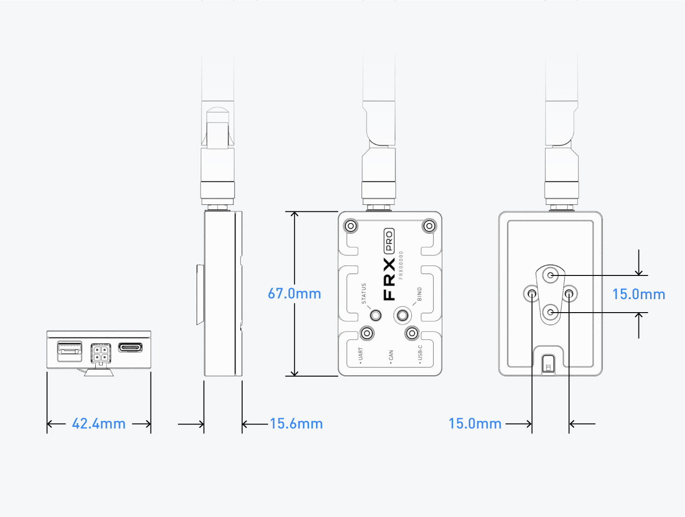

# Specifications

### Dimensions + Mounting Patterns

| Item | Dimensions |
| :--- | :--- |
| Length | 15.6mm |
| Height | 67.0mm |
| Width | 42.4mm |
| Mounting Pattern | M3 - 15mm x 15mm Grid |

### Specifications

| Item | Specification |
| :--- | :--- |
| Weight |  62.2g |
| Voltage | 5 V |
| Signal Power | 10mW - 1W \(User adjustable\) |
| Frequency | 902 - 928MHz \* |
| Spread Method | Frequency Hopping |
| Range | 5600ft \(Based on testing\) \*\* |
| Antenna Connector | RP-SMA |
| Operational Temperature Range | -20 to 50C |

\*FRX Pro's alternative frequencies to be released in the near future

\*\*Range is dependent on Signal power settings, RF environment, and line of sight

