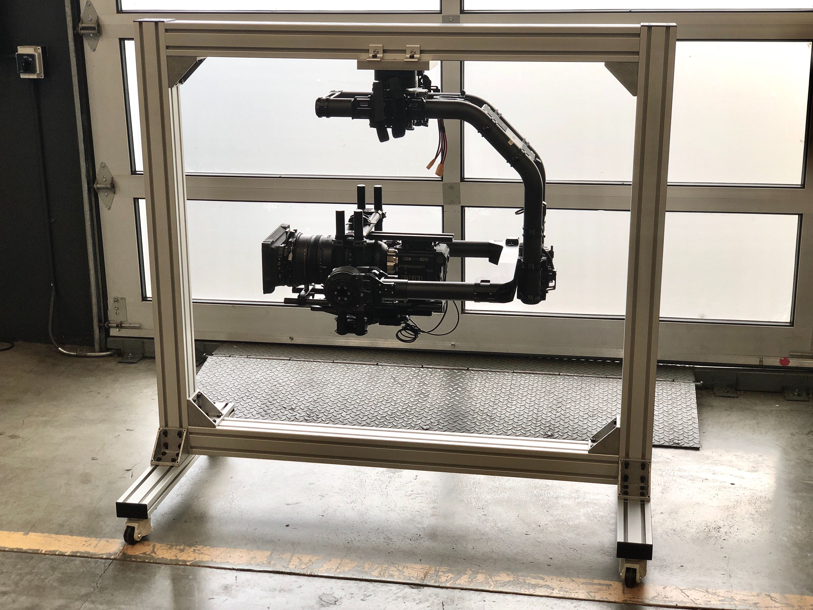

# MoVI XL Setup Stand

During development of MoVI XL we built a modular test stand and balancing rig. We found this stand to be very useful for building and balancing camera payloads before mounting XL to a vehicle or crane. Below you can find information and links to assist you in making your own!

You will need 3 things for this build:

**The frame** : We have built out a model of the stand on vention.io where you can either; click to buy the parts and assemble yourself or check out the bill-of-materials and cut-list so you can build your own from scratch.

[Vention MoVI XL Setup Stand](https://vention.io/designs/movi-xl-setup-stand-85647)

**The adapter plate** : This will allow you to mount the Movi XL Quick Release to the frame. You can fabricate this yourself, or order it from a service like [Protolabs ](https://www.protolabs.com/services/cnc-machining/)or [Xometry](https://www.xometry.com/).

[Adapter Plate 2D Drawing](https://www.dropbox.com/s/pg8ix1661t4ywg0/410-00987%20Mount%20Adapter%20Movi%20XL%20Quick%20Release%20-%20REV01.pdf?dl=0)  /  [STEP CAD file](https://www.dropbox.com/s/zb06f5kxpw2scdr/410-00987%20Mount%20Adapter%20Movi%20XL%20Quick%20Release.STEP?dl=0)

**The quick release** : The Movi XL Quick Release Kit can be found in the Freefly Systems Store. We recommend using [M6x20 FHCS](https://www.mcmaster.com/92125A240) \(qty6\) to attach to the Quick Release to the adapter plate.

[Movi XL Quick Release](https://store.freeflysystems.com/collections/movi-xl/products/quick-release-kit)

\*\*\*\*

