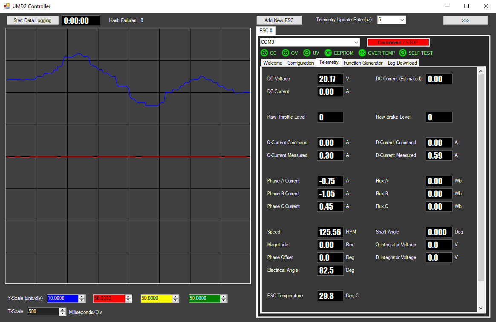
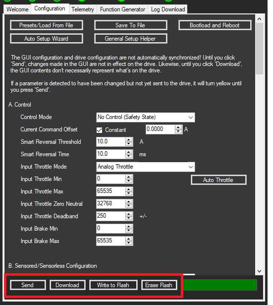

# Arc GUI

The Arc GUI is designed and tested for Windows 10. It may work on previous versions of Windows but it is untested.

## Installation: 

Just unzip the package into one folder and run the EXE. No installation is necessary, this will directly launch the GUI. 

July 16, 2019 - [v1.1.11](http://freefly-prod.s3.amazonaws.com/support/Arc_GUI_07_16_2019_v1_1_11_24d491c.zip)  
June 27, 2019 - [v1.1.10](http://freefly-prod.s3.amazonaws.com/support/Arc_GUI_06_24_2019_v1_1_10_bd3dbac.zip)  
April 1, 2019 - [v1.1.9](http://freefly-prod.s3.amazonaws.com/support/Arc_GUI_03_27_2019_v1_1_9_d520025.zip)  
November 15, 2018 - [v1.1.8](http://freefly-prod.s3.amazonaws.com/support/Arc_GUI_11_6_2018_v1_1_8_71c867b.zip)  
October 11, 2018 - [v1.1.6](http://freefly-prod.s3.amazonaws.com/support/Arc_GUI_10_11_2018_v1_1_6_356f3e5.zip)  
October 9, 2018 - [v1.1.5](http://freefly-prod.s3.amazonaws.com/support/Arc_GUI_10_9_2018_v1_1_5_2d7b575.zip)  
October 3, 2018 - [v1.1.4](http://freefly-prod.s3.amazonaws.com/support/Arc_GUI_10_1_2018_v1_1_4_1a6b609.zip)  
August 23, 2018 - [v1.1.2](http://freefly-prod.s3.amazonaws.com/support/Arc_GUI_v1.1.2.zip)  
August 17, 2018 - [v1.1.1](http://freefly-prod.s3.amazonaws.com/support/Arc_GUI_v1.1.1.zip)  
July 17, 2018 - [v1.1.0](http://freefly-prod.s3.amazonaws.com/support/Arc_GUI_v1.1.0.zip)  
July 12, 2018 - [v1.0.100](http://freefly-prod.s3.amazonaws.com/support/Arc_GUI_v1.0.100.zip)

For USB connectivity, you may need to install the STLink Virtual COM port driver: [https://www.st.com/en/development-tools/stsw-stm32102.html](https://www.st.com/en/development-tools/stsw-stm32102.html)

## Operation: 

The GUI is mostly self documented within so you should be able to understand the use and functions of the GUI from within.

If you want a bit more guidance on how to start the auto-setup wizard for a beginner user, look [here](basic-configuration-and-auto-setup-wizard.md).

For a detailed list of definitions and discussions on all tuning parameters for advanced users, look [here](advanced-configuration-parameter-list.md).

## Behavior of Configuration: 

When operating the configuration tab, realize that what's displayed is not real-time synchronized with the configuration on the drive. When you first connect, a 'Download' operation is performed which pulls the configuration from the drive and displays it on the Configuration tab. Any change you then make is not immediately sent to the drive until you press 'Send'. Using the 'Send' button sends it to the drive's active memory and it immediately affects the operation of the drive, but it is still stored temporarily and would be lost at a power cycle. To store a configuration indefinitely, press 'Write to Flash' **after** pressing 'Send' \(it writes what's on the drive to the flash memory, not what's on the screen so you must first use 'Send' to load your configuration to the drive, then 'Write to Flash' to load what's on the drive into long-term memory\). If you ever want to revert the drive to a factory configuration, you can use Erase Flash then power-cycle the drive \(disconnect and re-connect is not sufficient, drive must actually reboot\).

## Change Log: 

**v1.1.10**

* Adds support for erasing the log flash memory chip

**v1.1.9**

* Adds support for latest v1.1.9 Arc200 firmware

**v1.1.8 \(v1.1.7 was unreleased so this is a change log since 1.1.6\)**

* Correct math error in the DC current foldback graph generation of the general setup pop-up.
* Fix bug where a divide-by-zero hard fault may occur if clicking "Setup Wizard" on a drive that hasn't yet successfully completed an initial parameter download.
* Bug fix where on rare occasion, the function generator tab says the drive is in safety state on initial connection even though the drive is really configured in a controllable mode. 
* Reliability improvements in parameter send/download when multiple drives are connected to one GUI simultaneously.
* If you open the current tune wizard and click save-and-close without pressing run, a warning pops up confirming that you really intend to save-and-close.
* Now operates cleanly on a 720p monitor with scrolling implemented where windows previously didn't fit.
* Bug fix where loading a UMDS2 preset file that included a combo-box driven parameter that does not exist in the currently connected drive firmware previously caused a hard-fault exception.

**v1.1.6**

* Correct units of slew up/down to be in RPM/s instead of the previously incorrect RPM
* Add new "Max Phase Accel Available With Throttle" and "Max Phase Regen Available With Throttle" in case you want to limit your throttle's maximum range compared to the drive's configured max phase current.
* Bug fix where max phase accel and regen were not properly set after pressing save and close in the general setup pop-up
* Fix bug where connecting to an old drive firmware using a new GUI version may cause a hard-fault crash in the GUI

**v1.1.5**

* The AutoFOC pop-up no longer requires interacting with the function generator tab, user can instead use the built-in speed control slider
* Fix bug where encoder autotune pop-up still appears in quadrature mode
* Fix bug where the title of the groupbox for encoder calibration is not updated when changing the type of calibration
* If there is any general drive fault \(such as over-current, under-voltage, etc.\) at any point during an autotune of R, L, or FOC/KV, the autotune process is aborted and the user is informed of the problem \(usually power supply related\).

**v1.1.4 \(note v1.1.3 was unreleased so this is a change log since 1.1.2\):**

* Adjusted the current loop tuning levels to improve the robustness of a loop tune when running the advanced fastest-with-current filter.
* Rearranged the UI of the current loop tuning pop-up
* Changed the programmable over-voltage cutoff level maximum from 54v to 52v for Arc200 drives
* Add new separate Jitter Speed 1 and 2 parameters so that they are separate from RPM Closed Loop 1 and 2
* Remove the need for selecting between sensored and sensorless when tuning the current loop
* When loading a preset, if it uses DQ-filtering, a pop-up suggests changing this to Super-DQ-filtering since it has superior performance on the latest firmwares.
* Encoder calibration pop-up now in step-by-step wizard format which allows user to select the encoder type, set the drive configuration to speed mode/sensorless/QX, send, then spin the motor from within the setup pop-up.
* Auto-tune wizard merged with the general setup helper pop-up. Now the auto-tune wizard is just the first tab of the setup helper improving user work-flow and making the system easier to understand.
* Items in the general setup helper now disappear if they are not relevant to the selected mode of operation.
* Throttle setup pop-up now in step-by-step wizard format which allows the user to select the input type, set the drive configuration to No Control \(safety state\), send, then perform throttle setup based on the selected mode.
* Auto-tune wizard and applicable pop-ups now have built-in send buttons so you no longer have to do it from the configuration tab.
* Reliability of sending-configuration greatly reduced so you should now almost never see a notice about transmission verification failing on parameters.
* Logs can no longer be downloaded over a bluetooth connection. Note is displayed informing the user to re-connect over USB to download logs.
* Add support for CAN networking for command forwarding
* Add support for throttle expo

**v1.1.2:**

* General improvements to button and instruction text in the UI.

**v1.1.1:** 

* Add support for new definition of a QX121 packet with new byte offsets. GUI supports either new or legacy QX121 packet for backwards compatibility.
* Correct the axis labels on the X and Y axes in the dependent parameter pop-up.
* Re-order the parameter groups so that they appear in a more logical order \(advanced filter parameters at end, loop tuning in the middle, basic setup beginning\). This change only applies for latest comms rev or newer.
* Improved current command offset which is now just one parameter rather than being a speed-dependent setup requirement. Also added this parameter to the general setup helper wizard.
* Change "Temp Cutoff" and "Temp Foldback Start" parameter names to "ESC Temp Cutoff" and "ESC Temp Foldback Start" for clarity.
* Autotune task buttons are only enabled after the previous task is complete. Makes it nearly impossible to get out of order.
* Bug fix in presets pop-up where clicking in a blank space in the listbox previously caused an out-of-bounds array index hard fault.
* Autotune wizard now has an added step after loading pre-FOC autotune preset which requires sending the config to the drive before starting pole pair measurement.
* Add ability to set regen current foldback at low PWM widths when in torque forward only mode to avoid motor jerking at very low speeds with high regen commands.
* Improved in-app documentation on the encoder auto calibration process.

**v1.1.0:**

* Improved robustness of the flash log download system including additional error messages if the drive can't list all logs.
* Bug fix makes several pop-ups no longer cause the motor to time-out if OK is not clicked within a few seconds.
* Add details to inductance and resistance measurement pop-ups to discuss what variation from run to run is concerning.
* Move warning text about wattages to the end of the text block in the resistance and inductance measurement pop-ups.
* Improved function generator tab with adjustable scale labels on the slider and +- fixed value buttons.
* Improved in-program documentation on setting RPM Closed Loop 1 and RPM Closed Loop 2.
* Added a display of the GUI software version above the plot window and a display of the drive model and firmware version at the top of the telemetry tab.
* Send, download, and flash buttons are now greyed out and disabled until the currently-requested send or download operation completes. Improved user experience.
* Send and download now perform significantly faster over bluetooth and hopefully reliably now.
* Log save-as button is now only enabled after a log is successfully downloaded leading to an improved user experience.
* Telemetry updating is limited to 5hz when connected over Bluetooth, and a Bluetooth logo is displayed when in this state to inform the user.
* Send many 'Q's before the first QX when connecting to a drive to clear the parser state machine on the drive in case the last connection closed inelegantly and left the parser mid-message.

