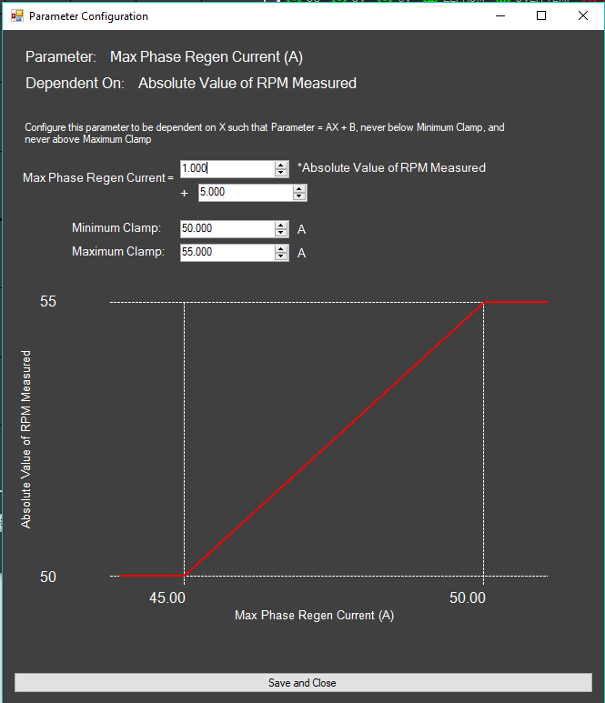

# Advanced Configuration \(Parameter List\)

Note this parameter list may change over time. The parameter set is defined within the firmware and as the motor algorithm continues development the exact set of parameters may be updated. If your firmware is newer or older than this documentation, the parameter selection and names may not exactly overlap.

### Dependent Parameters: 

Some parameters can be setup to change value based on a dependent variable \(in most cases, measured speed\). These will look like this:

If set to a constant value such that there is no dependence: 

If set to a dependent mode: 

When you click Setup on a dependent parameter, you will see a setup box like this:

  
  
This will guide you through setting up the dependent parameter and provides a graph showing the dependence for the variable.

## Control 

This section establishes how the user will command a speed, torque, or angle to the drive. This is mandatory to understand and setup to control an EV with anything other than the GUI.

When setting the min, max, or deadband, it is easiest to have your controller connected with the ESC in control mode: safety state. Go to the telemetry tab of the GUI and observe the Raw Throttle Level. This will guide you on what absolute levels you should be entering. See parameter definitions below for more guidance.

**Control Mode:**

* **No Control \(Safety State\):** This puts the drive into a safety state where nothing will control it to spin. The control loop is not running in this state. Never change to this state while the motor is running as it will act as shorting the phases and do a very high current brake that could damage things mechanically or electrically!
* **Speed Mode \(RPM\):** Drive is commanded in RPM, commands can come in as either positive or negative numbers for the two directions. Note that as of June 4, 2018, there is no autotune for the speed outer loop so some skill is required to use this mode.
* **Torque with Reverse \(+-A\):** Torque command mode that smoothly transitions between forward and reverse. Positive current commands make the motor spin forward, at which point negative commands make it brake. It smoothly transitions between zero and the negative currents make it spin backwards. When spinning backwards, positive current commands then make it brake. Positive current is forward acceleration or backwards braking, and negative current is forward braking or backwards acceleration.
* **Torque Forward Only \(+-A\):** Positive current commands make the motor accelerate and negative make it brake. The motor will never command torque to start spinning backwards. This mode is good for EV's which should not start driving backwards upon reaching zero speed while braking \(negative torque\). Currently there is no way to make the motor spin backwards but eventually implementations may be made to allow for a forward/reverse switch \(such as shifting your car into reverse vs. drive - you don't want it to just start driving backwards when you hit the brake!\)
* **Torque With Smart Reversal:** Torque mode where in order to switch directions, the ESC must observe that the motor has stopped after a braking event in the forward direction, then the user must return the throttle to a zero-current command, then push the throttle in the reverse direction again in order to get the vehicle to start going backwards. The opposite procedure occurs to get the vehicle moving forward again. It creates a distinct event required to "switch gears" into the other direction so that you can't brake and then have the vehicle start going the opposite direction immediately upon stopping.
* **Angle, sensored only, PIV Control \(deg\):** Acts as an absolute position mode. You must have an absolute encoder installed and calibrated before attempting to use this mode. Hall sensors are not good enough. Although this mode does work, as of June 4, 2018, it has minimal testing and should still be considered to be in a mostly experimental state. Note that as of June 4, 2018, there is no autotune for the speed inner loop or angle outer loop so some tuning skill is required to use this mode.

**Current Command Offset:** Current command offset adds a PWM-width dependent \(mostly speed dependent\) current to the user command when the drive is operating in any torque mode. This can be used to overcome any zero-bias errors in the current measurement so that when you command zero current, the motor will slow down while otherwise it may continue spinning or accelerate due to an offset error in the current measurement. If the motor doesn't stop with zero command, use a more negative current command offset. Using approximately -0.15 A/\(VDC \* PWMdec\) is recommended and is the default value. Most motors will quickly stop when commanded with zero current using this setting. PWMdec represents the PWM width as a value from 0 to 1.

**Torque-Forward-Only Regen Foldback Start-Below PWM:** This parameter is used to make the regen brake command fold back below the programmed PWM width.Usually you want this to be a few percent, default is 2%. This only applies in torque-forward-only mode, in all other operating modes this parameter has no effect on drive operation. Without this, when the motor regens and reaches zero speed, the regen command will make it want to start spinniing backwards. The moment it does, the torque command is cancelled because it is in forward only mode. Then it can start rolling forward again and then the regen torque command comes back. This creates an oscillation that results in stuttering torque. This foldback eliminates this phenomenon by avoiding regen current when the motor is approaching zero speed.

**Input Throttle Mode:** Note you should setup your throttle in 'No Control \(Safety State\)' mode! 

* **GUI:** Motor is commanded in RPM, amps, or degrees \(depending on operating mode\) from the GUI. All other control methods such as throttles or hand controllers are disabled.
* **Analog Throttle:** An analog connection \(0-5v maximum sense range\) is connected to the analog input pin to control the ESC.
* **PWM Throttle:** A PWM input is used on the throttle input pin.
* **PWM Throttle on Encoder Line:** A PWM input is used on the encoder input pin. This is provided for convenience in case that pin is more accessible in your wiring harness configuration. This mode cannot be used if you are using a PWM encoder.
* **Independent Analog Throttle and Brake:** Independent brake and throttle exist on the separate analog input pins for brake and throttle. If brake is pressed, it overrides the throttle.

**Smart Reversal Threshold/Time:** Only relevant when using Torque mode with smart reversal. These thresholds are used for the ESC to detect when the motor has stopped. The difference in currents between any two phases must be below the Smart Reversal Threshold for a duration of Smart Reversal Time before the ESC believes the motor has stopped spinning.

**In GUI control mode:**

* Input throttle and input brake settings have no effect. Only the GUI function generator controls the motor.

**In Analog Throttle or PWM Throttle:**

* **Input Throttle Min:** This is the input command which will result in maximum negative torque \(Peak Decel Current\), speed \(Max RPM Reverse Direction\), or angle \(Not yet implemented\). If you want to hold your throttle at full negative \(safest to do this with Control Mode in Safety State!\) and check the Raw Throttle Level on the Telemetry page, that'll tell you what to type in here, and use the same logic for setting the remaining settings in this section.
* **Input Throttle Max:** Same as min, but now for max accelerating current or maximum speed.
* **Input Throttle Zero Neutral:** The throttle level which corresponds to either zero speed or zero torque. If you are using a spring-return throttle as most hobby EV's do, this is the setting where you're not pushing the throttle either direction and want coasting.
  * If you want to disable reverse current or speed command, make sure Input Throttle Min is exactly equal to Input Throttle Zero Neutral and the drive won't command those quadrants. Similarly, if you only want reverse current or speed command, set Input Throttle Max exactly equal to Input Throttle Zero Neutral to disable positive current or speed command!
* **Input Throttle Deadband:** How much deadband should exist at the middle of the throttle. If this is zero, then the throttle would have to perfectly return to an exact known setting to get zero torque. Since this is not realistic, add a small dead-band so that an EV or RC car won't stutter with small amounts of current error when the throttle is released.
* In this mode, **Input Brake Min** and **Input Brake Max** have no effect.

**In Independent Analog Throttle and Brake Mode:**

You can use this mode in speed mode, although it doesn't make a lot of sense. This is really designed for torque mode. In speed mode, this results in the brake input commanding negative speeds and the throttle commanding positive speeds. If you were spinning a motor fast in the forward direction and feather the brake, it would do a full-power deceleration to hit the negative speed command given by the brake input. 

* **Input Throttle Min:** The minimum throttle value where an accelerating torque \(in torque command\) or speed command \(in speed mode\) starts being produced. Below this, the throttle current or speed command is zero \(or negative if the separate brake is pressed\).
* **Input Throttle Max:** The maximum throttle value for positive command. The torque command \(in torque mode\) or speed command \(in speed mode\) is proportional to the throttle input level between Input Throttle Min and Input Throttle Max.
* **Input Brake Min:** Similar to throttle min, below this there is no reverse command \(in torque mode braking, in speed mode negative speed command\). Above this reverse command starts to work. 
* **Input Brake Max:** The maximum input reverse command. The reverse input command is proportional to the brake input level between Input Brake Min and Input Brake Max.
* In this mode, **Input Throttle Zero Neutral** and **Input Throttle Deadband** have no effect.

## Sensored/Sensorless Configuration 

This section sets up whether the motor is in sensored or sensorless configuration. If in sensored mode, this is where you will setup the encoder type and perform calibration on it. After you have selected the sensor type and succeeded at making the motor spin sensorlessly, it is possible to use the "Auto Encoder Cal" button to setup the sensored offset and min/max encoder values.

**Sensored vs. Sensorless:**

* **Sensorless:** The motor will run only in sensorless mode. Any connected encoder will be completely ignored. In this mode.
* **Sensored:** The motor will run in sensored mode. It may transition into sensorless mode if you setup the transition zones appropriately as described in the parameters below

The following values only have relevance in sensorless mode:

**Sensorless Speed-Mode:**

* **Ramp Mode:** Open-loop ramp which is easiest to configure but least useful. This mode works great if the load has a small well known inertia and is always starting without being locked up or stalled. This is generally not going to be a sufficient start-up mode for an EV. This is a great way to easily start up a stand-alone motor for calibration or test purposes.
* **Jitter Start:** Runs the proprietary Freefly jitter-start algorithm. This is a good choice for EV's or for loads that need a high-speed start into an unknown or variable inertia. This is difficult to configure and as of June 4, 2018, there is no autotune or easy-to-write guide on how to set this up. Some details exist later on this page for configuring this mode.

**Sensorless Torque-Mode:**

* **Kick Start Mode:** This is a great easy way to get your EV started. This is especially perfect on scooters, pedal bikes, etc. where it is easy to get the vehicle started yourself. In this mode, providing throttle from a stand-still will do nothing. Once you get the vehicle started rolling at even a very slow speed, the ESC provides torque if commanded. It is highly recommended to start out your EV in this mode and get everything dialed in before attempting to setup jitter start mode
* **Jitter Start:** Runs the proprietary Freefly jitter-start algorithm. This is a good choice for EV's or for loads that need a high-speed start into an unknown or variable inertia. This is difficult to configure and as of June 4, 2018, there is no autotune or easy-to-write guide on how to set this up. Some details exist later on this page for configuring this mode. In most cases, this can be configured to allow an EV to start relatively seamlessly even on an incline.

The following values only have relevance in sensored mode:

**Sensored Mode:**

* **3 Hall Sensor:** Uses three hall sensors
* **PWM Absolute:** A PWM signal applied whose ontime is proportional to the absolute shaft angle
* **SPI Absolute:** The exact meaning of this may vary from drive to drive. Check your exact drive model's documentation to figure out exactly what is supported as an SPI encoder.
* **Quadrature \(With Boot Autocal\):** Generally only a good idea for angle mode, and a very good solution for that. Since quadrature is not absolute without some calibration, this will perform boot-time calibration where it spins the motor a quarter electrical cycle to calibrate the encoder to phase. As of April 2, 2018, you can't really use this if the motor is incapable of performing a low current open-loop auto cal on boot up.

**Sensored Offset:** This sets the offset between the phase angle and the sensor angle. It is necessary to use the 'Auto Encoder Cal' system unless you are an advanced user who can manually setup the phase angle offset. 

**Sensored Hall Code:** This tells the drive what configuration and placement the three hall sensors are in. It is necessary to use the 'Auto Encoder Cal' system to establish this unless you are an advanced user who can figure out which code to use by referencing other designs.

**Sensored Abs. Encoder Min:** Auto Encoder Cal can set this parameter. This sets the minimum encoder value the drive expects to see. For example if when spinning the absolute encoder value goes from 400 to 800, this value would be set to 400. 

**Sensored Abs. Encoder Max:** Auto Encoder Cal can set this parameter. This sets the maximum encoder value the drive expects to see. For example if when spinning the absolute encoder value goes from 400 to 800, this value would be set to 800.

**Sensorless Transition Start:** Upon reaching this speed, the drive will start transitioning to sensorless. It is a smooth transition between 'Sensorless Transition Start' and 'Sensorless Transition End'. It is recommended to have at least 100RPM of window between start and end in these parameters. If you want to run sensored at all speeds, set both this start and end value to extremely large numbers far above the maximum speed you'd ever expect to reach. That way it'll never reach the transition point and be stuck sensored.

**Sensorless Transition End:** The end point that goes with the above parameter. Above this speed, the drive is entirely in sensorless mode.

**Quadrature Cal Current:** This value only has relevance when the drive is booting up in quadrature mode. This is the current with which the drive will spin open-loop to establish the quadrature offset. Even in quadrature mode, this value does not affect run-time, only bootup.

## Motor Settings 

**Pole Pairs:** Sets the number of pole pairs of the motor. See autotune documentation for more information on how to automatically measure this.

**Resistance**: Sets the resistance of the motor. See autotune documentation for more information on setting this.

**Inductance:** Sets the inductance of the motor. Note that this parameter is not necessarily best set to what you'd measure with an inductance multi-meter. Many unusual controller behaviors get wrapped up into this parameter so it is best measured using the autotune system within UMD. See autotune documentation for more information on setting this.

**KV:** Sets the KV of the motor \(phase voltage per RPM\). See autotune documentation for more information on setting this.

**Current HPF:** This is an obsolete parameter that remains for engineering experimentation. Its value is irrelevant on released firmware.

## Operating Point Limits 

**Overvoltage Cutoff:** This sets the voltage above which the drive will enter a fault state and cut off gate drive. This should be set at least a few volts higher than the most charged battery voltage you expect to connect. Note that the ESC may have built in limits lower than the value you can type into this. 

**Overvoltage Foldback Start:** Above this voltage, fold-back will start which limits regenerative current in an attempt to not hit the hard cutoff. For best user experience, this should be at least a few volts below cutoff. For example on a 6s battery pack where 25.2v is the maximum expected voltage, you might set foldback start to 24v and cutoff to 25.2v, To disable the soft foldback, just set cutoff and foldback start to the same value. Remember that above this foldback start, you will start to lose regen! This could present a safety hazard if your vehicle has no backup mechanical brakes. If you are counting on the regen, you should not fully charge your batteries as there's no capacity left to charge into. You should also re-evaluate your life if you're trusting a small consumer electronic device with your immediate survival.

**Undervoltage Cutoff:** Below this voltage, the ESC will enter a fault state and cut off gate drive to protect the battery pack from critical under-voltage. You should set this to the absolute minimum voltage you'd ever want your motor drive to run at.

**Undervoltage Foldback Start:** Below this voltage, fold-back will start which limits forward current draw in an attempt to not hit the hard cutoff. For best user experience, this should be at least a few volts above cutoff. For example on a 6s battery pack where you don't want to ever go below 3.2v/cell, you could set your cutoff to 19.2v and foldback to start at 20.2v.

**Max Battery Draw:** This sets a limit on how much current can be drawn from the battery during acceleration events. This is calculated from phase current and duty cycle, there is no sensor performing this limiting. As a result, this is only an estimate and may have significant error. This should not be used as a precision cutoff. If you do not want to use battery current limiting and instead want to only limit the phase current commands, just set this to a number more than twice as high as the peak accel current configured below.

**Max Battery Regen:** This should be a positive number. This sets a limit on how much current can be regenerated back into the battery during regenerative braking events. This is also calculated with no direct sensor, so there may be significant errors. If you do not want to have a limit at the battery end, just set this to a number more than twice as high as the peak decel current configured below. Note that if you set this to a smaller value, you will have full regen at low speeds but at high speeds the regenerative current will be greatly reduced since the regen current at the battery is proportional to speed for a constant phase current. This could present a safety hazard if braking is less powerful than expected at speed.

**Max Phase Accel Current:** This sets the maximum phase current that will ever be commanded as a positive acceleration. This is speed dependent if you want this to vary with speed. Note the drive has built in limits on this value that may be lower than the GUI accepts, so just because you set this to 1000 doesn't mean you're getting 1000A.

**Max Phase Accel Current Available With Throttle:** Sets the max acceleration current that can be commanded with the control throttle. This does not affect QX or CAN commands. This is intended to limit the range of an analog or PWM throttle.

**Max Phase Regen Current:** This should be a positive number. This sets the maximum phase current that will ever be commanded as a regenerative braking event. This is speed dependent if you want this to vary with speed. Note the drive has built in limits on this value that may be lower than the GUI accepts, so just because you set this to 1000 doesn't mean you're getting 1000A.

**Max Phase Regen Current Available With Throttle:** Sets the max regen current that can be commanded with the control throttle.

**Temp Cutoff:** Sets the temperature at which the drive will turn off entering a fault condition

**Temp Foldback Start:** Sets the temperature above which the drive will reduce current linearly up to Temp Cutoff in an attempt to never hit that cutoff. For best user experience, this should be set approximately 10C lower than Temp Cutoff to give a wide foldback region.

##  Speed Limiting 

**Forward RPM Foldback Start/End:** Runs a current command foldback between start and end. This is especially useful in torque mode, because the 'Max RPM Forward Direction' doesn't do anything unless you're in speed mode. For best user experience, make sure there are at least a few hundred RPM between the start and end

**Reverse RPM Foldback Start/End:** Same as forward except acts on the reverse direction in case you want a different speed limit in that direction.

## Startup 

Used for setting up how the drive starts. In sensored mode, none of this matters.

**RPM Closed Loop 1:** In speed modes, this sets the minimum command speed. Below this speed, an RPM command does nothing and the motor does not attempt to start. 

**RPM Closed Loop 2:** In speed modes, this sets the speed below which the motor may stop spinning and wait until the command again exceeds RPM Closed Loop 1 before re-starting. RPM Closed Loop 1 must be larger than RPM Closed Loop 2.

When running in ramp mode, it usually works well to set Closed Loop 1 to around 2000eRPM for ramp startup and Closed Loop 2 to about 20% of that value.

**Jitter Speed 1** \(Introduced in firmware 1.1.2+, previously RPM Closed Loop 1 functioned as this when in jitter modes\): This is one of the speeds that jitter mode runs at open loop. It is usually best to set these jitter speeds in the low double-digit range, although you can fine tune these values for the best startup. It's really just a matter of trial and error to get the best jitter startup parameters for a particular motor and vehicle inertia.

**Jitter Speed 2** \(Introduced in firmware 1.1.2+, previously RPM Closed Loop 2 functioned as this when in jitter modes\): This is the second speed that jitter mode runs open loop. Usually it's best to have this very close to the same value as speed-1, although for some motors \(especially low inertia loads like propellers\) it may work well to have the two jitter speeds quite different.

**Jitter Frequency:** This only matters in sensorless jitter start. It sets the frequency which the drive jitters between the two previously mentioned frequencies. It's difficult to say what works best for a given motor and experimentation is required. Typically something in the 5-100Hz is found to work well but that could vary for atypical motors or loads!

**Jitter Current Multiplier:** When in jitter mode, the command current is multiplied by this amount. This gives a good strong jitter to get the motor started when it is under significant load. Usually 2-4x is a good figure here, although in some cases you might just want 1x.

**Jitter Advancement Time:** How long minimum-differential-flux must be met continuously before advancing out of jitter mode into run mode. This avoids spurious signals from making the drive exit jitter mode which creates a poor user experience. Usually this should be in the 1-100ms range. Any longer, and you'd probably actually notice a long amount of time the drive is sitting around jittering before starting. Any less, and those spurious events will make a poor experience.

**Ramp Current:** In ramp mode, this sets the current of the open-loop spin. In jitter speed mode, this sets the current of the jitter. This does not matter in kick start or jitter torque mode \(where the torque command times the current muliplier is instead used\)

**Ramp Rate:** In ramp mode, this sets how fast the drive ramps. If the load inertia is too high then the drive will lose sync because the open loop spin will be too fast at the ramp current to get the inertia going. If the drive enters siren mode during a ramp start, it probably lost sync due to too much inertia, too low ramp current, and/or too much ramp rate.

## Current Loop 

**DQ Park Filter/Super DQ Park Filter**: This sets the time constant of the D and Q axis current measurements. The DQ Park Filter acts upon the D and Q currents, while the Super DQ filter acts upon the super-transformed D and Q currents. In general, you want DQ park filtering for sensorless operation, and super-DQ filtering for sensored operation \(especially if running at a very low speed\). Set the other to zero.

**Q-Current Int:** Sets the integral gain of the Q current controller. This can be tuned using the 'I-Loop Wizard'.

**Q-Current Proportional:** Sets the proportional gain of the current controller. This presents a phase boost to raise crossover frequency and allow for a significantly faster current loop.

**D-Current Int:** Sets the integral gain of the D current controller. This can be tuned using the 'I-Loop Wizard'.

**D-Current Proportional:** Sets the proportional gain of the current controller. This presents a phase boost to raise crossover frequency and allow for a significantly faster current loop.

**Q-Current Int Startup:** The integral gain of the Q current controller when performing ramp and jitter starts. Sometimes this works better with a slower current loop, especially jitter start.

**Q-Current Int Proportional:** Sets the proportional gain for startup jitter or ramp.

**RPM Deriv Filt:** Filter applied to the derivative of the RPM.

**Super-Diff:** You should just leave this zero unless Freefly customer support tells you to do otherwise.

## RPM Loop 

**Max RPM Forward Direction:** Sets the maximum RPM that can be commanded in the forward direction. This is just a clamp on command and does not affect the control loop. This means this is only having an effect in speed mode where there is a speed command. In torque mode, there is no speed mode so this setting does nothing. In that mode you should be using 'Forward RPM Foldback Start/End' in the Speed Limiting section below. Any command above this limit will be ignored and replaced with this limit.

**Max RPM Reverse Direction:** This should be a positive number. Sets the maximum RPM that can be commanded in the reverse direction. This is just a clamp on command and does not affect the control loop. Any negative speed command beyond this limit will be ignored and replaced with this limit.

**Slew Up:** Sets the maximum slew rate for increasing RPM command. This only affects the command, not the operation of the control loop. If you want speeds to change slowly, set this to a lower number. Conversely if you want high accelerations such as you might on a multirotor, set this as high as you can while keeping the motor stable. Extremely high slew rates may cause instabilities in the speed controller so this is one method of mitigating instabilities. This is a speed dependent parameter if you want this to change with speed. Sometimes at very low speeds, having a lower slew rate is helpful to maintain stability since the controller struggles more at low speed while at higher speeds a fast slew rate is fine.

**Slew Down:** Sets the maximum slew rate for decreasing RPM command. 

**KP Up**: Sets the proportional gain of the speed controller for increasing speeds. As of April 4, 2018, there is no auto-tune for this.

**KP Down**: Sets the proportional gain of the speed controller for decreasing speeds. Often, this would be set to the same value as KP Up. As of April 4, 2018, there is no auto-tune for this.

**RPM Integrator:** Sets the integral gain of the speed controller. In many cases, you should just set this to 0. You only need this if you must have nearly zero error between measured speed and commanded speed. It is much more difficult to stabilize the control loop and get desirable step responses when including integral gain.

**RPM Integrator Max:** Sets the maximum current that can be added to the output of the outer-speed-loop as a result of the RPM integrator. useful to prevent major wind-up of the integrator if you don't want it to be able to output huge integral currents. If the integral gain is zero, then the value of this parameter is irrelevant.

**Thrust Drag:** Sets a feed-forward thrust drag. This parameter is largely experimental and has almost no testing or practical use history although it theoretically could improve transient response when using a propeller load.

## Angle Loop 

**Angle P Gain:** Sets the proportional gain of the angle controller. 

**Angle D Gain:** Sets the derivative gain of the angle controller.

## Flux observer 

**Flux VIR HPF:** This is the high-pass filter that is applied within the calculation of the integral of V-IR in the flux calculator. It is recommended to leave this at 1000ms unless you are an advanced user who knows how to tune this.

**Flux VIR LPF:** This is the low-pass filter applied in the integral calculation. It is recommended to leave this at a fixed 10ms value unless you are an advanced user. This is a speed-dependent parameter so to set it for 10ms set both the '&lt;' min and '&gt;' max both to 10ms.

**Sensorless Angle Filter:** Time constant of the angle filter. A good starting point for this is 4ms. It is very rare you would ever want it higher. If tuning the speed loop aggressively you may want to lower this. General motor instability may also be improved by lowering this.

**Speed Filter:** Time constant of the speed measurement filter. This is also good to start at 4ms. Again, very rare you'd want to go higher and lowering it may improve stability.

**Minimum Differential Flux:** Use the 'Flux Wizard' to set this \(only after KV is correctly set\). If the difference between any two fluxes is lower than this, then the ESC will register the motor as not spinning and set the speed measurement to zero. This is also used as the transition point in jitter start mode to trigger the ESC on when to advance from jitter mode to standard FOC run mode. The value of this parameter is irrelevant in fully sensored modes, but it is mandatory for any sensorless operation.

