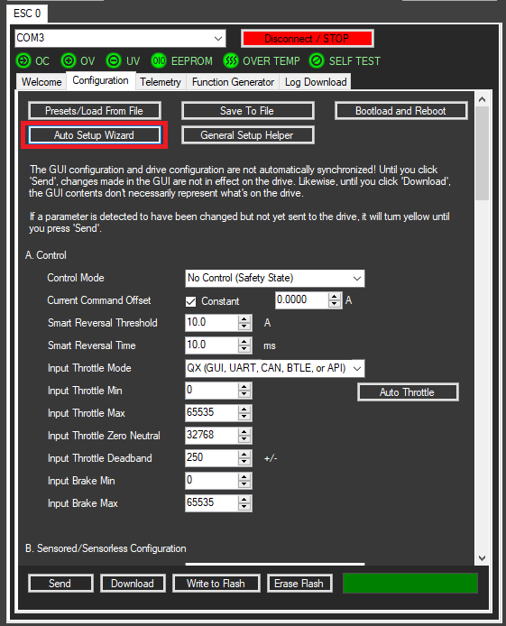
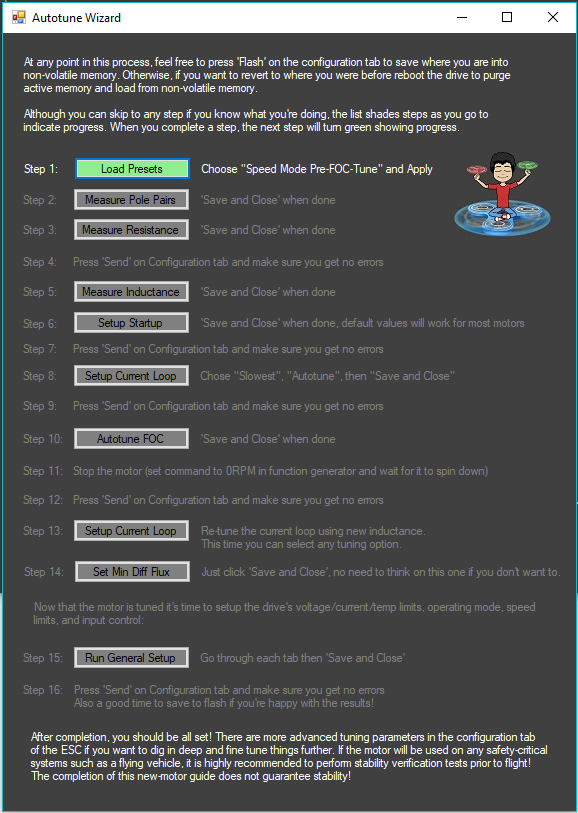

# Basic Configuration and Auto Setup Wizard

When you first get your drive, you will need to teach the motor drive about the motor so that the Field Oriented Control \(FOC\) can run properly. For a beginner user, the recommended method is to run the auto-setup wizard. This will guide you through a process of steps that makes the drive automatically measure important parameters such as resistance, inductance, and KV. Next it will guide you in setting up the drive's configuration such as operating point limits and how you will control the drive.

To launch this wizard, click 'Auto Setup Wizard' from within the Configuration tab:

This will launch the auto-setup wizard which guides through the process of setting up a motor and drive. Each step of this procedure has in-program instructions within the pop-ups so there is no further instruction provided here.

