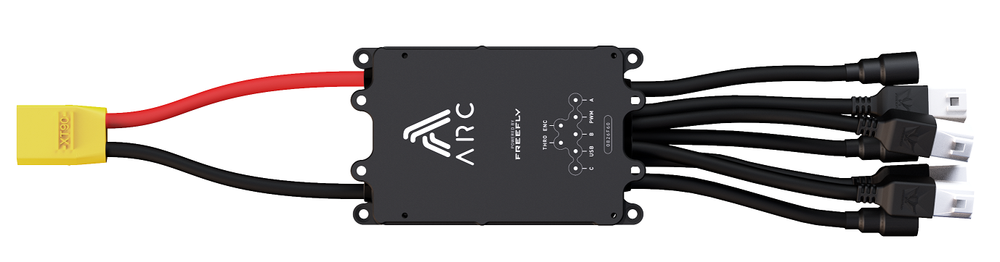

# Arc200

**Drive Specs:**

* Input Voltage: 4S \(13.6v\) - 12S \(50.4v\)\*
* Max peak phase current: 200A
  * Continuous current with little to no heatsinking \(hot-side facing upwards and unobstructed\): 60A
  * Continuous current when bolted to a typical EV aluminum chassis: 100-150A
  * Continuous current with infinite aluminum heatsink or water cooling, and forced air cooling on phase wires: 200A
* Control Inputs: PWM, Analog \(1x combined throttle/brake or independent throttle and brake\), UART/CAN \(for advanced users to interface through the Freefly API's QX protocol\)
* DC-Input: XT90
* Phase-Output: 8mm Female Bullet
* Sensor support: Fully sensorless, digital hall sensors, PWM
* Operating modes: Torque mode \(EV\), speed mode \(Multirotor, requires advanced user tuning\), angle/servo mode \(experimental, requires advanced user tuning and high-resolution motor encoder\)
* 23.4kHz switching frequency for zero audible PWM noise
* Integrated 5A 5V BEC \(Recommended continuous-current draw to be kept less than 3A\)
* Water resistant and splash proof - integrate into your application to avoid continuous water exposure

\* \(motor inductance must be above 12uH line-to-neutral when operating over 6S battery voltage or damage may occur and warranty void!\)

