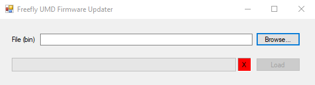

# Arc200 Firmware Updates

**Warning: Updating firmware will often make your saved motor configuration become invalidated. If you care about the settings loaded on the drive, make sure you use 'Save To File' on the configuration tab of the GUI so you can load the settings back onto the drive when done!** When you update the firmware, the parameters will only be invalidated and lost if the new firmware has a different parameter definition set. Most major firmware releases change this but if an update has the exact same parameter definition, you will notice your parameters are retained.

Launch the updater EXE and select the .ENC file for the firmware you want to update to. You can downgrade or upgrade from and to any version you want.

Connect the USB cable with the drive powered off, _then_ connect the ESC to a power source \(such as a battery or lab supply\). The LED on the drive should be solid blue. When it is solid blue, click load \(you might need to wait a few seconds for the computer to recognize the drive\). The drive will exit this solid-blue bootloader mode after 10-15 seconds so you need to get the timing right.

An alternate way to enter the bootloader to keep it in bootloader until the next power cycle is clicking 'Bootload and Reboot' on the configuration tab of the GUI. After clicking this, the drive will reboot and be in the solid-blue bootloader state. Now it will remain in bootloader forever until the next power cycle so you have all the time you need if you are struggling to use the timed bootloading method.

**Windows GUI can be downloaded** [**here**](../arc-gui/)**.**

## Arc200 Drive Firmware Files: 

June 27, 2019 - [v1.1.10](http://freefly-prod.s3.amazonaws.com/support/Arc200_v1.1.10_Firmware_And_Loader.zip)  
April 1, 2019 - [v1.1.9](http://freefly-prod.s3.amazonaws.com/support/Arc200_v1.1.9_Firmware_And_Loader.zip)  
January 10, 2019 - [v1.1.8](http://freefly-prod.s3.amazonaws.com/support/Arc200_v1.1.8_Firmware_And_Loader.zip)  
November 15, 2018 - [v1.1.7](http://freefly-prod.s3.amazonaws.com/support/Arc200_v1.1.7_Firmware_And_Loader.zip) **\(see comment in release notes about PWM scaling if using PWM input!\)**  
October 9, 2018 - [v1.1.5](http://freefly-prod.s3.amazonaws.com/support/Arc200_v1.1.5_Firmware_And_Loader.zip)  
October 3, 2018 - [v1.1.4](http://freefly-prod.s3.amazonaws.com/support/Arc200_v1.1.4_Firmware_And_Loader.zip)  
August 23, 2018 - [v1.1.2](http://freefly-prod.s3.amazonaws.com/support/Arc200_v1.1.2_Firmware_And_Loader.zip)  
August 17, 2018 - [v1.1.1](http://freefly-prod.s3.amazonaws.com/support/Arc200_v1.1.1_Firmware_And_Loader.zip)  
July 17, 2018 - [v1.1.0](http://freefly-prod.s3.amazonaws.com/support/Arc200_v1.1.0_Firmware_And_Loader.zip)  
July 12, 2018 - [v1.0.100](http://freefly-prod.s3.amazonaws.com/support/Arc200_v1.0.100_Firmware_And_Loader.zip)

## Arc200 Drive Bluetooth Firmware \(installed separately from main drive firmware through the same procedure - will not wipe drive configuration\): 

November 1, 2018 - [v1.0.1](http://freefly-prod.s3.amazonaws.com/support/Arc200_ble_fw_umd_v1.0.1_Power_Boost_2018_10_16_with_loader.zip) increases output power 4dB for increased range.

## Firmware Change Log: 

**v1.1.10:**

* Adds support for erasing the log memory chip

**v1.1.9:** 

* Adds a parameter that allows you to disable BTLE so that there are no security risks of people changing parameters while a drive is operating.

  
**v1.1.8:** 

* Re-enable data logging

**v1.1.7 \(note v1.1.6 was unreleased so this is a change log since 1.1.5\):**

**The scale for PWM commands was changed in 1.1.7 to represent milliseconds rather than previous arbitrary units. This means if you use PWM input, you will need to re-adjust the throttle min/max/neutral points.**

* Fix math error in DC current estimate where the value would falsely increase when the PWM magnitude is railed.
* Fix bug where regen torque is not available when a drive is configured in forward-only torque mode using hall sensors on a relatively slow motor \(such as a bicycle hub motor\).
* Flash data logging has been disabled while an issue with the system is being investigated \(in most cases, it didn't work in the previous releases either\). We hope to re-enable this in the near future in a new firmware update.
* Revise safety system on PWM so that there's no way updating settings can make the drive start up even if entering PWM mode and/or assigning invalid PWM ranges. PWM must pass through neutral before it'll start even after parameter updates.
* Correct behavior to take away torque or speed command when PWM-on-encoder-line signal is disconnected from the drive as a safety if throttle is lost.   

**v1.1.5:**

* Bug fix which caused CAN re-transmission to fail in 1.1.4.
* Direction reversal capability is now available from within the Motor Settings section of configuration.
* Bug fix which prevents certain motors from stopping when spinning in jitter-start speed mode with a low slew rate command.
* Bug fix where a motor with speed-dependent regen current that falls to zero-current at zero-RPM in hall-sensor mode may get stuck thinking it's spinning very slowly in reverse and not be able to accelerate forward.

**v1.1.4 \(note v1.1.3 was unreleased so this is a change log since 1.1.2\):**

* Corrected major bugs in the current command offset system which previously prevented reaching full regen when the motor was spinning forwards in torque mode.
* Corrected issue with integrator runaway during jitter start modes that created over-current faults and popping noises on certain motors and configurations.
* Improved performance of undervoltage and overvoltage foldbacks to avoid tripping a hard fault during normal operation
* Make Q-current request be buffered in mtr-&gt;q\_request\_pre\_foldback so that logging tasks asynchronous with the fastloop can't sometimes pick up pre-foldback values
* Add filtering to the PWM-out magnitude before it is fed into the foldback-regen-current-in-torque-forward-only system to fix an instability
* Add filtering to the signed current magnitude used in jitter start current loops to avoid excessive acoustic noise during startup
* Tero tuning added \(compiled when built using the Tero Keil target\)
* Fix a divide-by-zero vulnerability if regen or accel current limit is set to 0A \(or speed-dependent with a minimum of 0A\). 
* Improvements to under-voltage performance decreasing the odds of false-tripping an under voltage fault.
* Add support for CAN networking for command forwarding
* Add support for throttle expo
* Independent throttle/brake now smoothly transition between throttle and brake. No more step-change in torque request when you tap the brakes.
* Change foldback-below-PWM-torque-forward-only default to 5% \(previously 2%\).

**v1.1.2:**

* Major reliability bug fixes in the absolute encoder calibration algorithm.
* Fix flash logging which was broken in v1.1.1.
* Add raw brake input to the log

**v1.1.1:**

* Remove current HPF parameter. Confusing and un-utilized.
* Improved current command offset which is now just one parameter rather than being a speed-dependent setup requirement.
* Bug-fix where the Q-axis integrator was allowed to run away when in torque-mode jitter-start-mode and a zero current command was received with the motor not spinning. This resulted in a large current spike when a command was received as the integrator was railed to a high voltage.
* Add ability to set regen current foldback at low PWM widths when in torque forward only mode to avoid motor jerking at very low speeds with high regen commands.
* Remove current HPF parameter. Confusing and un-utilized.
* Improved current command offset which is now just one parameter rather than being a speed-dependent setup requirement.
* Bug-fix where the Q-axis integrator was allowed to run away when in torque-mode jitter-start-mode and a zero current command was received with the motor not spinning. This resulted in a large current spike when a command was received as the integrator was railed to a high voltage.
* Add ability to set regen current foldback at low PWM widths when in torque forward only mode to avoid motor jerking at very low speeds with high regen commands.

**v1.1.0:**

* Turn on MCU pull-down on UART RX line for increased safety against noise-induced QX messages.
* Update QX protocol to accept '...QQX...' beginning of message to allow for sending many Q's to clear the parser state machine.
* Corrected feed-forward KV math on a ramp-start in speed mode to decrease the speed jump when transitioning from ramp to run.
* Bug fix where the first time performing resistance might give different \(incorrect\) results compared to subsequent resistance measurements.

