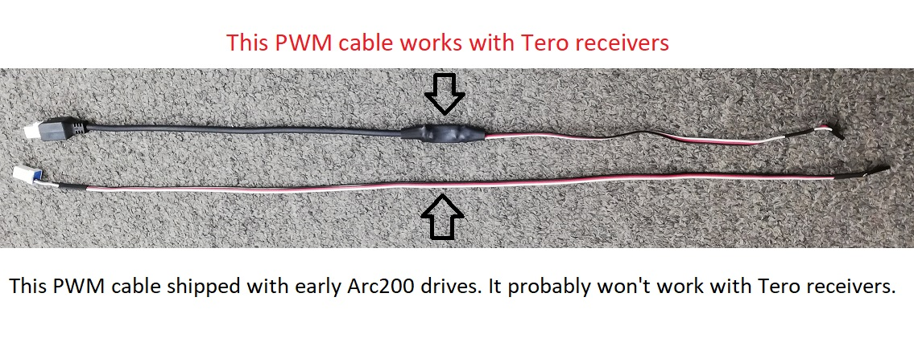

# Freefly Tero Variant

## Firmware 

If you purchased your drive as an Arc200, you will need to change the firmware on the drive to the Tero variant. If you purchased your drive as a pre-configured drive specifically for Tero use, it should come from the factory with Tero firmware installed. In that case, you only need to update the firmware if you want the latest version.

To update the firmware on the drive, follow the same [instructions](arc200-firmware-updates.md) as for the Arc200, except use the firmware on this page.

[v1.1.10](https://www.dropbox.com/s/ifhuagnengl8fl8/Tero_Firmware_UMDS2_Mini_F7_4_1_2019_v1_1_10_74a42e5.zip?dl=0) - Initial Release April 1, 2019

## Drive Installation 

The Tero drive is compatible with 4S and 6S Lipo batteries. **Do not use this drive on a Tero with more than 6S or damage may occur to the drive!** At boot-up, the drive should beep either 4, or 6 times. Make sure this matches up to the expected cell count to ensure that under-voltage thresholds are appropriately established.

Simply remove the Castle ESC taking note of what port it plugs into on the receiver, and connect the Freefly Arc200 ESC's servo connector to the same port. Connect that cable to the 'PWM' port of the Arc200 drive.

On first power-up, have the wheels lifted off the ground. Power up the radio and ensure the throttle-zero \(knob on the receiver\) is set such that the Tero does not accelerate. The Arc200's throttle is set to a different zero-point than the Castle ESC so you will most likely find the tires accelerating on first power-up until you change the throttle zero point.

Now you're ready to go! No software configuration or drive tuning is required for the Tero version.

## PWM Cable 

Early Arc200 drives shipped with a PWM cable that doesn't work well with the receiver that came with Tero. You can try it, but most likely there will be no throttle control. If it does not work, contact Freefly to receive the correct replacement cable.

