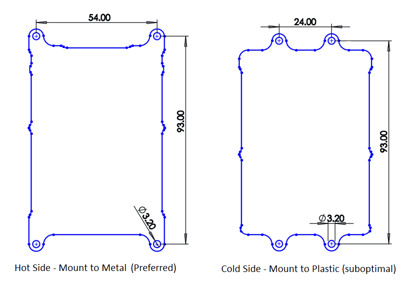
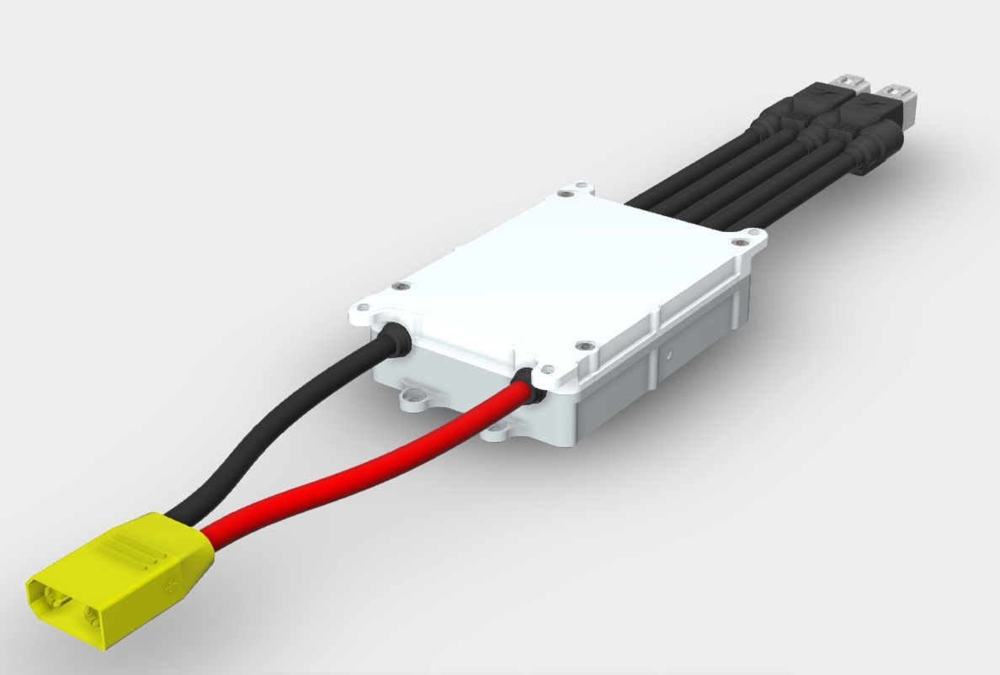
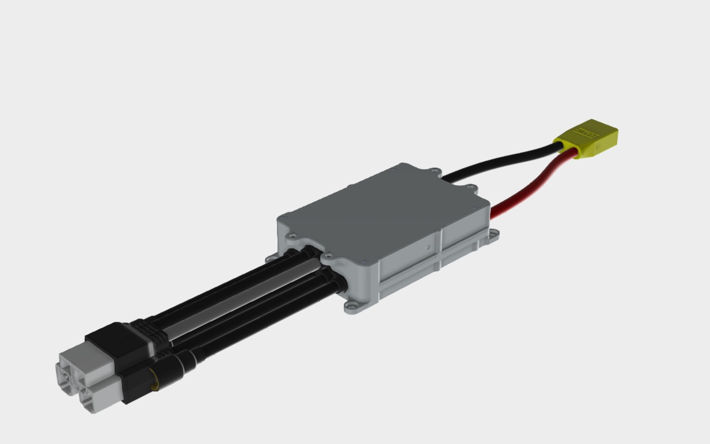

# Mounting the Arc200

The drive generates heat on the side opposite the logo engraving. If attaching the drive to a heat sink body such as a metal chassis, heatsink, water block, etc. the heatsink should attach to the side opposite the logo. If attaching the drive to a thermal insulator such as a plastic chassis, the drive should be mounted with the heat generating side out so air will flow over the hot side. In this case the logo should mount to the plastic body.  The drive mounts using 3mm hardware which is included with the Arc200.

Thermal paste or quality thermal pad should be used for proper thermal transfer into the heatsink.

If you need additional mounting hardware you can find many options [here](https://www.mcmaster.com/#standard-socket-head-screws/=1dl3rzr)

3D model of Arc200 \(STEP file\): [ARC200\_Block.STEP](FRP/attachments/270008349/307396609.step)

**Hot side \(Mount this to a heatsink or metal body through thermal pad or paste - preferred mounting method\):**

**Cold side \(Mount this to a plastic enclosure or any thermally insulating material if no heatsinking surface is available and leave the other side exposed to air\):**

