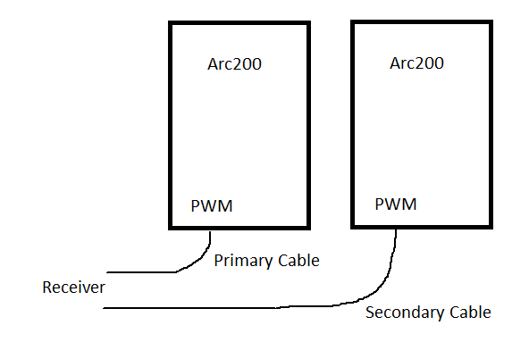
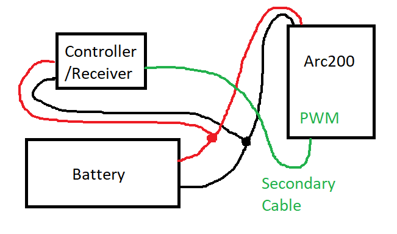
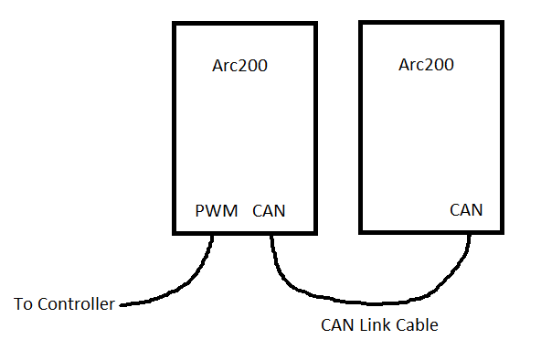
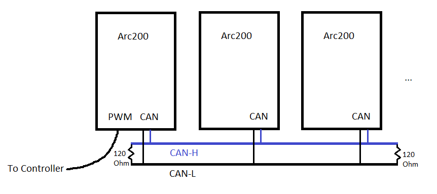
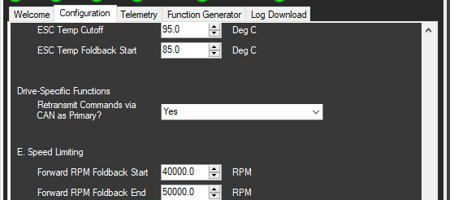
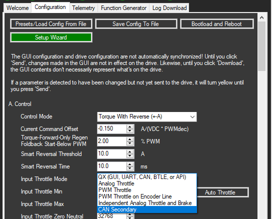

# Multiple Drives

If multiple drives are connected to the same DC power source, care must be taken to avoid damaging the drives when setting up the control interface.

The one rule that must always be obeyed is that you cannot connect ground or power supply output pins of any of the drives together! Doing so may cause permanent hardware damage to the drives and voids your warranty.

This naturally makes controlling the drives slightly more difficult because the PWM and analog inputs are ground referenced. Two solutions are outlined on this page.

## PWM Networking: 

For PWM input, you can connect the PWM controller to each drive in parallel but you must use the correct cables for each drive.

Freefly sells two PWM accessory cables: primary and secondary cables \(store links coming soon\). The primary cable connects opto-GND and GND together so that you can still get BEC power output to power a receiver, steering servo, etc. The secondary cable leaves the input opto-isolated \(opto-GND and GND are not connected\), but there is no BEC power available on the connector. 

By using either zero or one primary cables and all other drives using secondary cables, you can safely wire the PWM lines in parallel to the receiver, flight controller, etc. as long as that receiver/controller is not grounded anywhere else in the system! **Never use more than one PWM primary cable in any network of drives, and never use any PWM primary cables if the receiver/controller is externally grounded, or hardware damage may occur to the drives and your warranty will be void.**

**2-Drive network with receiver not externally grounded or powered**

**1+ Drives connected to a receiver that is externally grounded or powered:**

If the controller receives external ground connection, then you cannot safely use the master cable as you would create a ground loop that may damage the drive. In this instance, **all** drives must use the secondary PWM cable.

## CAN Networking: 

If each drive will be receiving the same command \(for example, a skateboard with one hand controller and two motors\) then you can use CAN networking to safely command two or more drives from a single PWM source.

If only two drives are in the network, you can use the Freefly CAN link cable \(not yet released for purchase as of 9/21/2018, link coming soon\). If connecting three or more drives, you will have to wire up your own CAN network following the directions below.

**2-drive using CAN link cable:**

**3+ drives using your own CAN network wiring:**

Do **not** connect the ground wires between the CAN ports! Only CAN-L and CAN-H.

In either case, setup the drive that connects to the controller \(master drive\) as you normally would if that were the only drive in the system. In the Drive-Specific Functions section of the Configuration, set "Retransmit Commands via CAN As Primary?" to "Yes". This makes any command received over its standard input mode \(PWM, Analog, etc.\) get re-transmitted over the CAN  network:

For all the other drives that connect only over CAN, this retransmission flag should be left at 'No'. On these drives, just set the "Input Throttle Mode" to "CAN Secondary". On these drives, there is no need to setup the throttle configuration as values are transmitted over CAN in their native unit \(amps, RPM, degrees\).

