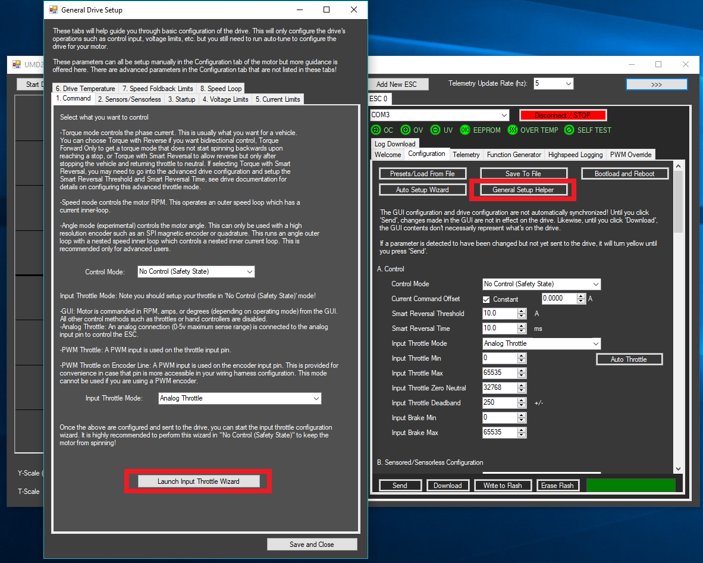
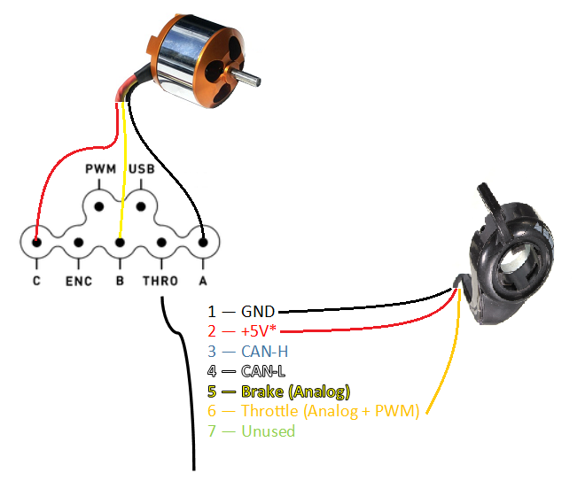
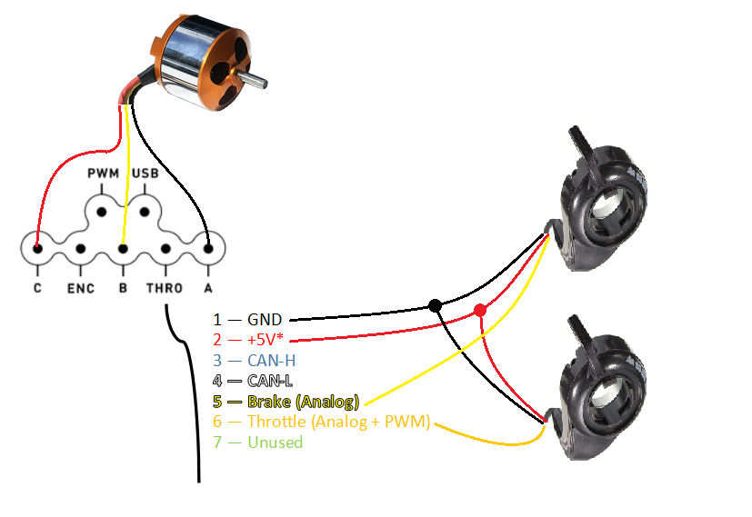
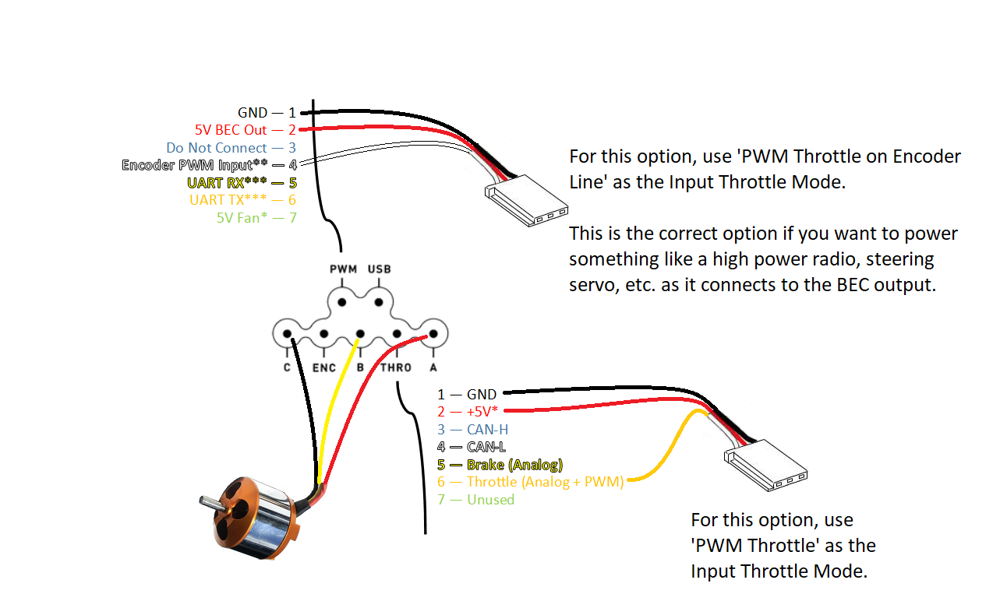
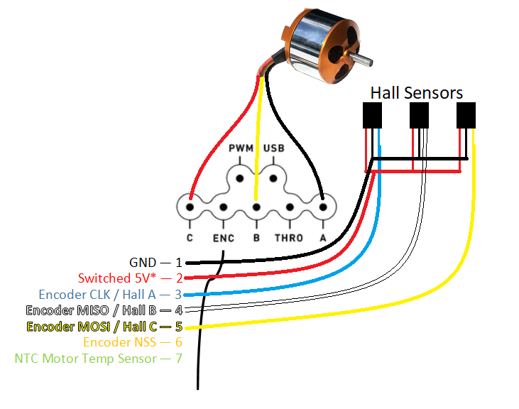

# Sample Configurations

This page covers some common installations of an Arc drive. Before you even worry about hooking these up, it is highly recommended to get your motor spinning successfully through the GUI. Get that done first, then start thinking about setting up control inputs and sensors. 

Before you start setting up the throttles, it is recommended to set the Control Mode to 'No Control \(Safety State\)' until you are happy with the throttle configuration. Otherwise the motor may receive commands mid-way through throttle setup!  
  
After you have setup your throttle and motor wiring, go to the Control tab of the general setup helper for more information on setting up your throttle, then launch the throttle wizard.  

## Sensorless With One Analog Throttle 

This is a popular configuration for something like a scooter where you want to have just one hand throttle. This can be a bit awkward for regenerative braking as these hand throttles usually spring-reset all the way one way which would put you in full braking when you take your hand off. It works out alright though if you want to get started with one throttle or really want to keep one hand free!

## Sensorless with Independent Analog Throttle and Brake 

This is the easiest to control and makes your electric vehicle behave much like a typical car. One hand controls throttle, the other controls braking. If you let off both hands, then it coasts much like when you take your foot off the gas in a car.

## Sensorless with PWM Control 

For PWM control, you can use the included PWM cable. This connects to the 'PWM' wire on the drive and converts it to the industry-standard hobby servo connector. This can be connected to something like an RC receiver, or really anything that outputs a PWM with high-time controlling the signal \(_not_ duty cycle\). 

If you want to do your own wiring and not use the provided adapter cable follow this diagram. There are two possible ways to hook up a PWM cable, select whichever makes the most sense for your wiring! In a very poor EMI environment, using the 'Encoder PWM Input' option will be somewhat more robust \(this is what the provided adapter cable uses\).

## Adding Sensors 

With any of these configurations, you can always add a sensor to the motor if you want true zero-speed torque. Although you can usually tune sensorless to give you great performance, it's not the same as a real sensored configuration for low speed torque performance.

Most people running an electric vehicle will want to add hall sensors. It is industry standard within the hobby ESC community and many motors can be purchased with sensors already built into the motor. 

