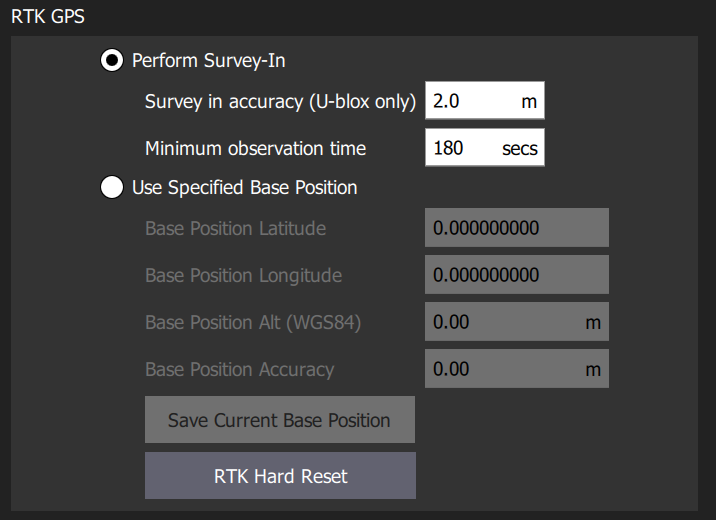

# Advanced Configuration

## Configuration

The default configurations have been tested to provide good performance for all users. However, there are a few additional settings that users can change to tweak RTK usage.

## Improving Height Hold Performance in RTK Mode

By default, Alta utilizes the barometer as principal source of height, since the baro accuracy \(10s of cm\) is much better than that of the normal GPS \(many meters\).

However, RTK provides very good height precision \(centimeters\), so it can be used to improve the Alta height performance by switching Alta to use GPS as the primary altitude source.

To change the height mode, navigate to the Parameters tab of QGC, and search for " EKF2\_HGT\_MODE." Set mode to "GPS" and reboot.

When not using RTK, it is recommended you return the EKF2\_HGT\_MODE to "Barometric Pressure"


Setting EKF Height Mode to GPS is only recommended when flying in RTK mode. In non-RTK mode \(or with a normal GPS\), the baro will provide much better height accuracy.



## Ground Station RTK Configuration

While the default RTK settings are likely to be sufficient for most people, Alta Ground Control Station allows you to tune the following RTK base station survey-in parameters:

* **Survey-in accuracy**: The lower the number, the more accurate the base station location will be, though it will also take longer to complete survey-in. Default value: 2.0m
* **Minimum observation time**: Longer time typically results in a better survey, though this number can be reduced if the base station GPS is in a location where the survey-in accuracy quickly reaches the desired number. Default value: 180 seconds

To change the parameters, perform the following steps:

<table>
  <thead>
    <tr>
      <th style="text-align:left"></th>
      <th style="text-align:left"></th>
      <th style="text-align:left"></th>
    </tr>
  </thead>
  <tbody>
    <tr>
      <td style="text-align:left">1.</td>
      <td style="text-align:left">Alta SW</td>
      <td style="text-align:left">OPEN Alta Ground Control Station</td>
    </tr>
    <tr>
      <td style="text-align:left">2.</td>
      <td style="text-align:left">Settings Tab</td>
      <td style="text-align:left">
        <p>Click on QGC logo, then &quot;General&quot; Button</p>
        <p>
          
        </p>
      </td>
    </tr>
    <tr>
      <td style="text-align:left">3.</td>
      <td style="text-align:left">RTK GPS</td>
      <td style="text-align:left">
        <p>Scroll Down to RTK GPS Section, change settings</p>
        <p>
          
        </p>
      </td>
    </tr>
    <tr>
      <td style="text-align:left">4.</td>
      <td style="text-align:left">Restart Alta SW</td>
      <td style="text-align:left">Restart Alta Ground Control Station to apply settings</td>
    </tr>
  </tbody>
</table>## Default PX4 Configuration with RTK GPS

The RTK module serial port is configured for 115kbaud. PX4 may not be able to automatically set to this baudrate, so it is recommended to set the parameter "SER\_GPS1\_BAUD" to 115200 8N1 to ensure reliable GPS communication.

## Default Freefly U-Blox F9P Configuration

The default GPS configuration is shown below. By default, PX4 only modifies RAM values, which reset to the flash values on every power-up.

However, if you inadvertently modify the Flash values, you can use the data below to reset them to the Freefly defaults.

```text
# Config changes format version 1.0
# created by u-center version 19.08.01 at 15:37:31 on Monday, 07 Oct 2019
[del]
[set]
  RAM CFG-UART1-BAUDRATE   0x1c200              # write value 115200  0x1c200      to item id 40520001 in layer 0
Flash CFG-UART1-BAUDRATE   0x1c200              # write value 115200  0x1c200      to item id 40520001 in layer 2
  RAM CFG-UART1-STOPBITS   1                    # write value 1 - ONE              to item id 20520002 in layer 0
Flash CFG-UART1-STOPBITS   1                    # write value 1 - ONE              to item id 20520002 in layer 2
  RAM CFG-UART1-DATABITS   0                    # write value 0 - EIGHT            to item id 20520003 in layer 0
Flash CFG-UART1-DATABITS   0                    # write value 0 - EIGHT            to item id 20520003 in layer 2
  RAM CFG-UART1-PARITY     0                    # write value 0 - NONE             to item id 20520004 in layer 0
Flash CFG-UART1-PARITY     0                    # write value 0 - NONE             to item id 20520004 in layer 2
  RAM CFG-UART1-ENABLED    1                    # write value 1                    to item id 10520005 in layer 0
Flash CFG-UART1-ENABLED    1                    # write value 1                    to item id 10520005 in layer 2
  RAM CFG-UART1INPROT-UBX  1                    # write value 1                    to item id 10730001 in layer 0
Flash CFG-UART1INPROT-UBX  1                    # write value 1                    to item id 10730001 in layer 2
  RAM CFG-UART1INPROT-NMEA 1                    # write value 1                    to item id 10730002 in layer 0
Flash CFG-UART1INPROT-NMEA 1                    # write value 1                    to item id 10730002 in layer 2
  RAM CFG-UART1INPROT-RTCM3X 1                    # write value 1                    to item id 10730004 in layer 0
Flash CFG-UART1INPROT-RTCM3X 1                    # write value 1                    to item id 10730004 in layer 2
  RAM CFG-UART1OUTPROT-UBX 1                    # write value 1                    to item id 10740001 in layer 0
Flash CFG-UART1OUTPROT-UBX 1                    # write value 1                    to item id 10740001 in layer 2
  RAM CFG-UART1OUTPROT-NMEA 0                    # write value 0                    to item id 10740002 in layer 0
Flash CFG-UART1OUTPROT-NMEA 0                    # write value 0                    to item id 10740002 in layer 2
  RAM CFG-UART1OUTPROT-RTCM3X 1                    # write value 1                    to item id 10740004 in layer 0
Flash CFG-UART1OUTPROT-RTCM3X 1                    # write value 1                    to item id 10740004 in layer 2
  RAM CFG-UART2-BAUDRATE   0x1c200               # write value 115200  0x1c200        to item id 40530001 in layer 0
Flash CFG-UART2-BAUDRATE   0x1c200               # write value 115200  0x1c200        to item id 40530001 in layer 2
  RAM CFG-UART2-STOPBITS   1                    # write value 1 - ONE              to item id 20530002 in layer 0
Flash CFG-UART2-STOPBITS   1                    # write value 1 - ONE              to item id 20530002 in layer 2
  RAM CFG-UART2-DATABITS   0                    # write value 0 - EIGHT            to item id 20530003 in layer 0
Flash CFG-UART2-DATABITS   0                    # write value 0 - EIGHT            to item id 20530003 in layer 2
  RAM CFG-UART2-PARITY     0                    # write value 0 - NONE             to item id 20530004 in layer 0
Flash CFG-UART2-PARITY     0                    # write value 0 - NONE             to item id 20530004 in layer 2
  RAM CFG-UART2-ENABLED    1                    # write value 1                    to item id 10530005 in layer 0
Flash CFG-UART2-ENABLED    1                    # write value 1                    to item id 10530005 in layer 2
  RAM CFG-UART2-REMAP      0                    # write value 0                    to item id 10530006 in layer 0
Flash CFG-UART2-REMAP      0                    # write value 0                    to item id 10530006 in layer 2
  RAM CFG-UART2INPROT-UBX  1                    # write value 1                    to item id 10750001 in layer 0
Flash CFG-UART2INPROT-UBX  1                    # write value 1                    to item id 10750001 in layer 2
  RAM CFG-UART2INPROT-NMEA 0                    # write value 0                    to item id 10750002 in layer 0
Flash CFG-UART2INPROT-NMEA 0                    # write value 0                    to item id 10750002 in layer 2
  RAM CFG-UART2INPROT-RTCM3X 1                    # write value 1                    to item id 10750004 in layer 0
Flash CFG-UART2INPROT-RTCM3X 1                    # write value 1                    to item id 10750004 in layer 2
  RAM CFG-UART2OUTPROT-UBX 1                    # write value 1                    to item id 10760001 in layer 0
Flash CFG-UART2OUTPROT-UBX 1                    # write value 1                    to item id 10760001 in layer 2
  RAM CFG-UART2OUTPROT-NMEA 0                    # write value 0                    to item id 10760002 in layer 0
Flash CFG-UART2OUTPROT-NMEA 0                    # write value 0                    to item id 10760002 in layer 2
  RAM CFG-UART2OUTPROT-RTCM3X 1                    # write value 1                    to item id 10760004 in layer 0
Flash CFG-UART2OUTPROT-RTCM3X 1                    # write value 1                    to item id 10760004 in layer 2
  RAM CFG-HW-ANT_CFG_VOLTCTRL 0                    # write value 0                    to item id 10a3002e in layer 0
Flash CFG-HW-ANT_CFG_VOLTCTRL 0                    # write value 0                    to item id 10a3002e in layer 2
  RAM CFG-HW-ANT_CFG_SHORTDET 0                    # write value 0                    to item id 10a3002f in layer 0
Flash CFG-HW-ANT_CFG_SHORTDET 0                    # write value 0                    to item id 10a3002f in layer 2
  RAM CFG-HW-ANT_CFG_OPENDET 0                    # write value 0                    to item id 10a30031 in layer 0
Flash CFG-HW-ANT_CFG_OPENDET 0                    # write value 0                    to item id 10a30031 in layer 2
  RAM CFG-TMODE-MODE       0                    # write value 0 - DISABLED         to item id 20030001 in layer 0
Flash CFG-TMODE-MODE       0                    # write value 0 - DISABLED         to item id 20030001 in layer 2
```

