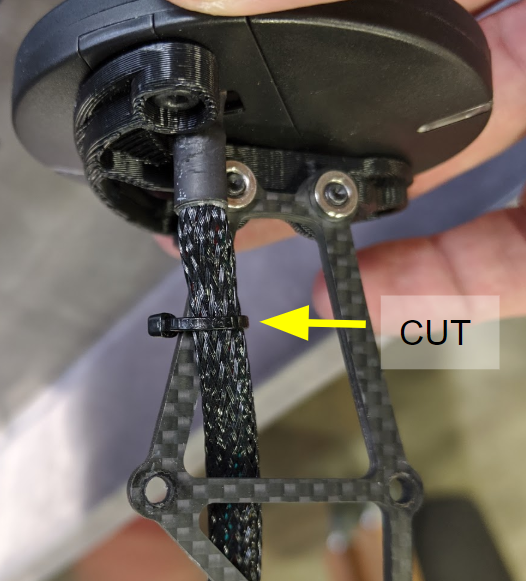
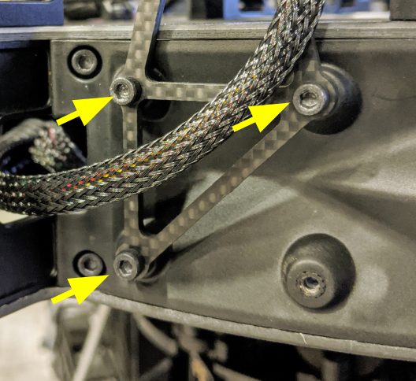
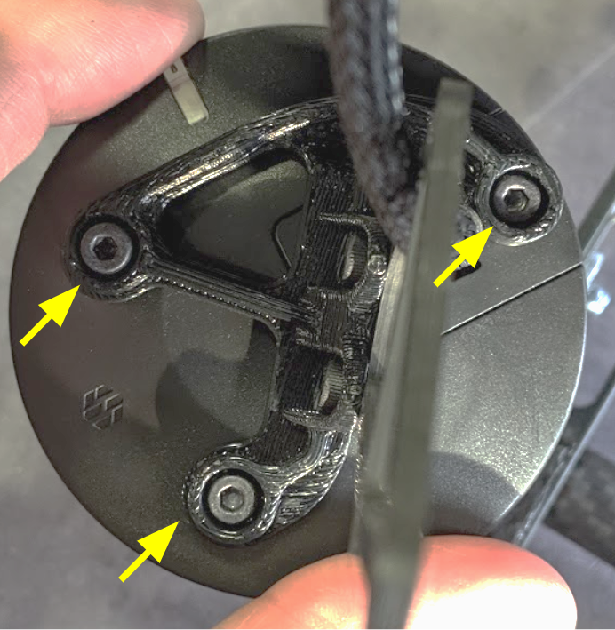
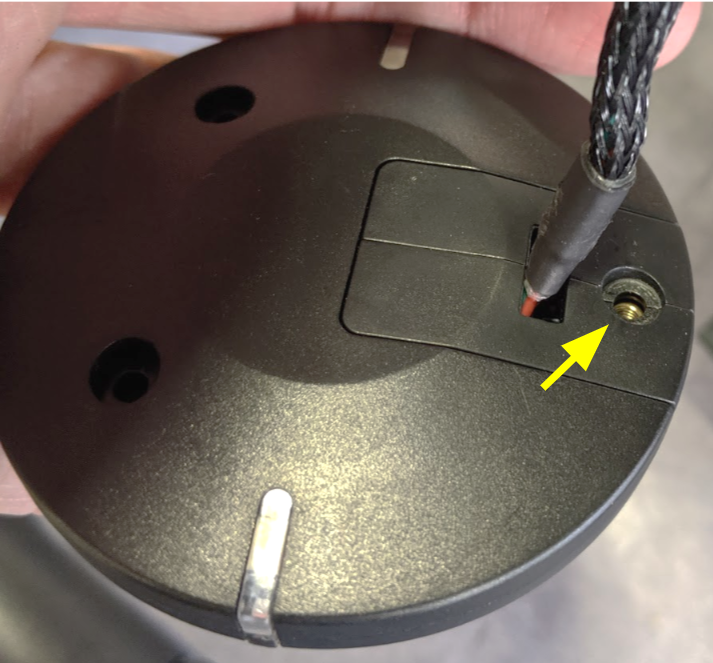
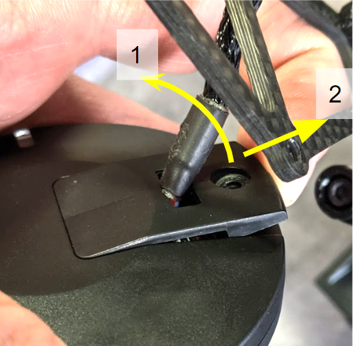
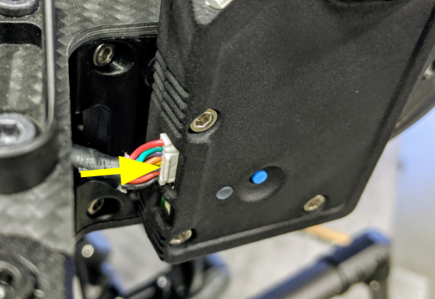
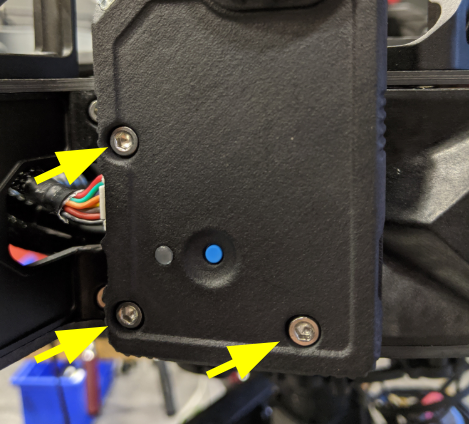

# Module Installation


**Follow this guide if you are retrofitting RTK GPS onto an existing Alta X.**


## Alta X Installation - Mechanical

The Rover module replaces the existing GPS module. Follow the instructions below to remove the previous GPS module and install the RTK module.

<table>
  <thead>
    <tr>
      <th style="text-align:left"></th>
      <th style="text-align:left"></th>
      <th style="text-align:left"></th>
    </tr>
  </thead>
  <tbody>
    <tr>
      <td style="text-align:left">1.</td>
      <td style="text-align:left">CUT cable tie</td>
      <td style="text-align:left">
        

        

          
        

      </td>
    </tr>
    <tr>
      <td style="text-align:left">2.</td>
      <td style="text-align:left">REMOVE three bracket mounting screws attaching the bracket to the Alta
        X</td>
      <td style="text-align:left">
        
      </td>
    </tr>
    <tr>
      <td style="text-align:left">3.</td>
      <td style="text-align:left">REMOVE the three mounting screws attaching the bracket to the GPS module</td>
      <td
      style="text-align:left">
        
        </td>
    </tr>
    <tr>
      <td style="text-align:left">4.</td>
      <td style="text-align:left">REMOVE cover screw</td>
      <td style="text-align:left">
        
      </td>
    </tr>
    <tr>
      <td style="text-align:left">5.</td>
      <td style="text-align:left">Carefully LIFT cable cover, slide out</td>
      <td style="text-align:left">
        

        

        

          
        

      </td>
    </tr>
    <tr>
      <td style="text-align:left">6.</td>
      <td style="text-align:left">With a driver or long device, DEPRESS connector latch and slide connector
        and cable out</td>
      <td style="text-align:left">
        

        

          
        

      </td>
    </tr>
    <tr>
      <td style="text-align:left">7.</td>
      <td style="text-align:left">REMOVE GPS device and mounting bracket</td>
      <td style="text-align:left">
        

        

      </td>
    </tr>
    <tr>
      <td style="text-align:left">8.</td>
      <td style="text-align:left">INSTALL RTK Module, button should be facing away from the aircraft</td>
      <td
      style="text-align:left"></td>
    </tr>
    <tr>
      <td style="text-align:left">9.</td>
      <td style="text-align:left">PLUG existing 8-pin GPS cable into RTK Module</td>
      <td style="text-align:left">
        

        

          
        

      </td>
    </tr>
    <tr>
      <td style="text-align:left">10.</td>
      <td style="text-align:left">
        
Apply threadlocker and SCREW the 3, M3x16 mm bolts

        
<b>Hint</b>: The M3x16 use a 2.5mm driver (ie &quot;Freefly Blue&quot;)

      </td>
      <td style="text-align:left">
        

        

          
        

      </td>
    </tr>
  </tbody>
</table>## Alta X Installation - Configuration Changes

After completing the mechanical installation, you will have to configure the autopilot.


Note: You must be running Alta SW 1.3 or above for RTK GPS operation


<table>
  <thead>
    <tr>
      <th style="text-align:left"></th>
      <th style="text-align:left"></th>
      <th style="text-align:left"></th>
    </tr>
  </thead>
  <tbody>
    <tr>
      <td style="text-align:left">1</td>
      <td style="text-align:left">Open Alta Ground Control</td>
      <td style="text-align:left"></td>
    </tr>
    <tr>
      <td style="text-align:left">2</td>
      <td style="text-align:left">Power Alta X up by connection at least one battery</td>
      <td style="text-align:left"></td>
    </tr>
    <tr>
      <td style="text-align:left">3</td>
      <td style="text-align:left">Connect to Alta X via Alta Ground Control</td>
      <td style="text-align:left"></td>
    </tr>
    <tr>
      <td style="text-align:left">4</td>
      <td style="text-align:left">Click on the Vehicle Setup (gear icon) and on the &quot;Sensors&quot;
        button.</td>
      <td style="text-align:left">
        

          
        

        

      </td>
    </tr>
    <tr>
      <td style="text-align:left">5</td>
      <td style="text-align:left">Press &quot;Compass&quot; to start compass calibration</td>
      <td style="text-align:left"></td>
    </tr>
    <tr>
      <td style="text-align:left">6</td>
      <td style="text-align:left">When prompted for autopilot orientation, set ROTATION_YAW_180</td>
      <td
      style="text-align:left">
        

        

        </td>
    </tr>
    <tr>
      <td style="text-align:left">7</td>
      <td style="text-align:left">Follow instructions to calibrate compass</td>
      <td style="text-align:left"></td>
    </tr>
    <tr>
      <td style="text-align:left">8</td>
      <td style="text-align:left">When prompted for external compass orientation, set <b>NO_ROTATION </b>(set
        to YAW_180 if placed in the alternate [rear] location)</td>
      <td style="text-align:left"></td>
    </tr>
    <tr>
      <td style="text-align:left">9</td>
      <td style="text-align:left">In Vehicle Setup, click on &quot;Parameters&quot; button</td>
      <td style="text-align:left">
        

        

          
        

      </td>
    </tr>
    <tr>
      <td style="text-align:left">10</td>
      <td style="text-align:left">In the &quot;Standard&quot; group, select &quot;Serial&quot;</td>
      <td style="text-align:left">
        

        

          
        

      </td>
    </tr>
    <tr>
      <td style="text-align:left">11</td>
      <td style="text-align:left">Set &quot;SER_GPS1_BAUD&quot; to 115200 8N1</td>
      <td style="text-align:left">
        

        

          
        

      </td>
    </tr>
    <tr>
      <td style="text-align:left">12</td>
      <td style="text-align:left">Reboot Alta</td>
      <td style="text-align:left"></td>
    </tr>
  </tbody>
</table>

