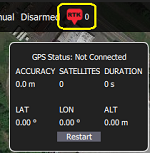
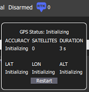

# Quick Start Guide

## Pre-requisites

Before operating the RTK GPS, you should have the following:

* **ALTA X with RTK GPS**
  * If you are retrofitting RTK GPS onto an existing ALTA X, follow the[ installation guide](rtk-module-installation.md). 
* ALTA X running **firmware v1.3** or above \([see firmware update steps here](../alta-x/untitled-4.md#updating-firmware)\) 
* **Telemetry Radio**, such as the [Freefly FRX Pro](https://store.freeflysystems.com/collections/alta-x/products/frx-pro-pair-with-accessories-for-alta-x) 
* **Base Station RTK GPS** module on a stable mount \(tripod is recommended!\) and a USB-C Cable

* **ALTA QGroundControl v1.3** or above running on Windows or macOS \([download on support page](https://freeflysystems.com/support/alta-x-support)\)

## Operation Checklist 

<table>
  <thead>
    <tr>
      <th style="text-align:left">&#x200B;Title</th>
      <th style="text-align:left">&#x200B;Title</th>
      <th style="text-align:left"></th>
    </tr>
  </thead>
  <tbody>
    <tr>
      <td style="text-align:left">1.</td>
      <td style="text-align:left">Get ALTA powered on and ready to fly</td>
      <td style="text-align:left"></td>
    </tr>
    <tr>
      <td style="text-align:left">2.</td>
      <td style="text-align:left">Install base station module onto mount</td>
      <td style="text-align:left"></td>
    </tr>
    <tr>
      <td style="text-align:left">3.</td>
      <td style="text-align:left">Connect ALTA QGroundControl to aircraft</td>
      <td style="text-align:left"></td>
    </tr>
    <tr>
      <td style="text-align:left">4.</td>
      <td style="text-align:left">Click the &quot;RTK&quot; symbol to open the status window</td>
      <td style="text-align:left">
        
      </td>
    </tr>
    <tr>
      <td style="text-align:left">5.</td>
      <td style="text-align:left">Connect base station module to laptop via USB</td>
      <td style="text-align:left"></td>
    </tr>
    <tr>
      <td style="text-align:left">6.</td>
      <td style="text-align:left">
        
Ensure QGroundControl recognized the module

        <ul>
          <li>Wait until GPS Status no longer says &quot;Not Connected&quot;</li>
        </ul>
      </td>
      <td style="text-align:left"></td>
    </tr>
    <tr>
      <td style="text-align:left">7.</td>
      <td style="text-align:left">Open RTK status window and press &quot;Restart&quot; button to initiate
        survey-in.</td>
      <td style="text-align:left">
        
      </td>
    </tr>
    <tr>
      <td style="text-align:left">8.</td>
      <td style="text-align:left">
        
Wait until GPS Status says &quot;GPS Initializing.&quot;

        
<b>Note: </b>If the status does not change after 10 seconds, refer to
          troubleshooting section.

      </td>
      <td style="text-align:left">
        
      </td>
    </tr>
    <tr>
      <td style="text-align:left">9.</td>
      <td style="text-align:left">
        
Wait for GPS Status to change to &quot;Survey-in Complete&quot;.

        
<b>Note</b>: The survey-in process will complete after the minimum survey-in
          time has completed (typically 180s) AND the accuracy is below the configured
          threshold (2m). See the configuration page for adjusting these parameters.

      </td>
      <td style="text-align:left">
        

        

          
        

      </td>
    </tr>
    <tr>
      <td style="text-align:left">10.</td>
      <td style="text-align:left">Wait for Aircraft GPS status of &quot;RTK GPS Lock (fixed)&quot;</td>
      <td
      style="text-align:left">
        

        

          
        

        </td>
    </tr>
    <tr>
      <td style="text-align:left">11.</td>
      <td style="text-align:left">Ensure that Aircraft location is correctly indicated on the map</td>
      <td
      style="text-align:left"></td>
    </tr>
    <tr>
      <td style="text-align:left">12.</td>
      <td style="text-align:left">Fly and enjoy!</td>
      <td style="text-align:left"></td>
    </tr>
  </tbody>
</table>
Any time you move the base station GPS, it is recommended that you manually restart survey-in by clicking on the "Restart" button. This ensures that the base station updates its location and provides optimal absolute positioning.


