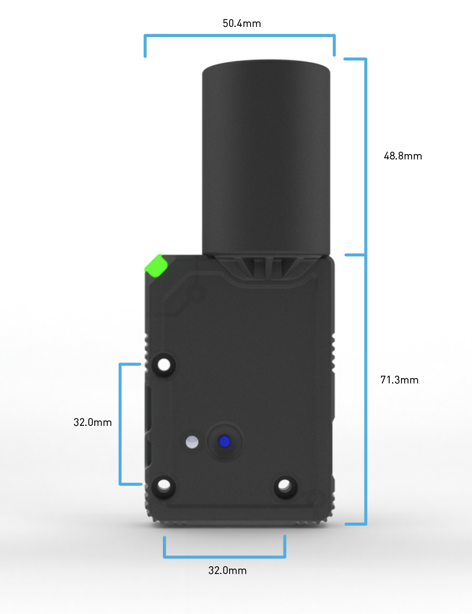
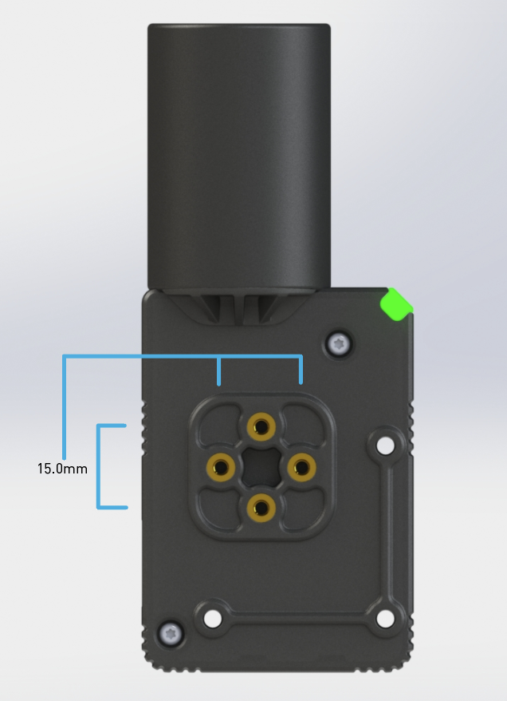
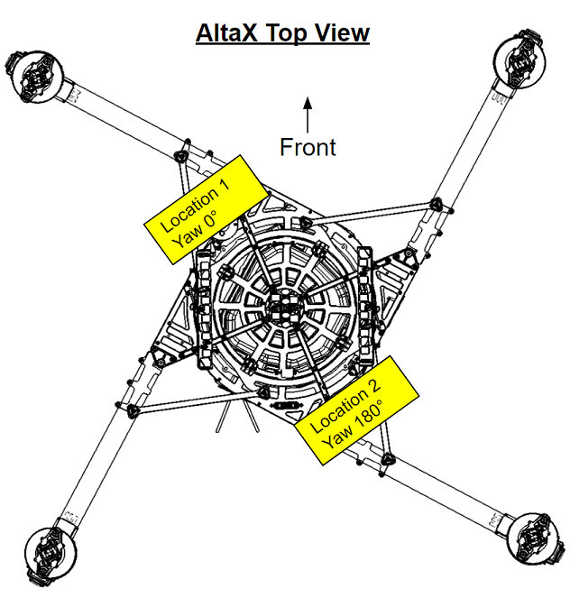

# Specifications

* Ublox ZED-F9P GPS Receiver
  * Ultracap backup power for fast \(hot-start\) restarts
  * EMI shield over receiver for improved EMI immunity
* IST8310 Magnetometer
* Safety-switch and safety LED
* RGB LEDs for status indication
  * NCP5623CMUTBG I2C Driver
* BMP388 Baro on I2C bus
* External, active antenna \(Maxtena M7HCT\)
  * SMA connector
* STM32 MCU for future CAN-based communication
  * FW updates through USB connector
* Connectivity:
  * USB-C
    * 2-way USB Switch to MCU and F9P
  * SMA for active antenna \(20mA max\)
  * 4-pin CAN Bus \(dronecode compliant\)
  * 8-pin UART/I2C
* Power:
  * Input from either \(diode OR'd\): 
    * USB \(5V\)
    * CAN \(4.7 to 25.2V\)
    * UART \(4.7 to 25.2V\)
  * Power Consumption &lt;1W

## RTK Performance over range

The performance of RTK over long distances is typically limited by:

* Telemetry link: You must have a telemetry link between the aircraft and ground station,
* RTK degradation over distance: As the aircraft moves away from the base station, the RTK accuracy will degrade. The F9P RTK GPS receiver spec is 0.01m CEP \(Circular Error Probability\) + 1ppm for both vertical and horizontal.
  * For example, at 10km distance from base station, the typical accuracy would be  0.01m + \(1km \* 1/1,000,000\) = 0.02m CEP

## Mechanical Dimensions

|  |  |
| :--- | :--- |

## Prerequisites

For use on Alta, the following is necessary:

* AltaX
* Alta SW 1.3 or above
* Datalink \(FRX Pro recommended\)
* Computer \(Mac or Windows\) running Alta QGC 1.3 or above
* Sturdy mount for base stations GPS. Tripod with 1/4-20 mount is recommended

## I2C Address Table

| Description | PN | I2C Address \(7-bit\) |
| :--- | :--- | :--- |
| RGB LED Driver | NCP5623C | 011 1001 \($39\) |
| Barometer | BMP388 | 111 0111 \($77\) |
| Magnetometer | IST8310 | 000 1110 \($0E\) |

## Connector Pinout

#### CAN Ports _- GH-4 Pin_

Peripheral CANbus for future expansion.

| Pin | Signal | Voltage \(V\) |
| :--- | :--- | :--- |
| 1 | VCC | +5V to 25.2V |
| 2 | CAN\_H | +5V |
| 3 | CAN\_L | +5V |
| 4 | GND | GND |

#### UART/I2C Ports _- GH-8 Pin_

Peripheral CANbus for future expansion.

<table>
  <thead>
    <tr>
      <th style="text-align:left">Pin</th>
      <th style="text-align:left">Signal</th>
      <th style="text-align:left">Signal Notes</th>
    </tr>
  </thead>
  <tbody>
    <tr>
      <td style="text-align:left">1</td>
      <td style="text-align:left">VCC</td>
      <td style="text-align:left">+5V to 25.2V</td>
    </tr>
    <tr>
      <td style="text-align:left">2</td>
      <td style="text-align:left">SERIAL: FC to GPS</td>
      <td style="text-align:left">3.3V TTL</td>
    </tr>
    <tr>
      <td style="text-align:left">3</td>
      <td style="text-align:left">SERIAL: GPS to FC</td>
      <td style="text-align:left">3.3V TTL</td>
    </tr>
    <tr>
      <td style="text-align:left">4</td>
      <td style="text-align:left">I2C-SCL</td>
      <td style="text-align:left"></td>
    </tr>
    <tr>
      <td style="text-align:left">5</td>
      <td style="text-align:left">I2C-SDA</td>
      <td style="text-align:left"></td>
    </tr>
    <tr>
      <td style="text-align:left">6</td>
      <td style="text-align:left">SAFETY SWITCH</td>
      <td style="text-align:left">
        
3.3V = PRESSED

        
0V = NOT PRESSED

        
4.7k pull-down

      </td>
    </tr>
    <tr>
      <td style="text-align:left">7</td>
      <td style="text-align:left">SAFETY LED</td>
      <td style="text-align:left">3.3V, pull low to turn on LED.
         20mA sink</td>
    </tr>
    <tr>
      <td style="text-align:left">8</td>
      <td style="text-align:left">GND</td>
      <td style="text-align:left">GND</td>
    </tr>
  </tbody>
</table>

## GPS Antenna Compatibility

The following antennas have been tested with the Freefly RTK GPS module:

* Maxtena M7HCT
* UBlox ANN-MB multi-band antenna

The Freefly RTK modules are shipped with Maxtena M7HCT multiband antennas. However, the GPS is compatible with other SMA, L1/L2 multiband antennas.

## Sensor Rotation

The IST8310 defines its coordinate system using left-hand rule, which is corrected in PX4 to be right-hand. Orientation is shown below in both native and PX4-corrected coordinates.

#### AltaX Orientation

When installed on AltaX, the PX4 orientation is with respect to the front-left vertical mounting surface. In other words, when installed on the front-left \(where the standard GPS is installed\), the "external mag" orientation should be set to Yaw 0° \(ie, No rotation\). When installed on the diagonal side \(rear-right\), the orientation should be set to Yaw 180°.

## 

